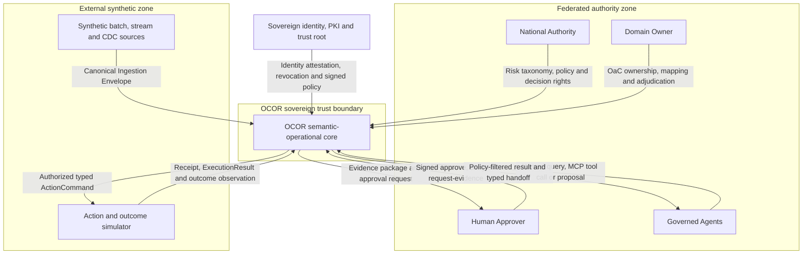
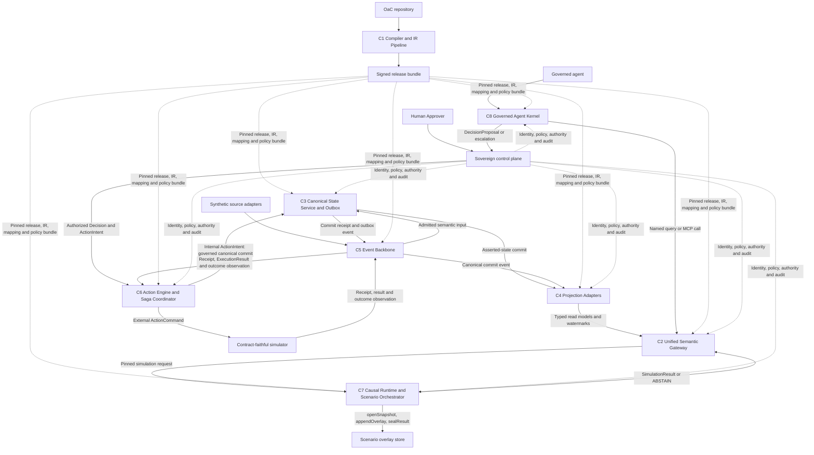
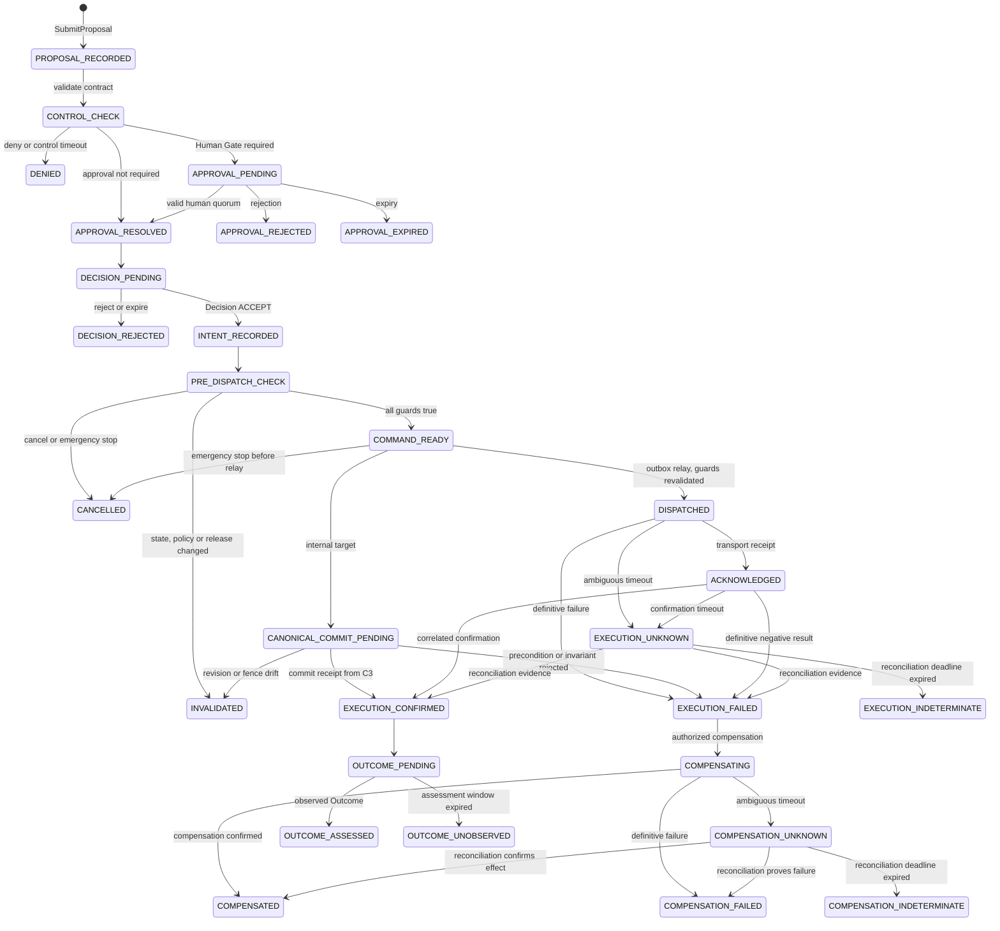
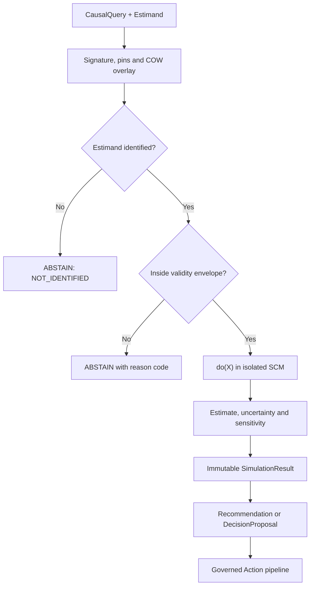
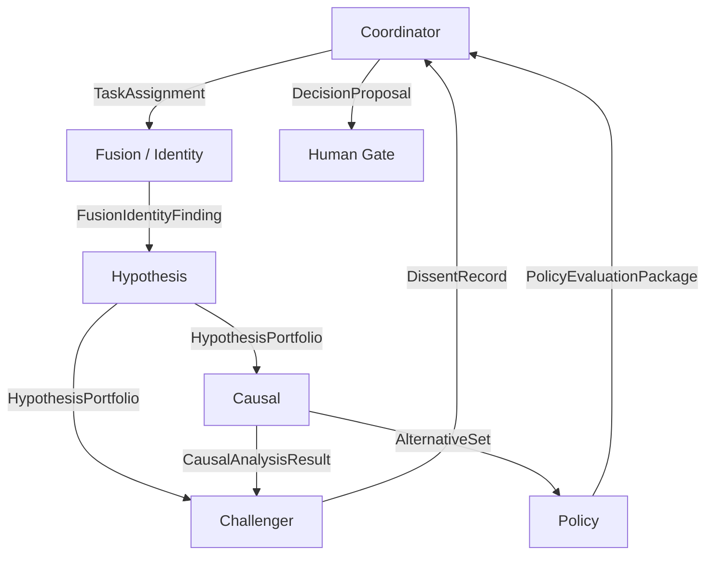
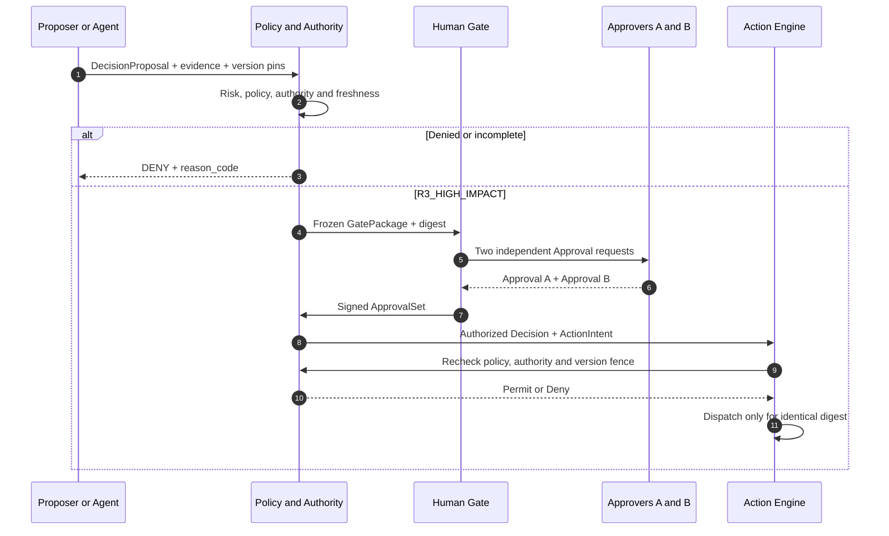
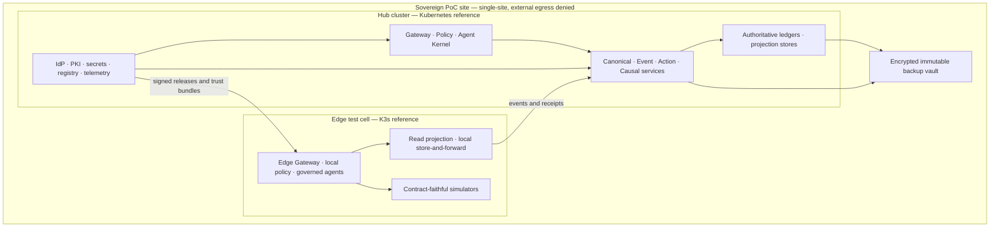

# 1. Document Control & System Context (C4 Level 1)

## 1.1 Controllo del documento

| Campo | Valore |
|---|---|
| Documento | `OCOR Architectural Design Document` |
| Identificativo | `OCOR-ADD-1.1` |
| Versione | `v1.1` |
| Data | 30 agosto 2026 |
| Sostituisce | `OCOR-ADD-1.0`, SHA-256 `1e0fe999d66b0133638293d9568f79fb861636f81bc939e170e7d6fa392d8fed` |
| Origine della revisione | `OCOR ADD v1.0 — Independent Critical Review`, finding `ARF-001`–`ARF-027` |
| Natura della revisione | Correttiva e chiarificatrice. Nessuna capability attivata, nessun requisito aggiunto o rimosso, nessun `OI-*`/`ASM-*`/`RSK-*` chiuso, stato probatorio invariato |
| Document owner | `OCOR Chief Architect` (ruolo) |
| Approval authority | Product Owner e Architecture Review Authority; approval dell'ADD non ancora registrata |
| Stato documentale | `CANDIDATE ARCHITECTURAL BASELINE — DRAFT FOR ARCHITECTURAL APPROVAL` |
| Stato delle modifiche v1.1 | `PROPOSED — PENDING CHANGE CONTROL`; ogni emendamento è tracciato nell'Amendment Log §8 e richiede approvazione secondo `DEC-196` |
| Stato tecnico | `Design Target`; ogni tecnologia nominata è `Candidate Implementation` |
| Baseline normativa | `Initial Requirements Baseline v1.0 — APPROVED BASELINE` |
| Decisione di freeze IRB | `DEC-196`, 30 agosto 2026 |
| Cut-off di contenuti ed evidenze | 29 agosto 2026 |
| SHA-256 IRB v1.0 | `4cf1071ca64eb532ee3f61b884b6ad807bc9a6e4d6a3ee6b16679060dccc7111` |
| SHA-256 Decision Register v1.0 | `1a1adfb4a7a83b7f1aae85fd07d6349302bc7d5d0e805908ab5ec157a2a0da32` |
| SHA-256 Requirement Register incorporato | `f8a25dd050caaa468001149abc92fa9e7713cc3ba17d61aab31bfee6af4008cd` |
| SHA-256 CAP/ELM Crosswalk incorporato | `cc1af191625b8267ac588dcdba1941dc316c75cdcc84efd312e8e32a4a0aef3b` |
| SHA-256 Context Pack v1.0 | `16578fdc9bd5652e6e4e0735402d66f2461652d3c191f74f8e77f4ded0c685f6` |
| SHA-256 Prompt Master | `3b8bd82e258fc5b286c9394c889990a8a7c5052ced6f918897cfc8f8b7363b47` |
| SHA-256 manifest IRB v1.0 | `1950e71ed20f7fadfa5a3f6c97467262a8479b4a3219a273f09421d9dbcf3876` |
| Stato probatorio | 285 requisiti; 284 `Confermato`; `FR-048` `Differito`; zero `Verified`; `E1=0`, `E2=0` |
| Limitazione | L'ADD non attesta implementazione, performance, HA, sicurezza, portabilità, parità o superiorità |

L'ADD concretizza la IRB senza modificarla. Le scelte vincolanti restano `DEC-001`–`DEC-196` e `ARC-001`–`ARC-023`; stack, versioni, edition, configurazioni e topologie nominate in questo documento sono candidati da sottoporre ai gate della IRB. Restano aperti, senza chiusura implicita, i 29 open issue accettati (`OI-001`, `OI-006`, `OI-008`–`OI-034`), le assunzioni, i rischi e le dipendenze della baseline. Nessun nuovo `DEC-*` è creato da questo documento: l'eventuale promozione di una scelta candidata a decisione di baseline usa change control e il progressivo successivo a `DEC-196`.

**Nota sulla revisione v1.1.** Gli emendamenti di questa versione correggono contraddizioni interne, completano contratti incompleti e chiudono lacune di tracciabilità rilevate dalla review indipendente dell'ADD v1.0. Non introducono capability, non modificano il perimetro PoC, non promuovono alcuna tecnologia candidata e non alterano `E1`/`E2`. Sette emendamenti stabiliscono o chiariscono una scelta architetturale vincolante e richiedono perciò una decisione di baseline: le voci candidate corrispondenti sono redatte in `OCOR_DEC_197_plus_Draft_v0.1.md` come **bozze non approvate**, e nessun identificativo `DEC-197` o successivo è assegnato da questo documento. L'Amendment Log completo è in §8.

## 1.2 System context

OCOR è un core semantico-operativo sovrano, proprietario e vendor-neutral. Nel PoC realizza una thin vertical slice del verticale `National Strategic Intelligence and Resilience` su una crisi nazionale interamente sintetica centrata sulla continuità elettrica e sulle dipendenze cyber, telecomunicazioni, informative e di supply chain. Le fonti e i destinatari esterni sono simulatori contract-faithful; non sono ammessi dati, credenziali, asset, organizzazioni o comandi operativi reali.



La National Authority coordina ma non eredita accesso universale. Il Domain Owner conserva l'autorità locale. L'Approver è distinto dal proposer. Ogni agente è un `Principal`; interagisce esclusivamente mediante Gateway, Agent Kernel e contratti tipizzati. Un source system è autorevole soltanto per l'Observation o Claim che emette; un target simulator è autorevole per receipt ed `ExecutionResult`, non per il successivo `OutcomeAssessment`.

## 1.3 Autorità e separazione dei concern

| Concern | Autorità e persistenza | Regola di separazione |
|---|---|---|
| Definizioni | Git/OaC/lock; bundle Canonical IR firmato | Nessuno store ricostruisce o modifica il sorgente |
| Observation | Sistema sorgente e journal di ingestione | Un'Observation non è un Claim accettato né stato canonico |
| Claim ed Evidence | Evidence/provenance record con fonte, reliability e stance | Nessuna promozione automatica |
| Canonical State | Canonical State Service tramite `VersionedAssertedState` | Un writer logico per ownership boundary e aggregate |
| Projection | `LogicProjection` e `W3CBoundary`, eliminabili e ricostruibili | Una Projection non è una fonte universale di verità |
| Prediction | Model Registry e result artifact versionato | `Prediction ≠ Decision ≠ CanonicalAssertion` |
| Intervention | Causal Runtime e scenario overlay isolato | `Intervention ≠ Action`; nessuna scrittura su `main` |
| Decision | Principal umano con Authority e Approval validi | Recommendation, Goal o prompt non concedono Authority |
| Action | Action Engine e Action Ledger | Stato esecutivo separato dal world state |
| ExecutionResult | Sistema destinatario/adapter e Action Ledger | Receipt, ACK e risultato non sono Outcome |
| OutcomeAssessment | Record governato, ammesso da nuova Observation/Evidence | Riferisce l'ExecutionResult senza coincidere con esso |

L'invariante formale è:

$$
\text{Observation/Claim} \ne \text{Canonical State} \ne \text{Projection} \ne
\text{Prediction} \ne \text{Intervention} \ne \text{Action} \ne \text{Outcome}.
$$

Non esiste un universal master, una transazione distribuita ACID globale, un triple-write sincrono sui tre store semantici o un multi-master globale. La convergenza è ottenuta tramite commit locali, outbox, eventi at-least-once, projector idempotenti, watermark, fencing e riconciliazione.

## 1.4 Trust boundaries e isolamento multi-compartimento

| Boundary | Attraversamento | Enforcement richiesto | Fail state |
|---|---|---|---|
| `TB-CXT-01` — Federated actors | Umani, applicazioni e domini verso OCOR | Identità individuale, mTLS, policy default-deny, purpose e authority scope | `DENY` |
| `TB-CXT-02` — External adapters | Sorgenti e simulatori verso ingress/egress | Schema, provenance, marking, idempotenza, rate limit e quarantine | `REJECTED` o `QUARANTINED` |
| `TB-CXT-03` — Agent sandbox | Agente verso Kernel, Gateway e tool | Capability allow-list, nessuna credenziale DB, egress deny, taint validation e budget | `CAPABILITY_DENIED` |
| `TB-CXT-04` — Sovereign control plane | PKI, identity, policy, approval e audit verso servizi | Workload identity, bundle firmati, SoD e fail-closed mutativo | `CONTROL_PLANE_UNAVAILABLE` |
| `TB-CXT-05` — Compartment | Tenant/domain/compartment verso risorse condivise | Separazione di namespace, rete, chiavi, cache, index, log e storage keyspace | `POLICY_DENIED` |
| `TB-CXT-06` — Backend adapter | Contratti OCOR verso datastore | SPI confinata; nessun dialect, schema fisico o ID backend nel contratto pubblico | `UNSUPPORTED_CAPABILITY` |
| `TB-CXT-07` — Scenario sandbox | `main` verso branch/overlay causale | Version pinning, copy-on-write, TTL, quota e assenza tecnica della capability `main.write` | `SCENARIO_ISOLATION_VIOLATION` |
| `TB-CXT-08` — External effect | Action Engine verso Action Adapter | Decision/Approval fence, dual control, idempotency/fencing e reconciliation | `EXECUTION_UNKNOWN` se ambiguo |
| `TB-CXT-09` — Supply chain | Build/signing verso runtime isolato | Source/lock pin, reproducible build, SBOM, provenance, firma e revoca offline | `RELEASE_REJECTED` |

Ogni chiamata, evento, cache entry, embedding, log, explanation e artefatto derivato trasporta almeno il **Governed Context Set**:

```text
tenant_id
organization_id
domain_id
compartments[]
classification_marking
purpose
principal_id
actor_chain
ontology_release_digest
policy_bundle_digest
correlation_id
```

Il Governed Context Set è normativo per tutti i contratti di §3, §4 e §5 e ciascuno di essi lo realizza integralmente. Due campi hanno una regola di origine specifica e non sono mai asseriti dal chiamante: `principal_id` e `actor_chain` derivano dal transport security context e dalla Delegation chain verificata, mai da un campo di payload o di body; `ingest_time`, `ontology_release_digest` e `policy_bundle_digest` sono assegnati dal boundary che ammette l'artefatto. La tabella di realizzazione per contratto è in §3.0.

La chiave di isolamento è la tupla `(tenant_id, domain_id, compartments, purpose, marking, release_digest)`. Cache e indici non sono condivisi fra tuple incompatibili; code, topic e storage prefix sono compartment-scoped; una query federata produce soltanto l'intersezione autorizzata. Il marking derivato è il `conservative_join` degli input e delle obligation. Marking sconosciuti o non confrontabili assumono la postura più restrittiva e `DENY_EXPORT`; ogni abbassamento crea un distinto artefatto di sanitizzazione/declassificazione con authority, Approval e audit.

Il PoC usa un tenant sintetico e almeno due compartimenti simulati. L'isolamento logico è obbligatorio; le classi che richiederanno separazione fisica restano governate da `OI-020`. Nessun claim di non-interferenza è ammesso prima dei relativi test.

## 1.5 Scope fence

| Classe | Disposizione |
|---|---|
| PoC in scope | Otto subsystem core, Policy/Authority, Human Gate, audit, PKI locale e simulatori contract-faithful |
| Differito | `FR-048`; hardening esteso di `CAP-024`; `ELM-011`, `ELM-015`, `ELM-035`, `ELM-049`, `ELM-070`, `ELM-080`, `ELM-084`, `ELM-091` |
| Fuori perimetro | `CAP-026`; replica completa Foundry/AIP/Apollo; dati e sistemi reali; effetti fisici; accreditamento; HA e scala nazionale Production |
| Evidence fence | Ogni elemento resta `Design Target` o `Candidate Implementation`; `E1=0`, `E2=0` |

# 2. Container Architecture & Decomposition (C4 Level 2)

## 2.1 Vista dei container



`RB` non è un nono subsystem: è l'artefatto immutabile prodotto da `C1` e pin-nato da `C2`–`C8`. `OVL` non è un nono subsystem: è lo store di overlay governato dall'adapter `ScenarioOverlayStore` interno a `C7` (§4.2), privo della capability `main.write` e incapace di produrre `OutboxEntry` pubblicabili (§2.5, regola 12). Il Sovereign Control Plane è un concern trasversale composto da identity/workload identity, PKI, policy, Human Gate, secret management e audit.

## 2.2 Specifica degli otto subsystem

`DT` indica comportamento imposto dalla baseline; `CI` indica implementazione candidata e non verificata.

| ID e subsystem | Ruolo e interfacce I/O | Statefulness e storage engine di riferimento | Failure domain e comportamento degradato |
|---|---|---|---|
| `C1` — Ontology Compiler & IR Pipeline | **Input:** OaC YAML, manifest/lock, moduli, tipi, link, constraint, mapping, query, function/model/action/tool contract, policy e migration. **Output:** Canonical IR JSON/Protobuf, `ir_digest`, artifact backend, OpenAPI/Protobuf/AsyncAPI/MCP, SDK Python/TypeScript, capability matrix, migration plan, SBOM, provenance e firma. | Worker stateless. Git/OaC/lock è l'autorità; Forgejo, registry OCI Harbor e firma DSSE/Cosign sono `CI`. Il registry conserva bundle content-addressed e immutabili. | Singola build/release digest. Parse/type error, ciclo, owner multiplo, `unsupported` non autorizzato, non determinismo, firma o licence gate fallito bloccano la release; il digest attivo non cambia. |
| `C2` — Unified Semantic Gateway | **Input:** named query o service request tipizzata, `SecurityContext`, consistency mode e version pin. **Output:** DTO filtrato con branch, release, commit/watermark, staleness, provenance e marking oppure errore tipizzato. Zero raw SQL/Cypher/Datalog/TypeQL/WOQL/SPARQL. | Request plane stateless; cache solo effimera, bounded e segregata per security context. Envoy, gRPC/OpenAPI e OPA sono `CI`; Canonical IR e policy bundle firmati sono read-only. | Instance/route. Identity, policy, audit o release fence indisponibili ⇒ deny/fail-closed; proiezione non sufficientemente fresca dopo l'attesa bounded ⇒ `PROJECTION_NOT_READY` o `STALE_CONTEXT` come `Problem`. Vietato il fallback diretto al datastore. |
| `C3` — Canonical State Service & Outbox Worker | **Input:** commit request governata emessa da `C6` (§2.5, regola 10) con expected revision, aggregate version, idempotency key, precondition, invariant, Evidence, `Decision` e `Authority ref`. **Output:** commit ID, receipt, canonical delta e outbox record. | Stateful per ownership boundary; un writer logico per aggregate/branch. `VersionedAssertedState` usa TerminusDB come `CI`; state delta e immutable `OutboxEntry` entrano nello stesso commit locale. | Ownership cell/aggregate e `writer_epoch` fencing. Writer stale respinto mediante fencing; crash dopo commit recuperato da outbox/reconciler. Nessun 2PC e nessun secondo writer automatico. |
| `C4` — Projection Adapters | **Input:** Canonical IR/mapping firmati, asserted-state operation e `canonical-state-committed`. **Output:** projected facts, validation result, watermark, checksum, drift e capability report. | `VersionedAssertedState`→TerminusDB; `LogicProjection`→TypeDB 3.x; `W3CBoundary`→Jena/TDB2, tutti `CI`. Logic e W3C sono eliminabili e ricostruibili; solo `C3` governa lo stato asserito. | Indipendente per adapter/store/branch. Lag o indisponibilità non alterano il commit canonico; il Gateway non mescola versioni. Deduplica `(store, branch, commit_id)`, replay, rebuild e reconciliation obbligatori. |
| `C5` — Event Backbone | **Input:** Canonical Ingestion Envelope, outbox, action, projection e simulation event. **Output:** stream partizionati, delivery attempt, checkpoint, DLQ/quarantine e replay. | Journal durevole, non world-state master. Kafka/Strimzi e Apicurio Registry sono `CI` strict-OSS. Ordering per `ordering_key`; delivery at-least-once. | Topic-partition, broker e consumer group. Backpressure e retry bounded; poison/permanent/policy-denied in quarantine/DLQ. Consumer idempotenti e replay; nessun claim exactly-once end-to-end. |
| `C6` — Action Engine & Saga Coordinator | **Input:** Decision autorizzata, ActionIntent, version fence, Policy/Authority/Approval e idempotency data. **Output:** ActionCommand, DeliveryAttempt, receipt, ExecutionResult, compensation ed eventi di outcome monitoring. | Stateful e autoritativo soltanto per workflow/execution state. Temporal e PostgreSQL sono `CI`; l'Action Adapter è sostituibile e il PoC usa un simulatore. | `action_id`/Saga e adapter esterno. Timeout ambiguo non idempotente ⇒ `EXECUTION_UNKNOWN`, stop del retry e riconciliazione. Worker stale fenced; compensation non cancella la storia. |
| `C7` — Causal Runtime & Scenario Orchestrator | **Input:** `{baseline, do, outcomes, horizon, seed, budget}`, release/model/evidence pin e validity context. **Output:** SimulationResult, diagnostics, uncertainty, sensitivity, lineage oppure `ABSTAIN` con reason code. | Orchestrator stateful per scenario; causal worker isolato ed effimero. Scenario overlay adapter, store S3-compatible content-addressed, job ledger PostgreSQL e PyWhy/DoWhy sono `CI`. | Scenario/run/sandbox. Fault tecnico ⇒ `FAILED`; scadenza TTL ⇒ `EXPIRED`; non-identificabilità, validity-envelope violation, OOD o stale context ⇒ `ABSTAIN` con reason code. TTL libera risorse. Nessuna identity del subsystem può scrivere su `main` o produrre ActionCommand. |
| `C8` — Governed Agent Kernel | **Input:** Task, Assignment, Goal, Delegation, budget, evidence ref e Message/Memory tainted. **Output:** handoff tipizzato, named query, MCP tool call, hypothesis/challenge, DecisionProposal, escalation e trace. | Stateful per run/task/commitment; Memory non autorevole e segregata. PostgreSQL per Run Ledger, OCI sandbox e MCP runtime sono `CI`; nessuna memoria globale o credenziale DB. | Agent/run/team sandbox. Budget, timeout, cycle detection o kill switch sospendono/terminano la run; revoca impedisce nuove tool call. Identity/policy/audit/version fence indisponibili ⇒ capability mutative fail-closed. |

### 2.2.1 Moduli interni e port logici

| Subsystem | Moduli interni obbligatori | Port vendor-neutral |
|---|---|---|
| `C1` | Meta-schema validator; dependency/lock resolver; deterministic type/constraint compiler; Canonical IR emitter; contract/artifact generator; packager, SBOM e signer | `ValidatePackage`, `Compile`, `SemanticDiff`, `PackageRelease`, `VerifyRelease` |
| `C2` | Transport/auth interceptor; Named Contract Router; Policy/Authority interceptor; consistency planner; result sanitizer/redactor | `GetObject`, `QueryObjectSet`, `Search`, `Traverse`, `Explain`, `GetProvenance` |
| `C3` | Admission/adjudication handler; aggregate command processor; local commit/outbox writer; writer-fence manager; reconciler | `AdmitClaim`, `CommitAggregate`, `GetCommit`, `ReconcileOutbox` |
| `C4` | Mapping executor; idempotent projector; local watermark/checksum writer; drift detector; capability probe | `Project`, `GetWatermark`, `Rebuild`, `RunAdapterConformance` |
| `C5` | Envelope validator; partitioner; journal; schema registry; retry/DLQ controller; replay controller | `Publish`, `Subscribe`, `Replay`, `Quarantine`, `ReprocessAuthorized` |
| `C6` | Proposal/Decision ledger; Human Gate client; FSM/Saga coordinator; fenced dispatcher; status reconciler; bounded compensation handler | `SubmitProposal`, `RecordApproval`, `RecordDecision`, `Dispatch`, `ReconcileExecution` |
| `C7` | Scenario manifest validator; copy-on-write overlay manager; SCM identification/estimation worker; async job controller; result sealer | `CreateScenario`, `RunCausalQuery`, `SimulateIntervention`, `GetJob`, `CancelJob` |
| `C8` | Principal/run manager; capability broker; context/taint firewall; token/resource budget limiter; typed handoff broker; monitoring handoff; kill-switch listener | `StartRun`, `AssignTask`, `CallTool`, `Handoff`, `Escalate`, `StopRun` |

## 2.3 Atomicità locale e propagazione asincrona

Per `C3`, l'operazione `commitAggregate` crea nello stesso commit locale del ruolo `VersionedAssertedState`: `(aggregate_delta, aggregate_revision+1, canonical_commit_id, OutboxEntry[])`. Il worker legge soltanto outbox committed, pubblica sul backbone e registra un `DeliveryAttempt` operativo separato. Il broker non partecipa al commit. Un crash nelle finestre seguenti produce:

| Finestra di failure | Stato osservabile | Recupero |
|---|---|---|
| Prima del commit locale | Nessun delta e nessuna outbox | Retry della request con stessa idempotency key |
| Dopo commit, prima del publish | Delta e outbox presenti; watermark invariato | Worker ripubblica la stessa `event_id` |
| Dopo publish, prima del delivery receipt | Possibile duplicato | Deduplica consumer su `(event_id, projection_id)` |
| Durante la proiezione | Canonical commit valido; proiezione stale | Transazione locale `facts + watermark`, replay o rebuild |
| Divergenza checksum | Risposta state-dependent bloccata o marcata stale | Reconciler confronta commit/watermark e ricostruisce; mai reverse-write |

## 2.4 Reference triad isolation e capability matrix

| Ruolo logico pubblico | Reference adapter `CI` | Write policy | Sostituibilità richiesta |
|---|---|---|---|
| `VersionedAssertedState` | TerminusDB | Commit su `main`: solo `C3`, per ownership boundary. Branch di scenario: solo l'adapter `ScenarioOverlayStore` di `C7`, privo della capability `main.write`, che non produce `OutboxEntry` pubblicabili | Export/reimport di stato, storia e Stable IDs; conformance del commit adapter |
| `LogicProjection` | TypeDB 3.x | Solo projector `C4`; read-only per Gateway e agenti | Rebuild da commit/outbox senza modifica di OaC o API |
| `W3CBoundary` | Apache Jena/TDB2 | Solo import/export/conformance adapter | Round-trip RDF/JSON-LD e SHACL nel profilo dichiarato |

La presenza nella triade non costituisce approvazione di licenza, edition o feature: ogni componente non-OSI/open-core richiede il gate `NFR-073`/`NFR-086`, eccezione time-bounded, capability gap, isolamento adapter ed exit plan. In assenza di esito, il release profile che dipende dalla feature è `NO-GO`.

La matrice seguente è una disposizione di design, non evidenza di conformance. `exact`, `emulated` e `materialized` diventano stati supportati soltanto dopo test ed evidenza dell'adapter.

Il vocabolario delle disposizioni distingue quattro situazioni che non devono essere confuse, perché solo la prima è un difetto: `unsupported` è un **gap dell'adapter** rispetto a una capability che il ruolo dovrebbe offrire, e blocca la release; `not_applicable_in_role` indica che la capability **non compete** a quel ruolo logico per progetto; `forbidden_by_design` indica una capability che l'architettura **vieta deliberatamente** e la cui presenza sarebbe un difetto; `deferred_by_scope` indica un elemento differito dallo scope fence §1.5. Le ultime tre non bloccano la release e non richiedono eccezione nominata.

| Capability | `VersionedAssertedState` / TerminusDB | `LogicProjection` / TypeDB 3.x | `W3CBoundary` / Jena |
|---|---|---|---|
| Commit, history e branch dello stato asserito | `exact` target | `materialized` read model | `materialized` exchange view |
| Named logical query e derived facts | `not_applicable_in_role` | `exact` target | `not_applicable_in_role` |
| RDF 1.1, JSON-LD e SHACL boundary | `not_applicable_in_role` | `not_applicable_in_role` | `exact` target |
| Scenario baseline e time travel | `exact` target | `emulated` con sandbox disposable | `not_applicable_in_role` |
| Cross-store commit/watermark | `exact` come commit source | `materialized` con watermark atomico ai facts | `materialized` con export watermark |
| `do(X)`, causal effect e counterfactual | `not_applicable_in_role` | `not_applicable_in_role` | `not_applicable_in_role` |
| Action/workflow execution | `not_applicable_in_role` | `not_applicable_in_role` | `not_applicable_in_role` |
| Vector profile PoC (`ELM-011`) | `deferred_by_scope` | `deferred_by_scope` | `deferred_by_scope` |
| Query dialect esposto ad app/agenti | `forbidden_by_design` | `forbidden_by_design` | `forbidden_by_design` |

Ogni `unsupported` raggiunto da un profilo richiesto blocca la build o richiede un'eccezione nominata; `not_applicable_in_role`, `forbidden_by_design` e `deferred_by_scope` non bloccano la build e non ammettono eccezione, perché non descrivono un gap da colmare. Una capability `forbidden_by_design` che risultasse disponibile su un adapter è un difetto di conformance e blocca la release. Un adapter non può alterare Canonical IR, ampliare Authority o cambiare contratti OaC/API/SDK/event/action/MCP.

## 2.5 Regole di interazione

1. `C2`–`C8` pin-nano lo stesso `ontology_release_digest`, `ir_digest`, `mapping_version` e `policy_bundle_digest`.
2. Solo `C3` può chiedere al `VersionedAssertedState` un commit su `main`.
3. `C4` non pubblica un watermark prima dei facts corrispondenti nella stessa transazione locale della proiezione.
4. Ogni evento è at-least-once; ogni consumer mutativo applica idempotency key e fencing.
5. Ogni risposta version-sensitive espone branch, commit/watermark effettivo e staleness.
6. `C7` produce soltanto `SimulationResult`, `Recommendation` o `DecisionProposal`; l'azione passa attraverso Policy, Authority, Human Gate e `C6`.
7. Agent Message, Memory, retrieved content e tool output restano tainted e non canonici.
8. Ogni evento governato è correlato a Principal, actor chain, purpose, release, Policy Decision e Audit Record.
9. Le tecnologie candidate non attraversano i public contract; versioni, edition, licenze e funzionalità HA restano soggette a `OI-028`.
10. Ogni mutazione dello stato canonico è prodotta esclusivamente da `C6` sul percorso governato. Una `Decision=ACCEPT` con `effect_class=CANONICAL_COMMIT` deriva un `ActionIntent` interno il cui destinatario è `C3` e non un Action Adapter esterno; `C3` accetta `AdmitClaim` e `CommitAggregate` soltanto con `Decision` e `Authority ref` validi, non scaduti e coerenti con il `GatePackage` congelato. Nessun altro subsystem, evento o adapter può indurre una mutazione canonica: `C5` recapita a `C3` esclusivamente input semantico non canonico ai sensi di §3.2, che non è ammissibile senza il percorso governato di §4.1.
11. Il relay dell'outbox pubblica esclusivamente `OutboxEntry` appartenenti al branch `main` dell'ownership boundary. Le entry replicate in un branch di scenario da `forkScenario` non sono pubblicabili, non generano `DeliveryAttempt` e sono ignorate dal reconciler.
12. Nessun subsystem può elevare lo stato probatorio: al cut-off tutti restano `Design Target` o `Candidate Implementation`.

## 2.6 Registro delle assunzioni sui backend candidati

Le disposizioni di §2.4 attribuiscono proprietà semantiche a tecnologie `Candidate Implementation`. Nessuna di quelle proprietà è verificata al cut-off. Questo registro le rende esplicite, ciascuna con il componente che vi dipende, il conformance test che la deve dimostrare, il fallback architetturale se non è soddisfatta e l'impatto della sua assenza. È il registro che `NFR-073` e `NFR-084` richiedono e che il DDD deve mantenere aggiornato.

Nessuna riga costituisce evidenza. Nessun `RSK-*` è chiuso da questa tabella.

| ID | Backend candidato | Proprietà semantica richiesta | Componente dipendente | Assunzione non verificata | Conformance test | Fallback | Impatto se non supportata |
|---|---|---|---|---|---|---|---|
| `BA-01` | TerminusDB — `VersionedAssertedState` | Commit locale atomico che includa in un'unica unità `aggregate_delta`, `aggregate_revision+1`, `canonical_commit_id` e `OutboxEntry[]`, con concorrenza ottimistica su `aggregate_revision` e fencing del writer | `C3` (§2.3, §6.2) | Che un versioned graph store supporti commit multi-documento atomici, e che l'outbox operativa possa risiedere nella storia versionata senza essere resa pubblicabile da un `forkScenario` (§2.5 r.11) | Crash-window test sulle cinque finestre di §2.3; test di concorrenza su writer stale; verifica che un fork non produca `DeliveryAttempt` | Outbox in store transazionale separato con due commit logici e reconciler, dichiarando esplicitamente la finestra di incoerenza; oppure `VersionedAssertedState` su RDBMS con event log | L'atomicità local-state+outbox decade: il pattern outbox non è più esente da perdita di evento, e §2.3 va riscritta. `RSK-013`, `RSK-019` |
| `BA-02` | TypeDB 3.x — `LogicProjection` | Visibilità atomica di facts e `projection_watermark`, per transazione locale oppure per versioned dataset con atomic pointer switch | `C4` (§2.5 r.3, §6.2 p.5) | Che almeno una delle due primitive esista e sia sostenibile per il volume di rebuild richiesto da `Rebuild` | Lettura concorrente durante la proiezione: nessun lettore osserva watermark avanzato con facts mancanti | Doppio dataset con puntatore atomico esterno gestito da `C4`; oppure watermark servito da `C4` e non dallo store | La consistenza osservabile decade: il Gateway non può garantire `AT_LEAST_COMMIT`. `RSK-052` |
| `BA-03` | TypeDB 3.x — time travel | Sandbox disposable per servire `EXACT_AT_COMMIT(Cn)` su query logiche nominate | `C2`, `C4` (§3.3, §6.2) | Che la creazione di una sandbox a un commit arbitrario sia possibile e sostenibile per richiesta | Benchmark di creazione sandbox; test di esaurimento risorse; test negativo con emulazione indisponibile | Restringere `EXACT_AT_COMMIT` al solo `VersionedAssertedState` e restituire `UNSUPPORTED_CAPABILITY` sulle query logiche, come già previsto da §3.3; oppure snapshot materializzati a commit selezionati | Il modo di consistenza più forte non è servibile sulle query logiche. `RSK-052` |
| `BA-04` | Apache Jena/TDB2 — `W3CBoundary` | Round-trip RDF 1.1 / JSON-LD / SHACL senza perdita nel profilo dichiarato, ed export watermark correlabile al commit canonico | `C4`, export/import (§2.4, §3.6) | Che il profilo portabile dichiarato sia effettivamente round-trippabile | Round-trip conformance su fixture canoniche; validazione SHACL delle shape di §3.6 | Boundary W3C come export batch offline non correlato a watermark, con staleness dichiarata e ruolo non interrogabile in linea | La portabilità W3C resta dichiarata ma non dimostrabile. `NFR-056`, `RSK-012` |
| `BA-05` | Temporal + PostgreSQL — `C6` | Workflow durevole con fencing del worker stale, idempotenza per `action_id`, nessuna cancellazione presunta dopo il dispatch, e rivalidazione delle guardie al momento dell'emissione (§4.1.2 `ACT-T14`) | `C6` (§4.1) | Che il motore garantisca esattamente le semantiche di `ACT-T14`, `ACT-T18`, `ACT-T19` e `ACT-T29` senza degradare; `DEP-011` mantiene aperta la verifica di licenza e benchmark | Failure injection su timeout ambiguo, worker stale e duplicate delivery | FSM proprietaria su PostgreSQL con outbox e lease, rinunciando alle primitive di workflow del motore | La guardia di emissione va reimplementata fuori dal motore. `RSK-023`, `RSK-054` |
| `BA-06` | Storage S3-compatible + PostgreSQL — `C7` | Content-addressing immutabile per `sealResult`; job ledger con budget, progress e cancellation; rilascio risorse entro il target dichiarato | `C7` (§4.2) | Che l'oggetto sigillato sia effettivamente immutabile e che la cancellazione liberi le risorse nel tempo previsto | Test di immutabilità post-`sealResult`; test di cancellazione con verifica del rilascio | Object lock applicativo con digest verificato a ogni lettura | La riproducibilità della run non è garantita. `RSK-028`, `NFR-090` |
| `BA-07` | Kafka/Strimzi — `C5` | Ordering per partizione, retention sufficiente al replay, DLQ e schema registry, in edizione strict-OSS | `C5` (§2.2, §3.8) | Che nessuna proprietà richiesta ricada in feature enterprise o licenze non ammesse; `OI-028` mantiene aperta la verifica | Inventario licenze e capability (`NFR-073`); test di replay dalla retention configurata | Backbone alternativo strict-OSS dietro lo stesso port `Publish/Subscribe/Replay/Quarantine`, già vendor-neutral | Il backbone va sostituito prima del gate. `RSK-047`, `RSK-051`, `RSK-056` |
| `BA-08` | OPA, Keycloak, SPIFFE/SPIRE, OpenBao | Decisione di policy entro `policy_authority_timeout`; revoca propagata e scadenza locale del `CapabilityLease` come meccanismi indipendenti per il target `≤10 s` | `C2`, `C6`, `C8`, control plane (§5.1, §5.5) | Che i due meccanismi raggiungano insieme il target; il `CapabilityLease` è un controllo proprio di OCOR (§5.2) e non dipende da `ELM-080` | Chaos/safety drill con misura dell'ultimo command accettato dopo lo stop | Scadenza locale ancorata alla vita del certificato workload, indipendente da qualsiasi lease semantica | Il target `NFR-047` non è raggiungibile con i soli meccanismi push. `RSK-037` |

Ogni riga è un candidato a `NO-GO` del release profile che vi dipende, secondo la regola di §2.4: in assenza di esito del conformance test, il profilo non è ammesso al gate. Il fallback dichiarato è la condizione che rende la sostituzione un'operazione di adapter e non una riprogettazione.

**Tracciabilità:** `DEC-005`, `DEC-020`, `DEC-147`, `DEC-154`, `DEC-162`, `DEC-179`; `NFR-058`, `NFR-064`, `NFR-073`, `NFR-084`, `NFR-086`; `ARC-018`, `ARC-019`, `ARC-022`; `DEP-001`, `DEP-011`, `DEP-020`, `DEP-023`; `RSK-012`, `RSK-047`, `RSK-051`, `RSK-056`; `OI-006`, `OI-028`.

# 3. Core Data Metamodels & Critical Interfaces

Tutti i contratti di questa sezione sono `Design Target`. Al cut-off `E1=0`, `E2=0`: non costituiscono evidenza di implementazione, conformità, parità o prestazione. Sono derivati esclusivamente da OaC/Canonical IR; nessun payload pubblico contiene TypeQL, WOQL, SPARQL, Datalog, Cypher, SQL, identificativi interni o schemi fisici dei backend.

## 3.0 Regole trasversali dei contratti

### 3.0.1 Realizzazione del Governed Context Set

Il Governed Context Set di §1.4 è normativo per ogni contratto. La tabella dichiara dove ciascun campo è realizzato e con quale regola di origine.

| Campo `§1.4` | Ingestion Envelope §3.2 | `QueryContext` §3.3 | `InvocationContext` §3.4 | `HandoffEnvelope` §4.3 | `SecurityContext` §5.3 | Osservabilità §6.3 | Origine |
|---|---|---|---|---|---|---|---|
| `tenant_id` | ✔ | ✔ | ✔ | ✔ | ✔ | ✔ | chiamante, validato |
| `organization_id` | ✔ | ✔ | ✔ | ✔ | ✔ | ✔ | binding autorizzato del Principal |
| `domain_id` | ✔ | ✔ | ✔ | ✔ | ✔ | ✔ | chiamante, validato |
| `compartments[]` | ✔ | ✔ | ✔ | ✔ | ✔ | ✔ | chiamante, validato |
| `classification_marking` | ✔ (inline) | ✔ (`*_ref`) | ✔ (`*_ref`) | ✔ (inline) | ✔ (decomposto) | ✔ (`*_ref`) | conservative join §5.3 |
| `purpose` | ✔ | ✔ | ✔ | ✔ | ✔ | ✔ | binding autorizzato dell'adapter o del Principal |
| `principal_id` | ✔ (`integrity.producer_principal_ref`) | **derivato** | **derivato** | ✔ | ✔ | ✔ | **transport security context; mai da body o payload** |
| `actor_chain` | ✔ | **derivato** | **derivato** | ✔ | ✔ | ✔ | **Delegation chain verificata; mai da body o payload** |
| `ontology_release_digest` | ✔ | ✔ (`ontology_release`) | ✔ (`ontology_release`) | ✔ | ✔ | ✔ | boundary di ammissione |
| `policy_bundle_digest` | ✔ | ✔ | ✔ | ✔ | ✔ | ✔ | boundary di ammissione |
| `correlation_id` | ✔ | ✔ | ✔ | ✔ | ✔ | ✔ | chiamante o generato all'ingresso |

«**derivato**» significa che il campo non compare nel contratto per costruzione e non può comparirvi: il Gateway e il Function/Model Registry ricavano Principal e actor chain dal contesto di sicurezza del trasporto, e un campo di richiesta che li dichiarasse sarebbe un vettore di impersonificazione. L'assenza dal contratto è quindi il comportamento corretto, non una lacuna, e il campo è comunque presente in ogni Audit Record e in ogni trace.

### 3.0.2 Forma unica del marking

Il marking esiste in una sola forma canonica, l'oggetto `marking` di §3.2 `$defs`, governato dal `MarkingSchemeDefinition` di §3.1.1. Le altre forme sono proiezioni definite di quell'oggetto e non modelli alternativi:

- ogni campo `*_marking_ref` (`classification_marking_ref`, `result_marking_ref`, `marking_ref`) è, senza eccezioni, `urn:sha256:<marking_digest>` dell'oggetto `marking` corrispondente, risolvibile tramite `GetProvenance` secondo policy;
- `SecurityContext` (§5.3) è la **valutazione** dell'oggetto `marking` secondo il `MarkingSchemeDefinition` attivo, non una sua ridefinizione: `classification_level` è il livello risolto dallo scheme, `mandatory_markings[]` e `caveats[]` partizionano `labels`, `dissemination_controls[]` coincide con l'omonimo campo dell'oggetto.

Un `*_marking_ref` non risolvibile, o un `marking_digest` che non corrisponde all'oggetto, produce `DENY` e non una postura permissiva.

### 3.0.3 Naming e cardinalità

Il campo che porta i compartimenti si chiama `compartments` in tutti i contratti ed è sempre un array con `minItems: 1` e `uniqueItems: true`, anche quando l'insieme è singoletto. La forma singolare `compartment` non è ammessa in alcun contratto, evento, envelope o record di osservabilità.

### 3.0.4 Versionamento dei contratti corretti in v1.1

Gli schemi modificati da questa revisione incrementano la propria versione: `canonical-ingestion-envelope` passa a `1.1`, `mcp-tool-contract` a `1.1`, la specifica OpenAPI del Gateway a `1.1.0`. `signed-canonical-ir:1.0` non è modificato e resta a `1.0`. Poiché l'ADD v1.0 non è mai stato approvato e `E1=0`, non esiste alcun consumer di questi contratti: la finestra di coesistenza e il migration path richiesti da `NFR-088` non si applicano, e la correzione non costituisce una breaking change su una release rilasciata. La regola resta valida per ogni versione successiva alla prima approvazione.

## 3.1 Ontology-as-Code e Canonical IR

### 3.1.1 Metamodello OaC

La sorgente autorevole è YAML validato da meta-schema; la semantica compilata autorevole è la Canonical IR. La relazione è unidirezionale: `OaC → Canonical IR → artifact`; gli store non rigenerano OaC.

| Costrutto | Cardinalità e campi normativi | Vincoli |
|---|---|---|
| `OntologyPackage` | `package_id`, `version`, `namespace_refs[1..*]`, `module_refs[1..*]`, `dependency_lock`, `owner`, `classification_marking`, `release_profile` | `package_id` è uno Stable Resource ID; versione SemVer; lock completo e risolvibile offline |
| `Namespace` | `namespace_id`, `uri`, `prefix`, `ownership_boundary`, `default_marking` | URI globale e immutabile; nessun nome o ID backend |
| `Module` | `module_id`, `version`, `namespace_ref`, `imports[0..*]`, `exports[0..*]`, `definitions[1..*]`, `owner`, `steward`, `reviewer`, `status`, `review_date` | Import esatti per versione e digest; grafo delle dipendenze aciclico |
| `TypeDefinition` | `type_id`, `kind`, `version`, `properties`, `keys`, `interfaces`, `lifecycle_ref`, `temporal_annotation`, `security_profile_ref` | `kind ∈ {OBJECT, INTERFACE, VALUE, STRUCT, ENUM, EVENT, ACTION, RELATION, CAUSAL, AGENT_RESOURCE}` |
| `PropertyDefinition` | `property_id`, `value_type_ref`, `cardinality`, `nullable`, `unit_ref`, `default`, `constraint_refs`, `temporal_annotation`, `marking_rule_ref` | Tipo forte; default e unità compatibili; nessuna coercizione implicita lossy |
| `LinkDefinition` | `link_id`, `roles[2..*]`, `role_player_type_refs`, cardinalità per ruolo, proprietà qualificate, `temporal_annotation`, `security_profile_ref` | Link binari e n-ari; `Link ≠ CausalEdge`; ruoli nominati e ordinamento semantico esplicito |
| `ConstraintDefinition` | `constraint_id`, `kind`, `scope_ref`, `typed_expression`, `evaluation_phase`, `severity`, `execution_owner`, `validity`, `repair_strategy` | `kind ∈ {TYPE, KEY, RANGE, CARDINALITY, INVARIANT, COMPLETENESS}`; diagnostica tipizzata e localizzata |
| `TemporalAnnotation` | `mode`, `valid_from_field`, `valid_to_field`, `system_from_field`, `system_to_field`, `precision`, `timezone_policy` | `mode ∈ {ATEMPORAL, VALID_TIME, TRANSACTION_TIME, BITEMPORAL}`; intervalli UTC semiaperti `[from,to)`; system time assegnato solo dal canonical writer |
| `DerivedDefinition` | `derived_id`, `result_type_ref`, `typed_ast`, `execution_owner`, `materialization_policy`, `dependency_refs` | Un solo `execution_owner`; negazione stratificata e ricorsione bounded/controllata |
| `ContractDefinition` | `contract_id`, `kind`, input/output schema, error model, effect class, risk class, policy/approval refs, version | `kind ∈ {NAMED_QUERY, FUNCTION, MODEL_FUNCTION, ACTION, EVENT, MCP_TOOL}`; nessun dialect backend |
| `MarkingSchemeDefinition` | `scheme_id`, `version`, `levels[1..*]` ordinati dal meno al più restrittivo, `dominance_relation`, `caveat_semantics`, `dissemination_control_semantics`, `join_rule`, `incomparable_behavior`, `declassification_authority_ref` | `levels` definisce un ordine totale o un reticolo esplicito con elemento massimo; `join_rule ∈ {LATTICE_JOIN}`; `caveat_semantics` e `dissemination_control_semantics ∈ {RESTRICTION, PERMISSION}`; `incomparable_behavior ∈ {DENY, MOST_RESTRICTIVE}`; nessun default implicito |
| `CapabilityDisposition` | `semantic_capability_id`, `adapter_role`, `disposition`, `limitation`, `evidence_ref` | `disposition ∈ {exact, emulated, materialized, unsupported, not_applicable_in_role, forbidden_by_design, deferred_by_scope}`; solo `unsupported` blocca la release senza eccezione approvata; `forbidden_by_design` disponibile su un adapter è un difetto di conformance |

Normalizzazione deterministica:

1. risoluzione di tutti gli import tramite lockfile `(resource_id, version, sha256)`;
2. Unicode NFC, timestamp UTC RFC 3339, decimali canonici e unità normalizzate;
3. ordinamento delle collezioni non semantiche per `(kind, stable_resource_id, version)`;
4. type checking, constraint analysis e unicità di `execution_owner`;
5. classificazione capability per adapter;
6. rifiuto fail-closed di cicli, riferimenti irrisolti, owner multipli e `unsupported` non approvati.

### 3.1.2 Struttura della Canonical IR firmata

~~~text
CanonicalIRCore = {
  format: "ocor.cir/1.0",
  release: {
    package_id, semantic_version, source_commit,
    compiler_version, lock_digest, mapping_version
  },
  namespaces: NamespaceIR[1..*],
  modules: ModuleIR[1..*],
  symbol_table: SymbolIR[1..*],
  types: TypeIR[0..*],
  links: LinkIR[0..*],
  constraints: ConstraintIR[0..*],
  temporal_semantics: TemporalIR[0..*],
  derived_definitions: DerivedIR[0..*],
  named_contracts: ContractIR[0..*],
  causal_manifests: CausalManifestIR[0..*],
  security_profiles: SecurityProfileIR[1..*],
  capability_matrix: CapabilityDispositionIR[1..*],
  artifact_plan: ArtifactPlanIR[1..*]
}
~~~

L'IR JSON è canonicalizzata secondo RFC 8785. `ir_digest = sha256(RFC8785(CanonicalIRCore))`. La serializzazione Protobuf è semanticamente equivalente e trasporta lo stesso `ir_digest`; non definisce un digest alternativo. Il payload firmato usa una busta DSSE verificabile offline:

~~~json
{
  "$schema": "https://json-schema.org/draft/2020-12/schema",
  "$id": "urn:ocor:schema:signed-canonical-ir:1.0",
  "type": "object",
  "additionalProperties": false,
  "required": [
    "payloadType",
    "payload",
    "canonicalization",
    "digest",
    "signingProfile",
    "signatures"
  ],
  "properties": {
    "payloadType": {
      "const": "application/vnd.ocor.canonical-ir.v1+json"
    },
    "payload": {
      "type": "string",
      "contentEncoding": "base64"
    },
    "canonicalization": {
      "const": "RFC8785"
    },
    "digest": {
      "type": "string",
      "pattern": "^sha256:[0-9a-f]{64}$"
    },
    "signingProfile": {
      "type": "string",
      "pattern": "^urn:ocor:crypto-profile:[A-Za-z0-9._-]+:[0-9]+$"
    },
    "signatures": {
      "type": "array",
      "minItems": 1,
      "items": {
        "type": "object",
        "additionalProperties": false,
        "required": ["keyid", "sig", "certificateChainRef", "signedAt"],
        "properties": {
          "keyid": {"type": "string", "minLength": 1, "maxLength": 256},
          "sig": {"type": "string", "contentEncoding": "base64"},
          "certificateChainRef": {
            "type": "string",
            "pattern": "^urn:sha256:[0-9a-f]{64}$"
          },
          "signedAt": {"type": "string", "format": "date-time"}
        }
      }
    }
  }
}
~~~

L'algoritmo crittografico è selezionato dall'active sovereign crypto profile, non codificato nell'IR; ciò preserva `OI-022` senza lasciare indeterminato il formato di firma. Admission verifica trust root, revoca, DSSE PAE, digest, lock, compiler e artifact manifest prima dell'attivazione.

**Tracciabilità:** `DEC-061`, `DEC-062`, `DEC-069`–`DEC-074`, `DEC-138`; `FR-024`–`FR-027`, `FR-040`–`FR-046`; `NFR-012`–`NFR-013`, `NFR-018`–`NFR-021`, `NFR-051`.

## 3.2 Canonical Ingestion Envelope

Il seguente JSON Schema 2020-12 valida l'envelope esterno. Il `payload` subisce una seconda validazione obbligatoria contro lo schema content-addressed indicato da `payload_schema`; fallimento, schema assente o digest discordante produce una `Violation` e quarantena. Gli adapter possono emettere envelope, ma non scrivere Canonical State o proiezioni.

~~~json
{
  "$schema": "https://json-schema.org/draft/2020-12/schema",
  "$id": "urn:ocor:schema:canonical-ingestion-envelope:1.1",
  "title": "OCOR Canonical Ingestion Envelope",
  "type": "object",
  "additionalProperties": false,
  "required": [
    "envelope_version",
    "event_id",
    "tenant_id",
    "organization_id",
    "domain_id",
    "compartments",
    "world_ref",
    "ingest_mode",
    "semantic_class",
    "event_type_id",
    "event_time",
    "ingest_time",
    "ordering_key",
    "idempotency_key",
    "purpose",
    "source",
    "aggregate",
    "payload_schema",
    "payload",
    "classification_marking",
    "provenance_ref",
    "integrity",
    "actor_chain",
    "ontology_release_digest",
    "policy_bundle_digest",
    "correlation_id",
    "transport"
  ],
  "properties": {
    "envelope_version": {"const": "1.1"},
    "event_id": {"type": "string", "format": "uuid"},
    "tenant_id": {"$ref": "#/$defs/stableId"},
    "organization_id": {"$ref": "#/$defs/stableId"},
    "domain_id": {"$ref": "#/$defs/stableId"},
    "compartments": {
      "type": "array",
      "minItems": 1,
      "uniqueItems": true,
      "items": {"$ref": "#/$defs/stableId"}
    },
    "purpose": {"type": "string", "minLength": 1, "maxLength": 256},
    "actor_chain": {
      "type": "array",
      "minItems": 1,
      "items": {"$ref": "#/$defs/stableId"}
    },
    "ontology_release_digest": {"$ref": "#/$defs/digest"},
    "policy_bundle_digest": {"$ref": "#/$defs/digest"},
    "world_ref": {"$ref": "#/$defs/stableId"},
    "ingest_mode": {"enum": ["BATCH", "STREAM", "CDC"]},
    "semantic_class": {
      "enum": ["OBSERVATION", "CLAIM", "OBSERVED_EVENT", "CDC_CHANGE"]
    },
    "event_type_id": {"$ref": "#/$defs/stableId"},
    "event_time": {"type": "string", "format": "date-time"},
    "effective_time": {
      "type": "object",
      "additionalProperties": false,
      "required": ["from"],
      "properties": {
        "from": {"type": "string", "format": "date-time"},
        "to": {
          "oneOf": [
            {"type": "string", "format": "date-time"},
            {"type": "null"}
          ]
        }
      }
    },
    "ingest_time": {"type": "string", "format": "date-time"},
    "ordering_key": {"type": "string", "minLength": 1, "maxLength": 512},
    "idempotency_key": {"type": "string", "minLength": 16, "maxLength": 256},
    "source": {
      "type": "object",
      "additionalProperties": false,
      "required": [
        "source_id",
        "source_record_id",
        "adapter_id",
        "adapter_version"
      ],
      "properties": {
        "source_id": {"$ref": "#/$defs/stableId"},
        "source_record_id": {"type": "string", "minLength": 1, "maxLength": 512},
        "adapter_id": {"$ref": "#/$defs/stableId"},
        "adapter_version": {"$ref": "#/$defs/semver"},
        "source_event_time_quality": {
          "enum": ["SOURCE_ASSERTED", "DERIVED", "UNKNOWN"]
        }
      }
    },
    "aggregate": {
      "type": "object",
      "additionalProperties": false,
      "required": ["aggregate_type_id", "aggregate_id"],
      "properties": {
        "aggregate_type_id": {"$ref": "#/$defs/stableId"},
        "aggregate_id": {"type": "string", "minLength": 1, "maxLength": 512},
        "expected_revision": {"type": "integer", "minimum": 0}
      }
    },
    "payload_schema": {"$ref": "#/$defs/schemaPin"},
    "payload": {"type": "object"},
    "classification_marking": {"$ref": "#/$defs/marking"},
    "provenance_ref": {"$ref": "#/$defs/contentRef"},
    "integrity": {
      "type": "object",
      "additionalProperties": false,
      "required": ["payload_digest", "producer_principal_ref"],
      "properties": {
        "payload_digest": {"$ref": "#/$defs/digest"},
        "producer_principal_ref": {"$ref": "#/$defs/stableId"},
        "signature_ref": {"$ref": "#/$defs/contentRef"}
      }
    },
    "correlation_id": {"type": "string", "format": "uuid"},
    "causation_id": {
      "oneOf": [
        {"type": "string", "format": "uuid"},
        {"type": "null"}
      ]
    },
    "transport": {
      "oneOf": [
        {"$ref": "#/$defs/batchTransport"},
        {"$ref": "#/$defs/streamTransport"},
        {"$ref": "#/$defs/cdcTransport"}
      ]
    }
  },
  "allOf": [
    {
      "if": {
        "properties": {"ingest_mode": {"const": "BATCH"}},
        "required": ["ingest_mode"]
      },
      "then": {"properties": {"transport": {"$ref": "#/$defs/batchTransport"}}}
    },
    {
      "if": {
        "properties": {"ingest_mode": {"const": "STREAM"}},
        "required": ["ingest_mode"]
      },
      "then": {"properties": {"transport": {"$ref": "#/$defs/streamTransport"}}}
    },
    {
      "if": {
        "properties": {"ingest_mode": {"const": "CDC"}},
        "required": ["ingest_mode"]
      },
      "then": {
        "properties": {
          "semantic_class": {"const": "CDC_CHANGE"},
          "transport": {"$ref": "#/$defs/cdcTransport"}
        }
      }
    },
    {
      "if": {
        "properties": {"semantic_class": {"const": "CDC_CHANGE"}},
        "required": ["semantic_class"]
      },
      "then": {
        "properties": {
          "ingest_mode": {"const": "CDC"},
          "transport": {"$ref": "#/$defs/cdcTransport"}
        }
      }
    }
  ],
  "$defs": {
    "stableId": {
      "type": "string",
      "pattern": "^urn:ocor:[A-Za-z0-9._~:/-]{1,240}$"
    },
    "semver": {
      "type": "string",
      "pattern": "^(0|[1-9][0-9]*)\\.(0|[1-9][0-9]*)\\.(0|[1-9][0-9]*)(?:-[0-9A-Za-z.-]+)?(?:\\+[0-9A-Za-z.-]+)?$"
    },
    "digest": {
      "type": "string",
      "pattern": "^sha256:[0-9a-f]{64}$"
    },
    "contentRef": {
      "type": "string",
      "pattern": "^urn:sha256:[0-9a-f]{64}$"
    },
    "schemaPin": {
      "type": "object",
      "additionalProperties": false,
      "required": ["schema_id", "schema_version", "schema_digest"],
      "properties": {
        "schema_id": {"$ref": "#/$defs/stableId"},
        "schema_version": {"$ref": "#/$defs/semver"},
        "schema_digest": {"$ref": "#/$defs/digest"}
      }
    },
    "marking": {
      "type": "object",
      "additionalProperties": false,
      "required": ["scheme_id", "labels", "marking_digest"],
      "properties": {
        "scheme_id": {"$ref": "#/$defs/stableId"},
        "labels": {
          "type": "array",
          "minItems": 1,
          "uniqueItems": true,
          "items": {"type": "string", "minLength": 1, "maxLength": 128}
        },
        "dissemination_controls": {
          "type": "array",
          "uniqueItems": true,
          "items": {"type": "string", "minLength": 1, "maxLength": 128}
        },
        "handling_instructions": {
          "type": "array",
          "uniqueItems": true,
          "items": {"type": "string", "minLength": 1, "maxLength": 256}
        },
        "marking_digest": {"$ref": "#/$defs/digest"}
      }
    },
    "batchTransport": {
      "type": "object",
      "additionalProperties": false,
      "required": ["mode", "batch_id", "record_index"],
      "properties": {
        "mode": {"const": "BATCH"},
        "batch_id": {"type": "string", "format": "uuid"},
        "record_index": {"type": "integer", "minimum": 0}
      }
    },
    "streamTransport": {
      "type": "object",
      "additionalProperties": false,
      "required": ["mode", "stream_id", "partition", "offset"],
      "properties": {
        "mode": {"const": "STREAM"},
        "stream_id": {"$ref": "#/$defs/stableId"},
        "partition": {"type": "integer", "minimum": 0},
        "offset": {"type": "string", "minLength": 1, "maxLength": 256}
      }
    },
    "cdcTransport": {
      "type": "object",
      "additionalProperties": false,
      "required": [
        "mode",
        "operation",
        "source_transaction_id",
        "source_position"
      ],
      "properties": {
        "mode": {"const": "CDC"},
        "operation": {"enum": ["CREATE", "UPDATE", "DELETE", "SNAPSHOT"]},
        "source_transaction_id": {
          "type": "string",
          "minLength": 1,
          "maxLength": 256
        },
        "source_position": {"type": "string", "minLength": 1, "maxLength": 256},
        "before_digest": {
          "oneOf": [{"$ref": "#/$defs/digest"}, {"type": "null"}]
        },
        "after_digest": {
          "oneOf": [{"$ref": "#/$defs/digest"}, {"type": "null"}]
        }
      }
    }
  }
}
~~~

Regole runtime:

- `ingest_time`, `ontology_release_digest`, `policy_bundle_digest` e `actor_chain` sono assegnati dal trusted ingress boundary e non sono asserzioni della sorgente; `purpose` e `organization_id` derivano dal binding autorizzato dell'adapter. Nessuno di questi campi può essere sovrascritto dal payload, e un envelope che li dichiari in modo incoerente con il binding è respinto con `Violation` e quarantena. `event_time` resta un'asserzione della sorgente.
- L'envelope realizza integralmente il Governed Context Set di §1.4: la chiave di isolamento `(tenant_id, domain_id, compartments, purpose, marking, release_digest)` è costruibile per ogni evento ammesso.
- `semantic_class = CDC_CHANGE` e `ingest_mode = CDC` sono mutuamente vincolanti: un change data capture non è ammissibile senza `source_transaction_id` e `source_position`, e non è quindi ordinabile né riconciliabile in loro assenza.
- `idempotency_key` deduplica l'evento logico; delivery attempt e offset restano record distinti.
- Ordering è garantito soltanto per `ordering_key` nella relativa partizione.
- Il payload può creare `Observation`, `Claim`, `ObservedEvent` o `CDCChange`; non rappresenta direttamente `CanonicalState`, `Projection`, `Prediction`, `Intervention`, `Action` o `Outcome`.
- Errori `TRANSIENT` sono retry-bounded; `PERMANENT`, `POLICY_DENIED` e `POISON_EVENT` entrano in quarantine/DLQ con reason code e provenance.
- Non è dichiarata semantica exactly-once end-to-end.

**Tracciabilità:** `DEC-089`–`DEC-091`; `FR-006`, `FR-069`–`FR-075`, `FR-131`; `NFR-006`, `NFR-027`–`NFR-028`, `NFR-040`; `ARC-004`, `ARC-016`; `RSK-020`, `RSK-035`.

## 3.3 Named Query Gateway — OpenAPI 3.1

Le sei operazioni sono query nominate generate dalla Canonical IR. Parametri e risultati di ogni `contract_id` sono schemi chiusi, versionati e content-addressed.

| Operazione tipizzata | Firma logica | Accesso consentito |
|---|---|---|
| `GetObject` | `GetObjectRequest<T> → QueryReply<ObjectSnapshot<T>>` | Stable Object ID e view nominata |
| `QueryObjectSet` | `ObjectSetRequest<P,T> → QueryReply<Page<ObjectSnapshot<T>>>` | Object Set nominato e parametri `P` |
| `Search` | `SearchRequest<P,T> → QueryReply<Page<SearchHit<T>>>` | Search contract nominato; score semantics esplicita |
| `Traverse` | `TraverseRequest<P,N,E> → QueryReply<TraversalResult<N,E>>` | Traversal contract allow-listed; nessuna path expression arbitraria |
| `Explain` | `ExplainRequest → QueryReply<ExplanationGraph>` | Proof/decision/model explanation policy-filtered |
| `GetProvenance` | `ProvenanceRequest → QueryReply<ProvenanceGraph>` | Lineage policy-filtered e marking-aware |

~~~yaml
openapi: 3.1.0
info:
  title: OCOR Named Query Gateway
  version: 1.1.0
security:
  - mutualTLS: []
    workloadOAuth: [ocor.query]
paths:
  /v1/queries/get-object:
    post:
      operationId: GetObject
      requestBody:
        required: true
        content:
          application/json:
            schema: {$ref: '#/components/schemas/GetObjectRequest'}
      responses:
        '200':
          description: Typed object snapshot
          content:
            application/json:
              schema: {$ref: '#/components/schemas/GetObjectResponse'}
        default: {$ref: '#/components/responses/Problem'}
  /v1/queries/query-object-set:
    post:
      operationId: QueryObjectSet
      requestBody:
        required: true
        content:
          application/json:
            schema: {$ref: '#/components/schemas/ObjectSetRequest'}
      responses:
        '200':
          description: Typed object page
          content:
            application/json:
              schema: {$ref: '#/components/schemas/ObjectPageResponse'}
        default: {$ref: '#/components/responses/Problem'}
  /v1/queries/search:
    post:
      operationId: Search
      requestBody:
        required: true
        content:
          application/json:
            schema: {$ref: '#/components/schemas/SearchRequest'}
      responses:
        '200':
          description: Policy-filtered search result
          content:
            application/json:
              schema: {$ref: '#/components/schemas/SearchResponse'}
        default: {$ref: '#/components/responses/Problem'}
  /v1/queries/traverse:
    post:
      operationId: Traverse
      requestBody:
        required: true
        content:
          application/json:
            schema: {$ref: '#/components/schemas/TraverseRequest'}
      responses:
        '200':
          description: Named traversal result
          content:
            application/json:
              schema: {$ref: '#/components/schemas/GraphResponse'}
        default: {$ref: '#/components/responses/Problem'}
  /v1/queries/explain:
    post:
      operationId: Explain
      requestBody:
        required: true
        content:
          application/json:
            schema: {$ref: '#/components/schemas/ExplainRequest'}
      responses:
        '200':
          description: Policy-filtered explanation graph
          content:
            application/json:
              schema: {$ref: '#/components/schemas/GraphResponse'}
        default: {$ref: '#/components/responses/Problem'}
  /v1/queries/get-provenance:
    post:
      operationId: GetProvenance
      requestBody:
        required: true
        content:
          application/json:
            schema: {$ref: '#/components/schemas/ProvenanceRequest'}
      responses:
        '200':
          description: Policy-filtered provenance graph
          content:
            application/json:
              schema: {$ref: '#/components/schemas/GraphResponse'}
        default: {$ref: '#/components/responses/Problem'}
components:
  securitySchemes:
    mutualTLS:
      type: mutualTLS
    workloadOAuth:
      type: oauth2
      flows:
        clientCredentials:
          tokenUrl: https://identity.ocor.svc/oauth2/token
          scopes:
            ocor.query: Invoke allow-listed named queries
  schemas:
    SchemaPin:
      type: object
      additionalProperties: false
      required: [schema_id, version, digest]
      properties:
        schema_id: {type: string, pattern: '^urn:ocor:[A-Za-z0-9._~:/-]+$'}
        version: {type: string}
        digest: {type: string, pattern: '^sha256:[0-9a-f]{64}$'}
    ResourceRef:
      type: object
      additionalProperties: false
      required: [resource_type_id, resource_id]
      properties:
        resource_type_id: {type: string, pattern: '^urn:ocor:[A-Za-z0-9._~:/-]+$'}
        resource_id: {type: string, minLength: 1, maxLength: 512}
    Consistency:
      type: object
      additionalProperties: false
      required: [mode]
      properties:
        mode:
          enum: [BEST_AVAILABLE, AT_LEAST_COMMIT, EXACT_AT_COMMIT]
        required_commit: {type: string, minLength: 1, maxLength: 256}
        wait_timeout_ms: {type: integer, minimum: 0, maximum: 30000}
      allOf:
        - if:
            properties:
              mode: {enum: [AT_LEAST_COMMIT, EXACT_AT_COMMIT]}
            required: [mode]
          then:
            required: [required_commit]
    QueryContext:
      type: object
      additionalProperties: false
      description: >-
        Realizza il Governed Context Set di §1.4. principal_id e actor_chain sono
        deliberatamente assenti: derivano dal transport security context e dalla
        Delegation chain verificata, e un campo di richiesta che li dichiarasse
        sarebbe un vettore di impersonificazione.
      required:
        - request_id
        - correlation_id
        - tenant_id
        - organization_id
        - domain_id
        - compartments
        - purpose
        - ontology_release
        - policy_bundle_digest
        - logic_version
        - branch
        - consistency
      properties:
        request_id: {type: string, format: uuid}
        correlation_id: {type: string, format: uuid}
        tenant_id: {type: string, pattern: '^urn:ocor:[A-Za-z0-9._~:/-]+$'}
        organization_id: {type: string, pattern: '^urn:ocor:[A-Za-z0-9._~:/-]+$'}
        policy_bundle_digest: {type: string, pattern: '^sha256:[0-9a-f]{64}$'}
        domain_id: {type: string, pattern: '^urn:ocor:[A-Za-z0-9._~:/-]+$'}
        compartments:
          type: array
          minItems: 1
          uniqueItems: true
          items: {type: string, pattern: '^urn:ocor:[A-Za-z0-9._~:/-]+$'}
        purpose: {type: string, minLength: 1, maxLength: 256}
        ontology_release: {type: string, minLength: 1, maxLength: 128}
        logic_version: {type: string, minLength: 1, maxLength: 128}
        branch: {type: string, minLength: 1, maxLength: 256}
        scenario_id: {type: string, format: uuid}
        consistency: {$ref: '#/components/schemas/Consistency'}
    ContractCall:
      type: object
      additionalProperties: false
      required: [contract_id, contract_version, contract_digest, parameters]
      properties:
        contract_id: {type: string, pattern: '^urn:ocor:[A-Za-z0-9._~:/-]+$'}
        contract_version: {type: string}
        contract_digest: {type: string, pattern: '^sha256:[0-9a-f]{64}$'}
        parameters:
          type: object
          description: Closed generated schema selected by contract_id and digest
    GetObjectRequest:
      type: object
      additionalProperties: false
      required: [context, object_ref, view_contract]
      properties:
        context: {$ref: '#/components/schemas/QueryContext'}
        object_ref: {$ref: '#/components/schemas/ResourceRef'}
        view_contract: {$ref: '#/components/schemas/ContractCall'}
    ObjectSetRequest:
      type: object
      additionalProperties: false
      required: [context, object_set_contract, page_size]
      properties:
        context: {$ref: '#/components/schemas/QueryContext'}
        object_set_contract: {$ref: '#/components/schemas/ContractCall'}
        page_size: {type: integer, minimum: 1, maximum: 1000}
        page_token: {type: string, maxLength: 4096}
    SearchRequest:
      type: object
      additionalProperties: false
      required: [context, search_contract, text, page_size]
      properties:
        context: {$ref: '#/components/schemas/QueryContext'}
        search_contract: {$ref: '#/components/schemas/ContractCall'}
        text: {type: string, minLength: 1, maxLength: 4096}
        page_size: {type: integer, minimum: 1, maximum: 200}
        page_token: {type: string, maxLength: 4096}
    TraverseRequest:
      type: object
      additionalProperties: false
      required: [context, start, traversal_contract]
      properties:
        context: {$ref: '#/components/schemas/QueryContext'}
        start:
          type: array
          minItems: 1
          maxItems: 100
          items: {$ref: '#/components/schemas/ResourceRef'}
        traversal_contract: {$ref: '#/components/schemas/ContractCall'}
    ExplainRequest:
      type: object
      additionalProperties: false
      required: [context, target, explanation_contract]
      properties:
        context: {$ref: '#/components/schemas/QueryContext'}
        target: {$ref: '#/components/schemas/ResourceRef'}
        explanation_contract: {$ref: '#/components/schemas/ContractCall'}
        max_depth: {type: integer, minimum: 1, maximum: 20, default: 5}
    ProvenanceRequest:
      type: object
      additionalProperties: false
      required: [context, target, direction, max_depth]
      properties:
        context: {$ref: '#/components/schemas/QueryContext'}
        target: {$ref: '#/components/schemas/ResourceRef'}
        direction: {enum: [UPSTREAM, DOWNSTREAM, BOTH]}
        max_depth: {type: integer, minimum: 1, maximum: 20}
        include_evidence: {type: boolean, default: true}
    ServedContext:
      type: object
      additionalProperties: false
      required:
        - ontology_release
        - branch
        - served_commit
        - watermark
        - staleness_ms
        - result_marking_ref
        - provenance_ref
      properties:
        ontology_release: {type: string}
        branch: {type: string}
        served_commit: {type: string}
        watermark: {type: string}
        staleness_ms: {type: integer, minimum: 0}
        result_marking_ref: {type: string}
        provenance_ref: {type: string, pattern: '^urn:sha256:[0-9a-f]{64}$'}
        redaction_count: {type: integer, minimum: 0}
    EpistemicStatus:
      type: object
      additionalProperties: false
      description: >-
        Stato di verita dell'oggetto servito. CANONICAL indica una
        CanonicalAssertion accettata da una Decision; le altre classi non sono
        stato canonico e non possono esserne promosse implicitamente.
      required: [status, accepting_decision_ref]
      properties:
        status:
          enum: [CANONICAL, CLAIMED, CONTESTED, UNADJUDICATED, RETRACTED]
        accepting_decision_ref:
          oneOf:
            - {type: string, pattern: '^urn:ocor:[A-Za-z0-9._~:/-]+$'}
            - {type: 'null'}
        contested_by_count: {type: integer, minimum: 0}
    Uncertainty:
      type: object
      additionalProperties: false
      required: [semantics]
      properties:
        semantics:
          enum: [NONE, INTERVAL, DISTRIBUTION, QUALITATIVE_SCALE, CALIBRATED_PROBABILITY]
        value: {type: object, description: Closed schema selected by semantics}
        calibration_ref: {type: string}
    IdentityCandidate:
      type: object
      additionalProperties: false
      description: >-
        Candidate identity non adjudicata. Non e appiattita nel risultato e non
        implica appartenenza al cluster canonico (FR-012).
      required: [candidate_ref, score, score_semantics, adjudication_status]
      properties:
        candidate_ref: {$ref: '#/components/schemas/ResourceRef'}
        score: {type: number}
        score_semantics:
          enum: [LEXICAL_RELEVANCE, VECTOR_SIMILARITY, HYBRID_RANK, MATCH_CONFIDENCE]
        adjudication_status:
          enum: [UNADJUDICATED, ACCEPTED, REJECTED, SPLIT]
    ObjectSnapshot:
      type: object
      additionalProperties: false
      description: >-
        Soddisfa FR-007: identita, relazioni, validita temporale, claims,
        evidenze, provenance, stato di verita, incertezza e spiegazione
        policy-filtered sono esposti per ogni risultato. I riferimenti a
        explanation e provenance sono risolvibili tramite Explain e
        GetProvenance secondo policy; le redazioni sono dichiarate in
        ServedContext.redaction_count.
      required:
        - object_ref
        - object_schema
        - valid_time
        - system_time
        - values
        - epistemic_status
        - claim_refs
        - evidence_refs
        - provenance_ref
        - marking_ref
      properties:
        object_ref: {$ref: '#/components/schemas/ResourceRef'}
        object_schema: {$ref: '#/components/schemas/SchemaPin'}
        valid_time: {$ref: '#/components/schemas/TemporalInterval'}
        system_time: {$ref: '#/components/schemas/TemporalInterval'}
        values:
          type: object
          description: Closed object schema generated from Canonical IR
        link_refs:
          type: array
          items: {$ref: '#/components/schemas/ResourceRef'}
        epistemic_status: {$ref: '#/components/schemas/EpistemicStatus'}
        uncertainty: {$ref: '#/components/schemas/Uncertainty'}
        claim_refs:
          type: array
          items: {type: string, pattern: '^urn:ocor:[A-Za-z0-9._~:/-]+$'}
        evidence_refs:
          type: array
          items: {type: string, pattern: '^urn:sha256:[0-9a-f]{64}$'}
        identity_candidates:
          type: array
          items: {$ref: '#/components/schemas/IdentityCandidate'}
        provenance_ref: {type: string, pattern: '^urn:sha256:[0-9a-f]{64}$'}
        explanation_ref: {type: string}
        marking_ref: {type: string, pattern: '^urn:sha256:[0-9a-f]{64}$'}
    TemporalInterval:
      type: object
      additionalProperties: false
      description: Intervallo UTC semiaperto [from,to); null in to indica un intervallo ancora aperto
      required: [from, to]
      properties:
        from: {type: string, format: date-time}
        to:
          oneOf:
            - {type: string, format: date-time}
            - {type: 'null'}
    GetObjectResponse:
      type: object
      additionalProperties: false
      required: [served, object]
      properties:
        served: {$ref: '#/components/schemas/ServedContext'}
        object: {$ref: '#/components/schemas/ObjectSnapshot'}
    ObjectPageResponse:
      type: object
      additionalProperties: false
      required: [served, items]
      properties:
        served: {$ref: '#/components/schemas/ServedContext'}
        items:
          type: array
          items: {$ref: '#/components/schemas/ObjectSnapshot'}
        next_page_token: {type: string}
    SearchHit:
      type: object
      additionalProperties: false
      required: [object, score, score_semantics]
      properties:
        object: {$ref: '#/components/schemas/ObjectSnapshot'}
        score: {type: number}
        score_semantics:
          enum: [LEXICAL_RELEVANCE, VECTOR_SIMILARITY, HYBRID_RANK]
    SearchResponse:
      type: object
      additionalProperties: false
      required: [served, hits]
      properties:
        served: {$ref: '#/components/schemas/ServedContext'}
        hits:
          type: array
          items: {$ref: '#/components/schemas/SearchHit'}
        next_page_token: {type: string}
    GraphNode:
      type: object
      additionalProperties: false
      required: [node_ref, node_kind, marking_ref]
      properties:
        node_ref: {$ref: '#/components/schemas/ResourceRef'}
        node_kind: {type: string}
        marking_ref: {type: string}
    GraphEdge:
      type: object
      additionalProperties: false
      required: [edge_type_id, from_ref, to_ref, marking_ref]
      properties:
        edge_type_id: {type: string}
        from_ref: {$ref: '#/components/schemas/ResourceRef'}
        to_ref: {$ref: '#/components/schemas/ResourceRef'}
        marking_ref: {type: string}
    GraphResponse:
      type: object
      additionalProperties: false
      required: [served, nodes, edges]
      properties:
        served: {$ref: '#/components/schemas/ServedContext'}
        nodes: {type: array, items: {$ref: '#/components/schemas/GraphNode'}}
        edges: {type: array, items: {$ref: '#/components/schemas/GraphEdge'}}
    Problem:
      type: object
      additionalProperties: false
      description: >-
        Profilo ristretto di RFC 9457. I membri standard type, title, status,
        detail e instance sono supportati; i membri di estensione arbitrari NON
        sono ammessi, per impedire che un errore trasporti contenuto non
        policy-filtered. reason_code, served e deferred_element sono le uniche
        estensioni ammesse e sono chiuse. La deviazione da RFC 9457 e
        intenzionale e dichiarata.
      required: [type, title, status, reason_code, correlation_id]
      properties:
        type: {type: string, format: uri}
        title: {type: string}
        status: {type: integer, minimum: 400, maximum: 599}
        detail: {type: string, maxLength: 1024}
        instance: {type: string, format: uri}
        reason_code:
          enum:
            - POLICY_DENIED
            - AUTHORITY_MISSING
            - CAPABILITY_DENIED
            - CONTRACT_NOT_FOUND
            - CONTRACT_DIGEST_MISMATCH
            - SCHEMA_VIOLATION
            - PROJECTION_NOT_READY
            - STALE_CONTEXT
            - RELEASE_MISMATCH
            - UNSUPPORTED_CAPABILITY
            - CAPABILITY_DEFERRED
            - CONTROL_PLANE_UNAVAILABLE
            - SCENARIO_ISOLATION_VIOLATION
        served: {$ref: '#/components/schemas/ServedContext'}
        deferred_element:
          type: string
          pattern: '^(ELM|CAP|FR)-[0-9]{3}$'
        correlation_id: {type: string, format: uuid}
      allOf:
        - if:
            properties:
              reason_code:
                enum: [STALE_CONTEXT, PROJECTION_NOT_READY, RELEASE_MISMATCH]
            required: [reason_code]
          then:
            required: [served]
        - if:
            properties:
              reason_code: {const: CAPABILITY_DEFERRED}
            required: [reason_code]
          then:
            required: [deferred_element]
  responses:
    Problem:
      description: Typed fail-closed error
      content:
        application/problem+json:
          schema: {$ref: '#/components/schemas/Problem'}
~~~

Il Principal effettivo è derivato da mTLS/workload identity e token verificato; nessun campo body può sostituirlo o ampliarne l'Authority. I campi `parameters` e `values` sono sostituiti nella specifica generata con schemi chiusi `additionalProperties: false`; il Gateway rifiuta digest o release non coincidenti. `EXACT_AT_COMMIT(Cn)` non può servire una proiezione a `Cm>Cn`, mentre `AT_LEAST_COMMIT(Cn)` può farlo dichiarando `Cm`. `VECTOR_SIMILARITY` e `HYBRID_RANK` sono valori riservati ma `UNSUPPORTED_CAPABILITY` nel profilo PoC finché `ELM-011` resta differito.

Ogni risposta version-sensitive espone il contesto servito, **incluse le risposte di errore**: un `Problem` con `reason_code ∈ {STALE_CONTEXT, PROJECTION_NOT_READY, RELEASE_MISMATCH}` trasporta obbligatoriamente `served` con branch, commit servito, watermark e staleness, così che il chiamante possa decidere se e quando ritentare senza interrogare un canale separato. Un `Problem` con `reason_code=CAPABILITY_DEFERRED` nomina l'elemento differito in `deferred_element`, che è il canale con cui `C7` espone il rifiuto di `ELM-070` (§4.2) e la build espone il profilo `FR-048` (§7.1).

Quando il ruolo che dovrebbe servire una richiesta `EXACT_AT_COMMIT(Cn)` ha disposizione `emulated` e l'emulazione non è disponibile, il Gateway restituisce `UNSUPPORTED_CAPABILITY` e non degrada silenziosamente a `AT_LEAST_COMMIT`; la disponibilità dell'emulazione è una proprietà dell'adapter soggetta a conformance test (§2.6, `BA-03`).

**Tracciabilità:** `DEC-075`, `DEC-080`–`DEC-081`; `FR-007`, `FR-012`, `FR-044`, `FR-047`, `FR-055`–`FR-057`; `NFR-012`, `NFR-022`, `NFR-024`, `NFR-034`, `NFR-077`; `ARC-004`, `ARC-010`, `ARC-016`; `RSK-017`, `RSK-052`.

## 3.4 Function & Model Registry — Protobuf/gRPC

Ogni invocazione usa pin esatti `(resource_id, semantic_version, artifact_digest, contract_digest)`. Range di versione e risoluzione “latest” sono vietati nel runtime. Una Function può calcolare o proporre una mutazione, ma non commetterla; un output di Model resta `Prediction`, `Belief` o `Recommendation`.

~~~proto
syntax = "proto3";

package ocor.registry.v1;

import "google/protobuf/any.proto";
import "google/protobuf/duration.proto";
import "google/protobuf/timestamp.proto";

service FunctionRegistry {
  rpc PublishFunction(PublishFunctionRequest) returns (PublishReceipt);
  rpc ResolveFunction(ResolveFunctionRequest) returns (FunctionDescriptor);
  rpc InvokeFunction(InvokeFunctionRequest) returns (FunctionResult);
}

service ModelRegistry {
  rpc PublishModel(PublishModelRequest) returns (PublishReceipt);
  rpc ResolveModel(ResolveModelRequest) returns (ModelDescriptor);
  rpc InvokeModel(InvokeModelRequest) returns (ModelResult);
}

enum EffectClass {
  EFFECT_CLASS_UNSPECIFIED = 0;
  PURE = 1;
  READ_CANONICAL = 2;
  READ_PROJECTION = 3;
  READ_EXTERNAL = 4;
  PROPOSE_MUTATION = 5;
  MODEL_INFERENCE = 6;
}

enum ModelOutputKind {
  MODEL_OUTPUT_KIND_UNSPECIFIED = 0;
  PREDICTION = 1;
  BELIEF = 2;
  RECOMMENDATION = 3;
}

message VersionPin {
  string resource_id = 1;
  string semantic_version = 2;
  string artifact_digest = 3;
  string contract_digest = 4;
}

message SchemaPin {
  string schema_id = 1;
  string semantic_version = 2;
  string schema_digest = 3;
  string protobuf_type_url = 4;
}

message TypedValue {
  SchemaPin schema = 1;
  google.protobuf.Any value = 2;
}

message InvocationContext {
  string request_id = 1;
  string tenant_id = 2;
  string domain_id = 3;
  repeated string compartments = 4;
  string purpose = 5;
  string ontology_release = 6;
  string logic_version = 7;
  string branch = 8;
  optional string scenario_id = 9;
  string correlation_id = 10;
  optional string causation_id = 11;
  optional string delegation_ref = 12;
  string classification_marking_ref = 13;
  string organization_id = 14;
  string policy_bundle_digest = 15;
}

message ResourceBudget {
  google.protobuf.Duration timeout = 1;
  uint64 cpu_millis = 2;
  uint64 memory_bytes = 3;
  uint64 output_bytes = 4;
}

message FunctionDescriptor {
  VersionPin pin = 1;
  SchemaPin input_schema = 2;
  SchemaPin output_schema = 3;
  repeated VersionPin dependencies = 4;
  EffectClass effect_class = 5;
  bool deterministic = 6;
  string execution_owner = 7;
  ResourceBudget budget = 8;
  repeated string policy_refs = 9;
  string artifact_signature_ref = 10;
  string provenance_ref = 11;
}

message ModelDescriptor {
  VersionPin model_pin = 1;
  VersionPin deployment_pin = 2;
  VersionPin mapping_pin = 3;
  SchemaPin input_schema = 4;
  SchemaPin output_schema = 5;
  EffectClass effect_class = 6;
  string validity_envelope_ref = 7;
  string training_lineage_ref = 8;
  string owner_principal_ref = 9;
  string risk_class = 10;
  string approval_status = 11;
  string artifact_signature_ref = 12;
}

message PublishFunctionRequest {
  FunctionDescriptor descriptor = 1;
  string signed_manifest_ref = 2;
  string change_proposal_ref = 3;
}

message PublishModelRequest {
  ModelDescriptor descriptor = 1;
  string signed_manifest_ref = 2;
  string change_proposal_ref = 3;
}

message PublishReceipt {
  string registry_commit = 1;
  string descriptor_digest = 2;
  google.protobuf.Timestamp accepted_at = 3;
  string audit_ref = 4;
}

message ResolveFunctionRequest {
  VersionPin pin = 1;
  InvocationContext context = 2;
}

message ResolveModelRequest {
  VersionPin model_pin = 1;
  VersionPin deployment_pin = 2;
  VersionPin mapping_pin = 3;
  InvocationContext context = 4;
}

message InvokeFunctionRequest {
  VersionPin function_pin = 1;
  InvocationContext context = 2;
  TypedValue input = 3;
  string idempotency_key = 4;
}

message FunctionResult {
  string invocation_id = 1;
  TypedValue output = 2;
  EffectClass effect_class = 3;
  string result_digest = 4;
  string provenance_ref = 5;
  string classification_marking_ref = 6;
  string served_commit = 7;
  string watermark = 8;
}

message InvokeModelRequest {
  VersionPin model_pin = 1;
  VersionPin deployment_pin = 2;
  VersionPin mapping_pin = 3;
  InvocationContext context = 4;
  TypedValue input = 5;
  string input_digest = 6;
}

message ValidityAssessment {
  bool inside_envelope = 1;
  string envelope_version = 2;
  repeated string failed_conditions = 3;
}

message UncertaintyDescriptor {
  string semantics = 1;
  TypedValue value = 2;
  string calibration_ref = 3;
}

message Abstention {
  string reason_code = 1;
  string explanation_ref = 2;
}

message ModelResult {
  string invocation_id = 1;
  ModelOutputKind output_kind = 2;
  oneof disposition {
    TypedValue output = 3;
    Abstention abstention = 4;
  }
  ValidityAssessment validity = 5;
  optional UncertaintyDescriptor uncertainty = 6;
  string result_digest = 7;
  string provenance_ref = 8;
  string classification_marking_ref = 9;
}
~~~

Vincoli di admission:

- `effect_class=UNSPECIFIED` è invalido.
- `ModelDescriptor.effect_class` deve essere `MODEL_INFERENCE`.
- `PROPOSE_MUTATION` restituisce soltanto una Change Proposal tipizzata; il commit richiede una Function-backed Action.
- `TypedValue.schema.protobuf_type_url` e digest devono coincidere con il descriptor pin-nato.
- Artifact, deployment o mapping non firmati, revocati o fuori release producono fail-closed.
- Il Principal e l'actor chain sono ottenuti dal transport security context e dalla Delegation chain verificata; `InvocationContext` non può dichiararli. Gli altri campi del Governed Context Set di §1.4 sono trasportati da `InvocationContext` e validati contro il binding autorizzato.
- Un Model fuori validity envelope restituisce `abstention`, mai output canonico.
- Un `ModelResult` con `oneof disposition` non valorizzata è invalido: proto3 lo consente sintatticamente, l'admission lo rifiuta fail-closed. Ogni invocazione produce esattamente un `output` **oppure** una `abstention`, mai nessuno dei due e mai entrambi.

**Tracciabilità:** `DEC-082`–`DEC-083`; `FR-058`–`FR-061`, `FR-088`; `NFR-025`, `NFR-030`; `ARC-010`, `ARC-012`; `RSK-024`.

## 3.5 MCP Governed Tool Contract

Il Tool Contract è indipendente dal Tool Binding. Il primo definisce semantica e autorità massima; il secondo associa un adapter/deployment senza modificare interfaccia, risk class o approval policy.

~~~json
{
  "$schema": "https://json-schema.org/draft/2020-12/schema",
  "$id": "urn:ocor:schema:mcp-tool-contract:1.1",
  "type": "object",
  "additionalProperties": false,
  "required": [
    "contract_id",
    "version",
    "contract_digest",
    "capability_id",
    "input_schema",
    "output_schema",
    "effect_class",
    "risk_class",
    "allowed_autonomy_tiers",
    "preconditions",
    "policy_refs",
    "approval",
    "idempotency",
    "timeout_ms",
    "retry",
    "compensation",
    "provenance_requirements",
    "evidence_requirements",
    "error_codes"
  ],
  "properties": {
    "contract_id": {"$ref": "#/$defs/stableId"},
    "version": {"$ref": "#/$defs/semver"},
    "contract_digest": {"$ref": "#/$defs/digest"},
    "capability_id": {"$ref": "#/$defs/stableId"},
    "input_schema": {"$ref": "#/$defs/schemaPin"},
    "output_schema": {"$ref": "#/$defs/schemaPin"},
    "effect_class": {
      "enum": [
        "READ_ONLY",
        "ANALYZE",
        "SIMULATE",
        "PROPOSE_ACTION",
        "EXECUTE_APPROVED_ACTION"
      ]
    },
    "risk_class": {"enum": ["LOW", "MEDIUM", "HIGH", "CRITICAL"]},
    "allowed_autonomy_tiers": {
      "type": "array",
      "minItems": 1,
      "uniqueItems": true,
      "items": {
        "enum": ["OBSERVE", "ANALYZE", "SIMULATE", "PROPOSE", "EXECUTE_APPROVED"]
      }
    },
    "preconditions": {
      "type": "array",
      "items": {"$ref": "#/$defs/namedPredicate"}
    },
    "policy_refs": {
      "type": "array",
      "minItems": 1,
      "uniqueItems": true,
      "items": {"$ref": "#/$defs/stableId"}
    },
    "approval": {
      "type": "object",
      "additionalProperties": false,
      "required": ["mode", "self_approval_allowed", "timeout_action"],
      "properties": {
        "mode": {"enum": ["NONE", "HUMAN_GATE", "DUAL_CONTROL"]},
        "self_approval_allowed": {"const": false},
        "required_approver_roles": {
          "type": "array",
          "uniqueItems": true,
          "items": {"$ref": "#/$defs/stableId"}
        },
        "independent_approver_count": {
          "type": "integer",
          "minimum": 0,
          "maximum": 2
        },
        "timeout_action": {"enum": ["DENY", "EXPIRE"]}
      }
    },
    "idempotency": {
      "type": "object",
      "additionalProperties": false,
      "required": ["scope", "key_required", "duplicate_semantics"],
      "properties": {
        "scope": {
          "enum": ["NONE", "REQUEST", "PRINCIPAL", "RESOURCE", "TENANT"]
        },
        "key_required": {"type": "boolean"},
        "duplicate_semantics": {
          "enum": ["REPLAY_RECEIPT", "REJECT_DUPLICATE", "NOT_APPLICABLE"]
        }
      }
    },
    "timeout_ms": {"type": "integer", "minimum": 1, "maximum": 300000},
    "retry": {
      "type": "object",
      "additionalProperties": false,
      "required": ["retry_safe", "max_attempts"],
      "properties": {
        "retry_safe": {
          "type": "boolean",
          "description": "true solo se l'operazione e provatamente idempotente lato destinatario; un esito ambiguo su retry_safe=false diventa EXECUTION_UNKNOWN e non e ritentabile (ACT-T18, ACT-T19)"
        },
        "max_attempts": {"type": "integer", "minimum": 1, "maximum": 5},
        "backoff": {
          "type": "array",
          "minItems": 1,
          "items": {"type": "string", "pattern": "^PT[0-9]+(\\.[0-9]+)?S$"}
        }
      },
      "allOf": [
        {
          "if": {
            "properties": {"retry_safe": {"const": false}},
            "required": ["retry_safe"]
          },
          "then": {"properties": {"max_attempts": {"const": 1}}}
        }
      ]
    },
    "compensation": {
      "type": "object",
      "additionalProperties": false,
      "required": ["mode", "irreversibility_class"],
      "properties": {
        "mode": {"enum": ["NOT_APPLICABLE", "HUMAN_AUTHORIZED"]},
        "compensation_contract_id": {"$ref": "#/$defs/stableId"},
        "irreversibility_class": {
          "enum": ["REVERSIBLE", "COMPENSATABLE", "IRREVERSIBLE"]
        }
      }
    },
    "provenance_requirements": {
      "type": "object",
      "additionalProperties": false,
      "required": [
        "record_input_digest",
        "record_output_digest",
        "record_policy_decision",
        "record_actor_chain",
        "record_tool_binding"
      ],
      "properties": {
        "record_input_digest": {"const": true},
        "record_output_digest": {"const": true},
        "record_policy_decision": {"const": true},
        "record_actor_chain": {"const": true},
        "record_tool_binding": {"const": true}
      }
    },
    "evidence_requirements": {
      "type": "object",
      "additionalProperties": false,
      "required": ["input_evidence", "output_evidence", "minimum_count"],
      "properties": {
        "input_evidence": {"enum": ["OPTIONAL", "REQUIRED"]},
        "output_evidence": {"enum": ["OPTIONAL", "REQUIRED"]},
        "minimum_count": {"type": "integer", "minimum": 0}
      }
    },
    "error_codes": {
      "type": "array",
      "minItems": 1,
      "uniqueItems": true,
      "items": {
        "enum": [
          "POLICY_DENIED",
          "AUTHORITY_MISSING",
          "CAPABILITY_DENIED",
          "APPROVAL_REQUIRED",
          "APPROVAL_EXPIRED",
          "CAPABILITY_REVOKED",
          "BUDGET_EXCEEDED",
          "SCHEMA_VIOLATION",
          "STALE_CONTEXT",
          "EMERGENCY_STOP_ACTIVE",
          "EXECUTION_UNKNOWN",
          "COMPENSATION_REQUIRED",
          "COMPENSATION_UNKNOWN"
        ]
      }
    }
  },
  "allOf": [
    {
      "if": {
        "properties": {"risk_class": {"enum": ["HIGH", "CRITICAL"]}},
        "required": ["risk_class"]
      },
      "then": {
        "properties": {
          "approval": {
            "properties": {
              "mode": {"const": "DUAL_CONTROL"},
              "independent_approver_count": {"const": 2}
            },
            "required": ["independent_approver_count"]
          }
        }
      }
    },
    {
      "if": {
        "properties": {"effect_class": {"const": "EXECUTE_APPROVED_ACTION"}},
        "required": ["effect_class"]
      },
      "then": {
        "properties": {
          "allowed_autonomy_tiers": {"contains": {"const": "EXECUTE_APPROVED"}},
          "approval": {
            "properties": {"mode": {"enum": ["HUMAN_GATE", "DUAL_CONTROL"]}}
          },
          "idempotency": {
            "properties": {
              "scope": {"not": {"const": "NONE"}},
              "key_required": {"const": true}
            }
          }
        }
      }
    },
    {
      "if": {
        "properties": {
          "approval": {
            "properties": {"mode": {"const": "DUAL_CONTROL"}},
            "required": ["mode"]
          }
        }
      },
      "then": {
        "properties": {
          "approval": {
            "properties": {"independent_approver_count": {"const": 2}},
            "required": ["independent_approver_count"]
          }
        }
      }
    },
    {
      "if": {
        "properties": {
          "compensation": {
            "properties": {"mode": {"const": "HUMAN_AUTHORIZED"}},
            "required": ["mode"]
          }
        },
        "required": ["compensation"]
      },
      "then": {
        "properties": {
          "compensation": {
            "required": ["mode", "compensation_contract_id", "irreversibility_class"]
          }
        }
      }
    },
    {
      "if": {
        "properties": {
          "approval": {
            "properties": {"mode": {"const": "HUMAN_GATE"}},
            "required": ["mode"]
          }
        },
        "required": ["approval"]
      },
      "then": {
        "properties": {
          "approval": {
            "properties": {
              "independent_approver_count": {
                "type": "integer",
                "minimum": 1,
                "maximum": 2
              },
              "required_approver_roles": {"minItems": 1}
            },
            "required": ["independent_approver_count", "required_approver_roles"]
          }
        }
      }
    },
    {
      "if": {
        "properties": {"effect_class": {"const": "EXECUTE_APPROVED_ACTION"}},
        "required": ["effect_class"]
      },
      "then": {
        "properties": {
          "approval": {"required": ["independent_approver_count"]},
          "error_codes": {"contains": {"const": "EXECUTION_UNKNOWN"}},
          "compensation": {"required": ["mode", "irreversibility_class"]}
        }
      }
    },
    {
      "if": {
        "properties": {"effect_class": {"const": "PROPOSE_ACTION"}},
        "required": ["effect_class"]
      },
      "then": {
        "properties": {
          "allowed_autonomy_tiers": {"contains": {"const": "PROPOSE"}}
        }
      }
    },
    {
      "if": {
        "properties": {"effect_class": {"const": "SIMULATE"}},
        "required": ["effect_class"]
      },
      "then": {
        "properties": {
          "allowed_autonomy_tiers": {"contains": {"const": "SIMULATE"}}
        }
      }
    },
    {
      "if": {
        "properties": {"effect_class": {"const": "ANALYZE"}},
        "required": ["effect_class"]
      },
      "then": {
        "properties": {
          "allowed_autonomy_tiers": {"contains": {"const": "ANALYZE"}}
        }
      }
    },
    {
      "if": {
        "properties": {"effect_class": {"const": "READ_ONLY"}},
        "required": ["effect_class"]
      },
      "then": {
        "properties": {
          "allowed_autonomy_tiers": {
            "not": {"contains": {"const": "EXECUTE_APPROVED"}}
          }
        }
      }
    }
  ],
  "$defs": {
    "stableId": {
      "type": "string",
      "pattern": "^urn:ocor:[A-Za-z0-9._~:/-]{1,240}$"
    },
    "semver": {
      "type": "string",
      "pattern": "^(0|[1-9][0-9]*)\\.(0|[1-9][0-9]*)\\.(0|[1-9][0-9]*)(?:-[0-9A-Za-z.-]+)?(?:\\+[0-9A-Za-z.-]+)?$"
    },
    "digest": {
      "type": "string",
      "pattern": "^sha256:[0-9a-f]{64}$"
    },
    "schemaPin": {
      "type": "object",
      "additionalProperties": false,
      "required": ["schema_id", "version", "digest"],
      "properties": {
        "schema_id": {"$ref": "#/$defs/stableId"},
        "version": {"$ref": "#/$defs/semver"},
        "digest": {"$ref": "#/$defs/digest"}
      }
    },
    "namedPredicate": {
      "type": "object",
      "additionalProperties": false,
      "required": ["predicate_id", "version", "failure_action"],
      "properties": {
        "predicate_id": {"$ref": "#/$defs/stableId"},
        "version": {"$ref": "#/$defs/semver"},
        "failure_action": {"enum": ["DENY", "ESCALATE"]}
      }
    }
  }
}
~~~

Ogni `tools/call` aggiunge un invocation envelope transport-attested con `agent_run_id`, workload Principal, `delegation_ref`, il Governed Context Set di §1.4, ontology/model/instruction pin, correlation ID, idempotency key e arguments conformi. Prompt, Goal, Message o Memory non modificano il Tool Contract e non concedono Authority. Shell, query backend arbitrarie e tool non allow-listed non sono capability esportabili. Poiché `ELM-035` è differito, il profilo PoC accetta compensation `NOT_APPLICABLE` o un singolo percorso bounded `HUMAN_AUTHORIZED`, non una Saga generale.

Lo schema enforza a livello di contratto — non soltanto in prosa — le regole che `G-CONTRACT` (§4.1.1) esige: irreversibilità e retry sono sempre dichiarati; `retry_safe=false` vincola `max_attempts` a 1, perché un esito ambiguo su operazione non provatamente idempotente diventa `EXECUTION_UNKNOWN` e non è ritentabile; un tool `EXECUTE_APPROVED_ACTION` deve dichiarare `EXECUTION_UNKNOWN` fra gli `error_codes`, un quorum umano non vuoto e un `irreversibility_class`; `approval.mode=HUMAN_GATE` richiede almeno un approvatore indipendente e almeno un ruolo approvatore nominato, coerentemente con `R2_CONTROLLED` (§5.4); ogni `effect_class` deve trovare il tier corrispondente in `allowed_autonomy_tiers`, e un tool `READ_ONLY` non può dichiarare il tier `EXECUTE_APPROVED`.

**Fence del profilo PoC.** Gli autonomy tier ammessi nel profilo PoC sono `OBSERVE`, `ANALYZE`, `SIMULATE` e `PROPOSE` (§4.3.1, invariante 2). Il compilatore `C1` rifiuta l'esportazione nel release bundle PoC di ogni Tool Contract con `effect_class=EXECUTE_APPROVED_ACTION` o con `EXECUTE_APPROVED` fra gli `allowed_autonomy_tiers`: il fence è un gate di build sul `release_profile`, non una configurazione runtime della capability allow-list. `EXECUTE_APPROVED_ACTION` resta definito nel contratto perché appartiene al profilo MVP e perché il percorso governato dopo Decision (§4.1) lo usa al di fuori della superficie agentica.

**Tracciabilità:** `DEC-110`–`DEC-113`, `DEC-131`; `FR-003`, `FR-106`–`FR-113`, `FR-137`, `FR-140`, `FR-163`; `NFR-005`, `NFR-016`, `NFR-034`, `NFR-048`; `ARC-014`, `ARC-015`; `RSK-038`, `RSK-054`, `RSK-055`.

## 3.6 Provenance & Evidence Metamodel

Il modello canonico estende concettualmente W3C PROV-O; la serializzazione RDF/JSON-LD è prodotta dall'adapter `W3CBoundary`. Jena è una proiezione sacrificabile e non diventa master di Claim, Evidence, identity decision o stato canonico.

| Classe OCOR | Base PROV-O | Campi/relazioni obbligatori |
|---|---|---|
| `Proposition` | `prov:Entity` | subject, predicate, object/value, polarity, world, version |
| `Assertion` | `prov:Entity` | proposition ref, world, valid/system time, marking e epistemic status |
| `Claim` | `Assertion` | `claimProposition`, `assertedBy`, `wasGeneratedBy`, source stance, lifecycle/adjudication/support status |
| `CanonicalAssertion` | `Assertion` | `acceptedFromClaim`, `acceptedByDecision`, accepting Authority e canonical commit; distinto dalla Claim sorgente |
| `Evidence` | `prov:Entity` | content digest, source, acquisition time, acquirer, method, chain of custody, marking, retention |
| `EvidentialSupport` | `prov:Entity` qualificata | evidence, proposition/claim, `stance ∈ {SUPPORTS, REFUTES, NEUTRAL}`, weight semantics, assessor, method, validity |
| `Source` | `prov:Entity` | source identity, owner, acquisition method, jurisdiction, coverage, marking |
| `SourceReliabilityAssessment` | `prov:Entity` | assessed source, assessor, method, reliability scale/value, known bias, context e validity interval |
| `CandidateMatch` | `prov:Entity` | due o più Source Identity, matcher/model pin, score e score semantics, status |
| `MatchEvidence` | `Evidence` | candidate match, feature/method ref, stance, assessor/model pin |
| `IdentityResolutionDecision` | `prov:Entity` | decision outcome, adjudicator, rationale, evidence set, valid/system time, Policy Decision |
| `MergeDecision` | `IdentityResolutionDecision` | canonical entity, memberships create/end, reversibility metadata |
| `SplitDecision` | `IdentityResolutionDecision` | `reversesDecision`, memberships end/create, impacted derivations |
| `ClusterMembershipAssertion` | `prov:Entity` | Source Identity, Canonical Entity, generating decision, valid/system time |
| `AcquisitionActivity` | `prov:Activity` | source input, method, actor, start/end |
| `TransformationActivity` | `prov:Activity` | inputs, output, rule/function/model/prompt pin, parameters, environment/scenario |
| `AdjudicationActivity` | `prov:Activity` | evidence used, Policy/Authority, associated Principal, decision output |

Relazioni normative principali:

~~~turtle
@prefix prov: <http://www.w3.org/ns/prov#> .
@prefix ocor: <urn:ocor:prov:> .
@prefix rdfs: <http://www.w3.org/2000/01/rdf-schema#> .

ocor:Proposition rdfs:subClassOf prov:Entity .
ocor:Assertion rdfs:subClassOf prov:Entity .
ocor:Claim rdfs:subClassOf ocor:Assertion .
ocor:CanonicalAssertion rdfs:subClassOf ocor:Assertion .
ocor:Evidence rdfs:subClassOf prov:Entity .
ocor:EvidentialSupport rdfs:subClassOf prov:Entity .
ocor:Source rdfs:subClassOf prov:Entity .
ocor:SourceReliabilityAssessment rdfs:subClassOf prov:Entity .
ocor:CandidateMatch rdfs:subClassOf prov:Entity .
ocor:MatchEvidence rdfs:subClassOf ocor:Evidence .
ocor:IdentityResolutionDecision rdfs:subClassOf prov:Entity .
ocor:MergeDecision rdfs:subClassOf ocor:IdentityResolutionDecision .
ocor:SplitDecision rdfs:subClassOf ocor:IdentityResolutionDecision .
ocor:ClusterMembershipAssertion rdfs:subClassOf prov:Entity .
ocor:AcquisitionActivity rdfs:subClassOf prov:Activity .
ocor:TransformationActivity rdfs:subClassOf prov:Activity .
ocor:AdjudicationActivity rdfs:subClassOf prov:Activity .
~~~

Invarianti:

1. **Nessuna promozione implicita.** Claim, Observation, model output, agent Message e Memory non assumono il tipo `CanonicalAssertion`. Claim e Canonical Assertion sono specializzazioni sorelle di `Assertion`, non una relazione di sottotipo reciproca. L'ammissione genera una nuova Canonical Assertion collegata alla Claim sorgente tramite `acceptedFromClaim` e ad Adjudication/Identity Resolution Decision, Policy, Authority ed Evidence.
2. **Evidence ≠ reliability.** `SourceReliabilityAssessment` valuta una Source in un contesto e intervallo; `EvidentialSupport` valuta come una specifica Evidence sostiene o confuta una Proposition.
3. **Derivazione completa.** Ogni Claim del mission thread è navigabile a Source, Evidence, Acquisition/Transformation Activity, actor/model/function/rule pin e marking.
4. **Reversibilità identity.** Merge e split non cancellano Source Identity o decisioni. Creano o chiudono `ClusterMembershipAssertion` bitemporali; uno split riferisce la decisione invertita, le membership impattate e le derivazioni da ritirare/ricalcolare.
5. **Tempi separati.** `validFrom/validTo` descrivono il mondo; `systemFrom/systemTo` descrivono la conoscenza registrata. Il Canonical State writer assegna il system time.
6. **Conservazione del dissenso.** Claim incompatibili, evidenze confutanti e Candidate Match non adjudicati rimangono rappresentabili e interrogabili secondo policy.
7. **Marking conservativo.** Ogni derivato, explanation, cache, embedding e Audit Record riceve un marking non meno restrittivo del join policy-defined degli input; declassificazione richiede un'attività governata separata.
8. **Provenance policy-aware.** `Explain` e `GetProvenance` non possono rivelare nodi, edge, cardinalità o ragioni di deny non autorizzati; redazioni e omissioni sono dichiarate nella response metadata.
9. **Content addressing.** Evidence immutabile, model/function artifact, transformation bundle e decision evidence-set sono referenziati tramite SHA-256 e firma quando prevista dal release profile.
10. **Truth maintenance.** Il ritiro di una premessa, un merge invertito o un'Evidence invalidata identifica tutte le `DerivedAssertion` e proiezioni dipendenti da ritirare o ricostruire.

SHACL deve verificare almeno: Claim con Proposition, Source/asserter, valid/system time e marking; Evidence con digest, source, acquisition e chain of custody; Evidential Support con stance, assessor/metodo e validity; Reliability Assessment con Source, assessor, scala, valore e contesto; Match Evidence con Candidate Match, score semantics e model/rule version; Merge/Split Decision con adjudicator, evidence-set, rationale, Policy Decision e membership delta; Canonical Assertion con `acceptedFromClaim` e decisione di accettazione esplicita; nessuna membership canonica originata da Candidate Match non adjudicato.

**Tracciabilità:** `DEC-063`, `DEC-079`, `DEC-142`–`DEC-143`; `FR-028`–`FR-030`, `FR-053`–`FR-054`, `FR-149`–`FR-150`; `NFR-014`, `NFR-054`–`NFR-055`; `RSK-017`, `RSK-041`, `RSK-042`.

## 3.7 Action Type Contract

`ContractDefinition.kind = ACTION` è il contratto più critico per la safety e riceve qui la stessa fedeltà normativa degli altri. È il contratto che `G-CONTRACT` (§4.1.1) valuta nel gate di pre-admission e che il compilatore rifiuta se privo di timeout espliciti (§4.1.3).

Un `ActionType` dichiara il proprio **bersaglio**: `EXTERNAL_ADAPTER` per un effetto sul mondo esterno, `CANONICAL_COMMIT` per una mutazione governata dello stato canonico diretta a `C3` (§2.5, regola 10). I due bersagli condividono la stessa FSM e le stesse guardie; differiscono per l'evidenza di conferma, che nel primo caso è un `ExecutionResult` correlato del destinatario e nel secondo il commit receipt di `C3`.

~~~json
{
  "$schema": "https://json-schema.org/draft/2020-12/schema",
  "$id": "urn:ocor:schema:action-type-contract:1.0",
  "title": "OCOR Action Type Contract",
  "type": "object",
  "additionalProperties": false,
  "required": [
    "action_type_id",
    "version",
    "contract_digest",
    "target",
    "effect_class",
    "risk_class",
    "parameters_schema",
    "expected_effect_schema",
    "timeouts",
    "retry",
    "idempotency",
    "compensation",
    "approval",
    "policy_refs",
    "preconditions",
    "provenance_requirements",
    "evidence_requirements",
    "error_codes"
  ],
  "properties": {
    "action_type_id": {"$ref": "#/$defs/stableId"},
    "version": {"$ref": "#/$defs/semver"},
    "contract_digest": {"$ref": "#/$defs/digest"},
    "target": {"enum": ["EXTERNAL_ADAPTER", "CANONICAL_COMMIT"]},
    "canonical_commit_binding": {
      "type": "object",
      "additionalProperties": false,
      "description": "Obbligatorio se e solo se target=CANONICAL_COMMIT; vietato altrimenti",
      "required": [
        "ownership_boundary",
        "aggregate_type_id",
        "produced_assertion_class",
        "requires_accepted_from_claim",
        "requires_evidence_set"
      ],
      "properties": {
        "ownership_boundary": {"$ref": "#/$defs/stableId"},
        "aggregate_type_id": {"$ref": "#/$defs/stableId"},
        "produced_assertion_class": {
          "enum": [
            "CanonicalAssertion",
            "ClusterMembershipAssertion",
            "MergeDecision",
            "SplitDecision",
            "RetractionAssertion"
          ]
        },
        "requires_accepted_from_claim": {"type": "boolean"},
        "requires_evidence_set": {"type": "boolean"}
      },
      "allOf": [
        {
          "if": {
            "properties": {"produced_assertion_class": {"const": "CanonicalAssertion"}},
            "required": ["produced_assertion_class"]
          },
          "then": {
            "properties": {
              "requires_accepted_from_claim": {"const": true},
              "requires_evidence_set": {"const": true}
            }
          }
        }
      ]
    },
    "effect_class": {
      "enum": [
        "INTERNAL_STATE_MUTATION",
        "EXTERNAL_NOTIFICATION",
        "EXTERNAL_STATE_MUTATION",
        "CANONICAL_COMMIT"
      ]
    },
    "risk_class": {"enum": ["R0_READ", "R1_ANALYZE", "R2_CONTROLLED", "R3_HIGH_IMPACT"]},
    "parameters_schema": {"$ref": "#/$defs/schemaPin"},
    "expected_effect_schema": {"$ref": "#/$defs/schemaPin"},
    "timeouts": {
      "type": "object",
      "additionalProperties": false,
      "required": [
        "proposal_ttl",
        "approval_ttl",
        "decision_dispatch_ttl",
        "predispatch_fence_ttl",
        "ack_timeout",
        "execution_confirmation_timeout",
        "reconciliation_deadline",
        "outcome_assessment_window"
      ],
      "properties": {
        "proposal_ttl": {"$ref": "#/$defs/duration"},
        "approval_ttl": {"$ref": "#/$defs/duration"},
        "decision_dispatch_ttl": {"$ref": "#/$defs/duration"},
        "predispatch_fence_ttl": {"$ref": "#/$defs/duration"},
        "ack_timeout": {"$ref": "#/$defs/duration"},
        "execution_confirmation_timeout": {"$ref": "#/$defs/duration"},
        "reconciliation_deadline": {"$ref": "#/$defs/duration"},
        "outcome_assessment_window": {"$ref": "#/$defs/duration"}
      }
    },
    "retry": {
      "type": "object",
      "additionalProperties": false,
      "required": ["retry_safe", "max_attempts"],
      "properties": {
        "retry_safe": {"type": "boolean"},
        "max_attempts": {"type": "integer", "minimum": 1, "maximum": 5},
        "backoff": {
          "type": "array",
          "minItems": 1,
          "items": {"$ref": "#/$defs/duration"}
        }
      },
      "allOf": [
        {
          "if": {
            "properties": {"retry_safe": {"const": false}},
            "required": ["retry_safe"]
          },
          "then": {"properties": {"max_attempts": {"const": 1}}}
        }
      ]
    },
    "idempotency": {
      "type": "object",
      "additionalProperties": false,
      "required": ["key_required", "scope", "duplicate_semantics"],
      "properties": {
        "key_required": {"const": true},
        "scope": {"enum": ["REQUEST", "PRINCIPAL", "RESOURCE", "TENANT"]},
        "duplicate_semantics": {"enum": ["REPLAY_RECEIPT", "REJECT_DUPLICATE"]}
      }
    },
    "compensation": {
      "type": "object",
      "additionalProperties": false,
      "required": ["mode", "irreversibility_class"],
      "properties": {
        "mode": {"enum": ["NOT_APPLICABLE", "HUMAN_AUTHORIZED"]},
        "compensation_action_type_id": {"$ref": "#/$defs/stableId"},
        "irreversibility_class": {
          "enum": ["REVERSIBLE", "COMPENSATABLE", "IRREVERSIBLE"]
        }
      }
    },
    "approval": {
      "type": "object",
      "additionalProperties": false,
      "required": ["mode", "self_approval_allowed", "timeout_action"],
      "properties": {
        "mode": {"enum": ["NONE", "HUMAN_GATE", "DUAL_CONTROL"]},
        "self_approval_allowed": {"const": false},
        "required_approver_roles": {
          "type": "array",
          "uniqueItems": true,
          "items": {"$ref": "#/$defs/stableId"}
        },
        "independent_approver_count": {
          "type": "integer",
          "minimum": 0,
          "maximum": 2
        },
        "timeout_action": {"enum": ["DENY", "EXPIRE"]}
      }
    },
    "policy_refs": {
      "type": "array",
      "minItems": 1,
      "uniqueItems": true,
      "items": {"$ref": "#/$defs/stableId"}
    },
    "preconditions": {
      "type": "array",
      "items": {"$ref": "#/$defs/namedPredicate"}
    },
    "provenance_requirements": {
      "type": "object",
      "additionalProperties": false,
      "required": [
        "record_proposal_digest",
        "record_policy_decision",
        "record_actor_chain",
        "record_approval_set",
        "record_delivery_attempts"
      ],
      "properties": {
        "record_proposal_digest": {"const": true},
        "record_policy_decision": {"const": true},
        "record_actor_chain": {"const": true},
        "record_approval_set": {"const": true},
        "record_delivery_attempts": {"const": true}
      }
    },
    "evidence_requirements": {
      "type": "object",
      "additionalProperties": false,
      "required": ["proposal_evidence", "confirmation_evidence", "minimum_count"],
      "properties": {
        "proposal_evidence": {"enum": ["OPTIONAL", "REQUIRED"]},
        "confirmation_evidence": {"const": "REQUIRED"},
        "minimum_count": {"type": "integer", "minimum": 0}
      }
    },
    "error_codes": {
      "type": "array",
      "minItems": 1,
      "uniqueItems": true,
      "items": {
        "enum": [
          "SCHEMA_VIOLATION",
          "CONTRACT_REJECTED",
          "POLICY_DENIED",
          "AUTHORITY_MISSING",
          "APPROVAL_REQUIRED",
          "APPROVAL_EXPIRED",
          "IDEMPOTENCY_CONFLICT",
          "STALE_CONTEXT",
          "PROJECTION_NOT_READY",
          "RELEASE_MISMATCH",
          "EMERGENCY_STOP_ACTIVE",
          "AUDIT_UNAVAILABLE",
          "EXECUTION_UNKNOWN",
          "EXECUTION_INDETERMINATE",
          "COMPENSATION_UNKNOWN",
          "COMPENSATION_INDETERMINATE"
        ]
      }
    }
  },
  "allOf": [
    {
      "if": {
        "properties": {"target": {"const": "CANONICAL_COMMIT"}},
        "required": ["target"]
      },
      "then": {
        "properties": {
          "effect_class": {"const": "CANONICAL_COMMIT"},
          "compensation": {
            "properties": {"irreversibility_class": {"enum": ["REVERSIBLE", "COMPENSATABLE"]}}
          }
        },
        "required": ["canonical_commit_binding"]
      }
    },
    {
      "if": {
        "properties": {"target": {"const": "EXTERNAL_ADAPTER"}},
        "required": ["target"]
      },
      "then": {
        "not": {"required": ["canonical_commit_binding"]},
        "properties": {
          "effect_class": {
            "enum": [
              "INTERNAL_STATE_MUTATION",
              "EXTERNAL_NOTIFICATION",
              "EXTERNAL_STATE_MUTATION"
            ]
          }
        }
      }
    },
    {
      "if": {
        "properties": {"risk_class": {"const": "R3_HIGH_IMPACT"}},
        "required": ["risk_class"]
      },
      "then": {
        "properties": {
          "approval": {
            "properties": {
              "mode": {"const": "DUAL_CONTROL"},
              "independent_approver_count": {"const": 2},
              "required_approver_roles": {"minItems": 2}
            },
            "required": ["independent_approver_count", "required_approver_roles"]
          }
        }
      }
    },
    {
      "if": {
        "properties": {"risk_class": {"const": "R2_CONTROLLED"}},
        "required": ["risk_class"]
      },
      "then": {
        "properties": {
          "approval": {
            "properties": {
              "mode": {"enum": ["HUMAN_GATE", "DUAL_CONTROL"]},
              "independent_approver_count": {"minimum": 1}
            },
            "required": ["independent_approver_count", "required_approver_roles"]
          }
        }
      }
    },
    {
      "if": {
        "properties": {
          "compensation": {
            "properties": {"mode": {"const": "HUMAN_AUTHORIZED"}},
            "required": ["mode"]
          }
        },
        "required": ["compensation"]
      },
      "then": {
        "properties": {
          "compensation": {"required": ["compensation_action_type_id"]}
        }
      }
    },
    {
      "if": {
        "properties": {
          "compensation": {
            "properties": {"irreversibility_class": {"const": "IRREVERSIBLE"}},
            "required": ["irreversibility_class"]
          }
        },
        "required": ["compensation"]
      },
      "then": {
        "properties": {
          "risk_class": {"const": "R3_HIGH_IMPACT"},
          "compensation": {"properties": {"mode": {"const": "NOT_APPLICABLE"}}}
        }
      }
    },
    {
      "if": {
        "properties": {"retry": {"properties": {"retry_safe": {"const": false}}, "required": ["retry_safe"]}},
        "required": ["retry"]
      },
      "then": {
        "properties": {"error_codes": {"contains": {"const": "EXECUTION_UNKNOWN"}}}
      }
    }
  ],
  "$defs": {
    "stableId": {
      "type": "string",
      "pattern": "^urn:ocor:[A-Za-z0-9._~:/-]{1,240}$"
    },
    "semver": {
      "type": "string",
      "pattern": "^(0|[1-9][0-9]*)\\.(0|[1-9][0-9]*)\\.(0|[1-9][0-9]*)(?:-[0-9A-Za-z.-]+)?(?:\\+[0-9A-Za-z.-]+)?$"
    },
    "digest": {"type": "string", "pattern": "^sha256:[0-9a-f]{64}$"},
    "duration": {"type": "string", "pattern": "^PT[0-9]+(\\.[0-9]+)?[SMH]$"},
    "schemaPin": {
      "type": "object",
      "additionalProperties": false,
      "required": ["schema_id", "version", "digest"],
      "properties": {
        "schema_id": {"$ref": "#/$defs/stableId"},
        "version": {"$ref": "#/$defs/semver"},
        "digest": {"$ref": "#/$defs/digest"}
      }
    },
    "namedPredicate": {
      "type": "object",
      "additionalProperties": false,
      "required": ["predicate_id", "version", "failure_action"],
      "properties": {
        "predicate_id": {"$ref": "#/$defs/stableId"},
        "version": {"$ref": "#/$defs/semver"},
        "failure_action": {"enum": ["DENY", "ESCALATE"]}
      }
    }
  }
}
~~~

`canonical_commit_binding` è obbligatorio se e solo se `target=CANONICAL_COMMIT` ed è vietato per `target=EXTERNAL_ADAPTER`: dichiara l'`ownership_boundary`, l'`aggregate_type_id` bersaglio e la classe di asserzione prodotta. Quando la classe è `CanonicalAssertion`, `requires_accepted_from_claim` e `requires_evidence_set` sono strutturalmente `true`, perché §3.6 invariante 1 non ammette una Canonical Assertion priva di `acceptedFromClaim` e di decisione di accettazione esplicita.

Vincoli di admission:

- Ogni `ActionType` privo anche di un solo timeout è rifiutato dal compilatore: non esiste timeout implicito o ereditato.
- Una mutazione canonica non può essere `IRREVERSIBLE`: la reversibilità di merge e split è imposta da §3.6, invariante 4.
- Un'azione `IRREVERSIBLE` è necessariamente `R3_HIGH_IMPACT` e non ammette compensation dichiarata, perché una compensation su effetto irreversibile sarebbe una promessa non mantenibile.
- `retry_safe=false` impone `max_attempts=1` e la dichiarazione di `EXECUTION_UNKNOWN`.
- `self_approval_allowed` è strutturalmente `false`; `R2_CONTROLLED` richiede almeno un approvatore indipendente, `R3_HIGH_IMPACT` esattamente due con ruoli distinti.

**Tracciabilità:** `DEC-010`, `DEC-011`, `DEC-092`–`DEC-096`, `DEC-131`, `DEC-132`, `DEC-169`, `DEC-174`; `FR-003`, `FR-031`–`FR-033`, `FR-075`–`FR-083`, `FR-136`–`FR-137`, `FR-162`–`FR-163`; `NFR-005`, `NFR-027`, `NFR-029`, `NFR-047`, `NFR-079`; `ARC-011`, `ARC-014`; `CAP-009`–`CAP-011`; `ELM-024`–`ELM-028`, `ELM-031`–`ELM-034`, `ELM-036`–`ELM-037`; `RSK-013`, `RSK-022`, `RSK-023`, `RSK-037`, `RSK-054`.

## 3.8 Event Subscription Contract

`ContractDefinition.kind = EVENT` definisce la superficie di sottoscrizione e change feed generata dalla Canonical IR e materializzata da `C5` attraverso il port `Subscribe`. È la superficie richiesta da `FR-016` e generata come AsyncAPI da `C1`. Come per le query, non espone dialect, offset fisici del broker o identificativi interni: il consumer si muove per `subscription_id` e cursor opaco.

~~~json
{
  "$schema": "https://json-schema.org/draft/2020-12/schema",
  "$id": "urn:ocor:schema:event-subscription-contract:1.0",
  "title": "OCOR Event Subscription Contract",
  "type": "object",
  "additionalProperties": false,
  "required": [
    "subscription_contract_id",
    "version",
    "contract_digest",
    "event_type_refs",
    "delivery",
    "ordering",
    "filter",
    "payload_schema",
    "marking_policy",
    "replay",
    "error_codes"
  ],
  "properties": {
    "subscription_contract_id": {"$ref": "#/$defs/stableId"},
    "version": {"$ref": "#/$defs/semver"},
    "contract_digest": {"$ref": "#/$defs/digest"},
    "event_type_refs": {
      "type": "array",
      "minItems": 1,
      "uniqueItems": true,
      "items": {"$ref": "#/$defs/stableId"}
    },
    "delivery": {
      "type": "object",
      "additionalProperties": false,
      "required": ["semantics", "consumer_must_deduplicate", "dedup_key"],
      "properties": {
        "semantics": {"const": "AT_LEAST_ONCE"},
        "consumer_must_deduplicate": {"const": true},
        "dedup_key": {"const": "event_id"},
        "max_in_flight": {"type": "integer", "minimum": 1}
      }
    },
    "ordering": {
      "type": "object",
      "additionalProperties": false,
      "required": ["guarantee", "ordering_key_field"],
      "properties": {
        "guarantee": {"const": "PER_ORDERING_KEY"},
        "ordering_key_field": {"const": "ordering_key"}
      }
    },
    "filter": {
      "type": "object",
      "additionalProperties": false,
      "required": ["filter_contract_id", "arbitrary_predicates_allowed"],
      "properties": {
        "filter_contract_id": {"$ref": "#/$defs/stableId"},
        "arbitrary_predicates_allowed": {"const": false}
      }
    },
    "payload_schema": {"$ref": "#/$defs/schemaPin"},
    "marking_policy": {
      "type": "object",
      "additionalProperties": false,
      "required": ["propagate_marking", "redact_unauthorized", "declare_redactions"],
      "properties": {
        "propagate_marking": {"const": true},
        "redact_unauthorized": {"const": true},
        "declare_redactions": {"const": true}
      }
    },
    "replay": {
      "type": "object",
      "additionalProperties": false,
      "required": ["replay_allowed", "cursor_opaque", "authorization_required"],
      "properties": {
        "replay_allowed": {"type": "boolean"},
        "cursor_opaque": {"const": true},
        "authorization_required": {"const": true},
        "max_replay_window": {"type": "string", "pattern": "^P[0-9]+D$"}
      }
    },
    "error_codes": {
      "type": "array",
      "minItems": 1,
      "uniqueItems": true,
      "items": {
        "enum": [
          "POLICY_DENIED",
          "AUTHORITY_MISSING",
          "SCHEMA_VIOLATION",
          "RELEASE_MISMATCH",
          "SUBSCRIPTION_NOT_FOUND",
          "CURSOR_EXPIRED",
          "CONTROL_PLANE_UNAVAILABLE"
        ]
      }
    }
  },
  "$defs": {
    "stableId": {
      "type": "string",
      "pattern": "^urn:ocor:[A-Za-z0-9._~:/-]{1,240}$"
    },
    "semver": {
      "type": "string",
      "pattern": "^(0|[1-9][0-9]*)\\.(0|[1-9][0-9]*)\\.(0|[1-9][0-9]*)(?:-[0-9A-Za-z.-]+)?(?:\\+[0-9A-Za-z.-]+)?$"
    },
    "digest": {"type": "string", "pattern": "^sha256:[0-9a-f]{64}$"},
    "schemaPin": {
      "type": "object",
      "additionalProperties": false,
      "required": ["schema_id", "version", "digest"],
      "properties": {
        "schema_id": {"$ref": "#/$defs/stableId"},
        "version": {"$ref": "#/$defs/semver"},
        "digest": {"$ref": "#/$defs/digest"}
      }
    }
  }
}
~~~

Ogni evento consegnato trasporta il Governed Context Set di §1.4 e, per gli eventi version-sensitive, `canonical_commit` e `projection_watermark`. Il contratto non dichiara semantica exactly-once e impone al consumer la deduplica su `event_id`. Il cursor è opaco: nessun offset di partizione, nome di topic o identificativo di broker attraversa il contratto pubblico, coerentemente con `TB-CXT-06`.

**Tracciabilità:** `DEC-053`, `DEC-089`–`DEC-091`; `FR-016`, `FR-069`–`FR-075`, `FR-148`; `NFR-027`–`NFR-028`, `NFR-052`, `NFR-077`, `NFR-088`; `ARC-004`, `ARC-009`; `CAP-011`; `ELM-024`–`ELM-028`; `RSK-021`, `RSK-058`.

## 3.9 Conformance target

| Target | Criterio di accettazione | Metodo/evidenza futura | `EV-*` | Stato corrente |
|---|---|---|---|---|
| Determinismo IR | Due build isolate producono lo stesso `ir_digest` e artifact byte-identici | Golden/reproducible-build test | `EV-010`, `EV-009` | `NOT RUN` |
| Neutralità backend | Zero dialect o ID interno in API, SDK, MCP, eventi ed export | Static scan e contract suite | `EV-024`, `EV-010` | `NOT RUN` |
| Envelope canonico | Fixture batch, stream e CDC valida oppure `Violation` tipizzata; duplicati convergono; il Governed Context Set è presente e coerente col binding | Schema, replay e fault-injection test | `EV-015`, `EV-013` | `NOT RUN` |
| Registry pinning | Digest/version/schema errati rifiutati; Function/Model non mutano stato implicitamente; `ModelResult` senza disposition rifiutato | gRPC negative suite | `EV-012` | `NOT RUN` |
| Tool governance | Contract incompleto non esportato; tool non allow-listed e accessi backend negati; `EXECUTE_APPROVED_ACTION` non esportabile nel profilo PoC | Compiler, security e adversarial test | `EV-024`, `EV-028` | `NOT RUN` |
| Action Type completeness | `ActionType` privo di timeout, retry o irreversibilità rifiutato; quorum vuoto rifiutato; `IRREVERSIBLE` non compensabile | Compiler negative suite e conformance | `EV-016`, `EV-017` | `NOT RUN` |
| Event subscription | Cursor opaco; nessun offset o topic esposto; marking propagato e redazioni dichiarate | Contract e non-interference test | `EV-015`, `EV-024` | `NOT RUN` |
| Marking algebra | `conservative_join` calcolabile e monotono: nessun derivato meno restrittivo di un input | Golden test di propagazione su `MarkingSchemeDefinition` fixture | `EV-003`, `EV-026` | `NOT RUN` |
| Provenance completa | Claim-to-outcome navigabile con marking e redazione corretti | Golden trace/replay | `EV-027`, `EV-008` | `NOT RUN` |
| Identity reversibile | `merge → split` ricostruisce viste bitemporali e ritira/ricalcola derivazioni | Scenario test e audit inspection | `EV-005`, `EV-008` | `NOT RUN` |

# 4. Runtime Execution Engines & Workflows

Tutti i componenti e i flussi descritti in questa sezione hanno stato `Design Target` o `Candidate Implementation`; al cut-off corrente `E1=0`, `E2=0`.

## 4.1 Action Pipeline Finite State Machine

`SubmitProposal` attraversa un pre-admission gate prima della creazione della FSM. Schema, firma, digest, `ActionType` attivo, release pin e campi minimi di marking/provenance sono verificati fail-closed. Un fallimento restituisce `SCHEMA_VIOLATION` o `CONTRACT_REJECTED`, registra `Violation` e Audit Record correlati e **non crea** un'`ActionInstance`; pertanto nessuna transizione, Approval o idempotency receipt esecutiva può derivarne.

Ogni istanza di Action è identificata dalla tupla:

~~~text
ActionInstance :=
  action_instance_id
  + tenant_id
  + organization_id
  + compartments[]
  + action_type@release_digest
  + action_target                      ∈ {EXTERNAL_ADAPTER, CANONICAL_COMMIT}
  + proposal_digest
  + aggregate_ref
  + expected_revision
  + idempotency_key
  + stop_epoch_at_command_ready
  + policy_bundle_digest
  + correlation_id
~~~

La pipeline governa **entrambe** le classi di mutazione. Un `ActionType` con `target=EXTERNAL_ADAPTER` produce un effetto sul mondo esterno e si conferma con un `ExecutionResult` del destinatario; un `ActionType` con `target=CANONICAL_COMMIT` (§3.7) produce una mutazione dello stato canonico e si conferma con il commit receipt di `C3`. L'ammissione di una Claim a `CanonicalAssertion`, una `MergeDecision`, una `SplitDecision` e ogni altra mutazione canonica percorrono quindi la stessa FSM, le stesse guardie e lo stesso Human Gate delle azioni esterne: non esiste un secondo percorso, non governato, verso lo stato canonico. È questa la realizzazione di `ARC-014` e della regola 10 di §2.5.

`ActionProposal`, `PolicyAuthorityDecision`, `ApprovalRecord`, `Decision`, `ActionIntent`, `ActionCommand`, `DeliveryAttempt`, `ExecutionResult` e `OutcomeAssessment` sono record distinti, immutabili, correlati e append-only. Ogni transizione aggiorna atomicamente soltanto l'Action Ledger locale e la relativa Transactional Outbox; dispatch, proiezioni e conferme esterne sono asincroni. Non è ammessa alcuna transazione distribuita globale.



Il diagramma e la tabella §4.1.2 sono in corrispondenza biunivoca: ogni arco del diagramma ha esattamente una transizione normativa e viceversa. `EXECUTION_INDETERMINATE` e `COMPENSATION_INDETERMINATE` sono stati terminali di escalation, non di successo né di fallimento: chiudono la macchina e trasferiscono la responsabilità a un Human Gate, senza mai inferire l'esito dall'assenza di risposta.

### 4.1.1 Guardie formali

| Guardia | Condizioni congiuntive |
|---|---|
| `G-CONTRACT` | Schema valido; `ActionType` firmato e attivo; parametri tipizzati; `effect_class`, `risk_class`, timeout, retry, idempotency, compensabilità e irreversibilità dichiarati; marking e provenance presenti |
| `G-AUTHORITY` | Principal autenticato; capability allow-listed; Delegation valida per scope, purpose, risk ceiling e TTL; actor chain integra; Policy e Authority services disponibili |
| `G-APPROVAL` | Per High-Impact: due Approval di Principal umani distinti, Domain Approver e National Approver; nessun approvatore coincide col proposer; firme legate a proposal digest, revision, release e scadenza |
| `G-DECISION` | `Decision=ACCEPT` firmata dall'Authority competente, non scaduta e limitata a effetto, target, parametri e validity window approvati |
| `G-FRESHNESS` | `expected_revision`, canonical commit, policy digest, Authority, Approval set, ontology release, adapter binding e watermark coincidono con i valori correnti; nessun `STALE_CONTEXT` o `PROJECTION_NOT_READY`; **nessun effetto esterno in stato `EXECUTION_UNKNOWN`, `EXECUTION_INDETERMINATE`, `COMPENSATION_UNKNOWN` o `COMPENSATION_INDETERMINATE` insiste sullo stesso `aggregate_ref` e sullo stesso target esterno** |
| `G-DISPATCH` | Emergency stop inattivo e `stop_epoch` invariato rispetto a quello registrato in `ACT-T12`; fencing token corrente; audit append durevole disponibile; circuit breaker chiuso; adapter conforme; idempotency key valida; command deadline non scaduta |

### 4.1.2 Transizioni normative

| ID | Origine ed evento | Guardia | Effetto durevole | Destinazione o fallback |
|---|---|---|---|---|
| `ACT-T01` | Nuova `SubmitProposal` | `G-CONTRACT` | Registra proposta, fingerprint, actor chain, Evidence e receipt | `PROPOSAL_RECORDED` |
| `ACT-T02` | Duplicato con stessa key e fingerprint | Receipt già presente | Restituisce il receipt originale; nessun nuovo effetto | Stato invariato |
| `ACT-T03` | Stessa key con fingerprint diverso | Conflitto | Registra `IDEMPOTENCY_CONFLICT` | `DENIED` |
| `ACT-T04` | Avvio controllo | `G-AUTHORITY` valutabile | Registra input e policy snapshot | `CONTROL_CHECK` |
| `ACT-T05` | Policy/Authority deny, indisponibile o timeout | Guardia non soddisfatta | Registra reason code e decisione fail-closed | `DENIED` |
| `ACT-T06` | Human Gate richiesto | Risk/effect policy | Crea work item con evidence package e scadenza | `APPROVAL_PENDING` |
| `ACT-T07` | Gate non richiesto | Policy firmata | Registra `ApprovalAssessment=NOT_REQUIRED`; non simula Approval umana | `APPROVAL_RESOLVED` |
| `ACT-T08` | Approval ricevute | `G-APPROVAL` | Registra quorum, firme, scope e TTL | `APPROVAL_RESOLVED` |
| `ACT-T09` | Approval rifiutata o scaduta | — | Registra rifiuto/scadenza; nessun consenso per silenzio | `APPROVAL_REJECTED` o `APPROVAL_EXPIRED` |
| `ACT-T10` | Decisione | `G-DECISION` | Registra `Decision` e rationale; il reject chiude l'istanza | `INTENT_RECORDED` o `DECISION_REJECTED` |
| `ACT-T11` | Derivazione intento | Decision valida | Registra `ActionIntent`, desired effect e ChangeSet senza command | `PRE_DISPATCH_CHECK` |
| `ACT-T12` | Rivalidazione finale | `G-FRESHNESS ∧ G-DISPATCH` | Registra command, fencing token, `stop_epoch` corrente e outbox nella stessa transazione locale | `COMMAND_READY` |
| `ACT-T13` | Drift materiale | Guardia non soddisfatta | Invalida l'istanza; la nuova proposta la riferisce con `supersedes` | `INVALIDATED` |
| `ACT-T14` | Relay outbox verso adapter esterno | Command non scaduto ∧ `G-DISPATCH` rivalidata **al momento dell'emissione** ∧ `stop_epoch` invariato ∧ audit append disponibile ∧ `action_target=EXTERNAL_ADAPTER` | Registra `DeliveryAttempt`; invia lo stesso command e la stessa key | `DISPATCHED` |
| `ACT-T15` | ACK o adapter receipt | Correlation valida | Registra ricezione, non successo operativo | `ACKNOWLEDGED` |
| `ACT-T16` | Conferma esterna | Evidenza correlata e verificabile | Registra `ExecutionResult=CONFIRMED` | `EXECUTION_CONFIRMED` |
| `ACT-T17` | Fallimento definitivo | Evidenza correlata | Registra `ExecutionResult=FAILED` | `EXECUTION_FAILED` |
| `ACT-T18` | Timeout dopo possibile side effect | Esito non determinabile | Sospende retry, apre reconciliation e registra reason code | `EXECUTION_UNKNOWN` |
| `ACT-T19` | Retry sicuro | `retry_safe=true` nel contratto, stessa key, fencing token e `stop_epoch` correnti, audit append disponibile e retry budget non esaurito | Nuovo `DeliveryAttempt`, mai nuovo logical command | `DISPATCHED` |
| `ACT-T20` | Reconciliation | Query di stato read-only o evento tardivo | Risolve soltanto con evidenza positiva | confirmed, failed o resta unknown |
| `ACT-T21` | Avvio compensation | Compensation dichiarata e già autorizzata, oppure nuova Decision | Crea una nuova command correlata alla Saga | `COMPENSATING` |
| `ACT-T21a` | Esito compensation definitivo | Evidence correlata | Registra successo o fallimento definitivo | `COMPENSATED` o `COMPENSATION_FAILED` |
| `ACT-T21b` | Timeout o anomalia dopo possibile effetto compensativo | Esito non determinabile | Registra subtype `EXECUTION_UNKNOWN`, sospende ogni retry e apre status inquiry/reconciliation | `COMPENSATION_UNKNOWN` |
| `ACT-T21c` | Reconciliation compensation | Evidence positiva correlata | Risolve lo stato senza inferenze da assenza di risposta | `COMPENSATED`, `COMPENSATION_FAILED` o resta `COMPENSATION_UNKNOWN` |
| `ACT-T22` | Osservazione successiva | Execution confermata | L'Outcome rientra come Observation/Evidence e viene valutato separatamente | `OUTCOME_ASSESSED` |
| `ACT-T23` | Cancel o emergency stop | Prima dell'emissione; ha precedenza su `ACT-T14` | Termina senza command; dopo il dispatch non presume cancellazione esterna | `CANCELLED` oppure reconciliation/compensation |
| `ACT-T24` | Scadenza del `reconciliation_deadline` con stato `EXECUTION_UNKNOWN` | Nessuna evidenza positiva acquisita entro il deadline | Registra `EXECUTION_INDETERMINATE`, congela retry e compensation automatiche, apre escalation obbligatoria al Human Gate con evidence package, e mantiene il blocco di `G-FRESHNESS` su `aggregate_ref` e target esterno finché un Principal umano non adjudica | `EXECUTION_INDETERMINATE` |
| `ACT-T25` | Scadenza del `reconciliation_deadline` con stato `COMPENSATION_UNKNOWN` | Nessuna evidenza positiva acquisita entro il deadline | Registra `COMPENSATION_INDETERMINATE` ed escalation obbligatoria; nessuna inferenza di successo o fallimento | `COMPENSATION_INDETERMINATE` |
| `ACT-T26` | Apertura della decisione | `G-APPROVAL` risolta | Registra l'apertura della finestra decisionale e i pin congelati | `DECISION_PENDING` |
| `ACT-T27` | Execution confermata | Evidenza correlata registrata | Apre la finestra di osservazione dell'Outcome | `OUTCOME_PENDING` |
| `ACT-T28` | Scadenza della finestra di assessment | Nessuna Observation correlata entro `outcome_assessment_window` | Registra l'assenza di Outcome osservato senza inferirne il valore | `OUTCOME_UNOBSERVED` |
| `ACT-T29` | Dispatch verso `C3` | Command non scaduto ∧ `G-DISPATCH` rivalidata all'emissione ∧ `stop_epoch` invariato ∧ audit append disponibile ∧ `action_target=CANONICAL_COMMIT` | Consegna a `C3` la commit request governata con `Decision`, `Authority ref`, Evidence set, `expected_revision` e idempotency key | `CANONICAL_COMMIT_PENDING` |
| `ACT-T30` | Commit receipt di `C3` | Receipt correlato e verificabile | Registra `ExecutionResult=CONFIRMED` con `canonical_commit_id`; la `CanonicalAssertion` prodotta riferisce `acceptedFromClaim` e `acceptedByDecision` secondo §3.6 | `EXECUTION_CONFIRMED` |
| `ACT-T31` | Rifiuto di `C3` | Precondizione, invariante o revisione attesa non soddisfatte | Registra `ExecutionResult=FAILED` con reason code; nessuno stato canonico è modificato | `EXECUTION_FAILED` o `INVALIDATED` |

`ACT-T23` ha precedenza su `ACT-T14` e su `ACT-T29`: un emergency stop accettato localmente prima dell'emissione impedisce il relay e porta a `CANCELLED`, anche quando la command deadline non è scaduta. La guardia di stop, la disponibilità dell'audit e il fencing sono rivalutati **al momento dell'emissione**, non soltanto alla creazione del command: fra `COMMAND_READY` e il relay esiste una finestra pari a `predispatch_fence_ttl`, e la rivalidazione è ciò che impedisce a un command già pronto di raggiungere l'adapter dopo l'attivazione dello stop.

Un `EXECUTION_UNKNOWN` o `COMPENSATION_UNKNOWN` non risolto entro il `reconciliation_deadline` **non resta pendente indefinitamente**: transita in uno stato terminale di indeterminatezza che nomina un responsabile umano e che blocca, attraverso `G-FRESHNESS`, ogni nuova azione sullo stesso aggregate e sullo stesso target esterno. È questo blocco, non la sola idempotency key, a impedire la doppia attuazione descritta da `RSK-023` quando l'esito della prima operazione resta ignoto.

Un timeout post-dispatch di un'operazione non idempotente produce obbligatoriamente `EXECUTION_UNKNOWN`: non equivale né a successo né a fallimento e non abilita retry ciechi. Un ACK prova soltanto la ricezione. `ExecutionResult` prova l'esito dichiarato dal destinatario; `OutcomeAssessment` valuta separatamente l'effetto osservato sul mondo.

La compensation non è rollback implicito: è una nuova operazione governata con idempotency key, fencing, Delivery Attempt ed Execution Result propri. `COMPENSATION_UNKNOWN` è uno stato specializzato della semantica `EXECUTION_UNKNOWN`: non equivale a fallimento e non abilita retry ciechi. Il PoC esercita al massimo un percorso compensativo bounded mediante simulatore contract-faithful; il modello generalizzato multi-step corrispondente a `ELM-035` resta differito.

### 4.1.3 Profilo temporale candidato PoC

| Parametro | Candidate configuration |
|---|---:|
| `proposal_ttl` | `PT15M` |
| `policy_authority_timeout` | `PT3S` |
| `approval_ttl` | `PT10M` |
| `decision_dispatch_ttl` | `PT5M` |
| `predispatch_fence_ttl` | `PT30S` |
| `adapter_ack_timeout` | `PT5S` |
| `execution_confirmation_timeout` | `PT30S` |
| `reconciliation_interval` / deadline | `PT30S` / `PT15M` |
| `outcome_assessment_window` | `PT60M` |
| Retry idempotenti | massimo 3 attempt; backoff `PT1S`, `PT2S`, `PT4S` |
| Arresto job causale cancellato | rilascio risorse entro `PT30S` |
| Emergency stop locale | effettivo entro `PT10S` |

Questi valori sono configurazioni candidate firmate nel profilo PoC, non SLO verificati; non chiudono gli open issue prestazionali o `OI-024`. Il compilatore rifiuta un `ActionType` privo di timeout espliciti.

**Tracciabilità:** `DEC-010`, `DEC-011`, `DEC-018`, `DEC-041`, `DEC-064`, `DEC-084`, `DEC-092`–`DEC-096`, `DEC-108`, `DEC-132`, `DEC-167`, `DEC-169`, `DEC-174`, `DEC-187`, `DEC-190`; `FR-008`, `FR-031`–`FR-033`, `FR-062`, `FR-075`–`FR-083`, `FR-104`–`FR-105`, `FR-123`, `FR-138`, `FR-149`, `FR-162`–`FR-163`, `FR-173`–`FR-174`; `NFR-027`, `NFR-029`, `NFR-037`, `NFR-047`, `NFR-079`, `NFR-081`, `NFR-092`; `ARC-003`, `ARC-009`–`ARC-017`; `CAP-009`–`CAP-011`; `ELM-024`–`ELM-028`, `ELM-031`–`ELM-037`; `RSK-013`, `RSK-019`, `RSK-021`–`RSK-023`, `RSK-037`, `RSK-050`, `RSK-052`, `RSK-054`.

## 4.2 Causal Inference & Scenario Branching

Il Causal Runtime riceve esclusivamente viste tipizzate e policy-filtered dal Scenario Orchestrator; non accede direttamente alla triade di proiezione o al writer canonico. Il port vendor-neutral `ScenarioOverlayStore` espone:

~~~text
openSnapshot
forkScenario
appendOverlay
readAt
sealResult
discard
~~~

L'eventuale implementazione tramite branch TerminusDB o altro backend resta confinata nell'adapter.

Ogni `ScenarioRunSpec` è immutabile e contiene:

| Campo | Semantica |
|---|---|
| `scenario_id`, `parent_scenario_id`, `run_id` | Identità e lineage del World ipotetico |
| `canonical_branch`, `canonical_commit_ref`, `projection_watermarks` | Snapshot autorevole e consistenza osservata |
| `ontology_release_digest`, `logic_bundle_digest` | Versioni semantiche e logiche |
| `causal_model_digest`, `policy_bundle_digest` | SCM e policy snapshot firmati |
| `assumption_set_ref`, `input_digest`, `evidence_refs` | Premesse e input riproducibili |
| `seed`, `time_horizon`, `validity_at`, `budget` | Riproducibilità e limiti della run |
| `tenant_id`, `organization_id`, `domain`, `compartments[]`, `classification_marking`, `purpose`, `policy_bundle_digest` | Boundary di sicurezza; realizza il Governed Context Set di §1.4 |

La baseline è montata read-only; ogni ipotesi è un delta append-only in overlay copy-on-write isolato per `(scenario_id, run_id, compartments)`. Cache, indici e projection key includono l'intera tupla di version pin. Un rebase crea una nuova versione e non riscrive la run originale.



Per un SCM \(M=(U,V,F,P(U))\), `SimulateIntervention(do(X=x))` costruisce \(M_{do(X=x)}\) sostituendo \(F_X\) con il valore imposto e rimuovendo gli archi entranti in \(X\). Non equivale a property update, branch edit o Action.

~~~text
CausalRunOutcome :=
    ESTIMATED {
      identification_result,
      estimator_ref,
      effect_estimate,
      uncertainty,
      diagnostics,
      sensitivity,
      assumptions,
      lineage
    }
  | ABSTAIN {
      reason_code,
      diagnostics,
      failed_conditions,
      evidence_refs,
      permissible_next_steps
    }
  | REJECTED {
      contract_or_policy_reason
    }
  | FAILED {
      technical_failure,
      retry_safety
    }
~~~

| `ABSTAIN.reason_code` | Condizione |
|---|---|
| `NOT_IDENTIFIED` | L'estimand non è identificabile sotto SCM e assunzioni registrati |
| `INSUFFICIENT_EVIDENCE` | Supporto, qualità o copertura dell'Evidence insufficienti |
| `OUTSIDE_VALIDITY_ENVELOPE` | Almeno un constraint esplicito di popolazione, orizzonte, regime di misura o contesto del validity envelope non è soddisfatto; `failed_conditions` è obbligatorio |
| `OUT_OF_DISTRIBUTION` | Tutti i constraint espliciti del validity envelope sono soddisfatti, ma l'input cade fuori dal supporto empirico dei dati di identificazione/addestramento, rilevato dai diagnostics |
| `EXTRAPOLATIVE` | Effetto dipendente da extrapolation non autorizzata |
| `STALE_CONTEXT` | Snapshot, Evidence, model o watermark oltre freshness policy |
| `NOT_TRANSPORTABLE` | Effetto non trasferibile alla popolazione o dominio target |
| `ASSUMPTION_VIOLATION` | Assunzione causale richiesta contraddetta dai diagnostics |

I reason code non sono mutuamente esclusivi per costruzione; quando più condizioni sono soddisfatte prevale il codice più specifico, secondo la precedenza:

`ASSUMPTION_VIOLATION` > `NOT_IDENTIFIED` > `OUTSIDE_VALIDITY_ENVELOPE` > `OUT_OF_DISTRIBUTION` > `EXTRAPOLATIVE` > `NOT_TRANSPORTABLE` > `INSUFFICIENT_EVIDENCE` > `STALE_CONTEXT`.

`OUTSIDE_VALIDITY_ENVELOPE` e `OUT_OF_DISTRIBUTION` sono disgiunti per definizione: il primo indica la violazione di un constraint **esplicito** dichiarato nel validity envelope, il secondo l'uscita dal supporto **empirico** con tutti i constraint espliciti soddisfatti. Un'implementazione che li usi in modo intercambiabile è non conforme.

`ABSTAIN` non contiene alcun Effect Estimate. Il vincolo è strutturale e non di giudizio: lo schema generato di `ABSTAIN.diagnostics` esclude ogni campo di tipo effect estimate, intervallo di confidenza, ranking di intervento o quantità da cui una prescrizione sia derivabile; `diagnostics` può contenere soltanto test di identificabilità, esiti di refutation, misure di copertura e riferimenti a `failed_conditions`. Un `ABSTAIN` non può essere convertito automaticamente in prescrizione; un'eventuale eccezione umana è un record separato, non modifica l'esito epistemico e non autorizza direttamente un'Action. Errori di firma, schema, policy o version pin producono `REJECTED`; fault computazionali producono `FAILED`.

I workload causali non bounded sono job `L2 asynchronous-compute` con lifecycle:

~~~text
queued → running → paused | cancelled | completed | failed | expired
~~~

Budget, quota, progress, cancellation, timeout e backpressure sono obbligatori. Il timeout non rende implicitamente valido un risultato parziale. Development branch, historical snapshot, Scenario World e Counterfactual World hanno tipi e lifecycle distinti; nessuno possiede capability `canonical.main.write`, `action.command.emit` o accesso a endpoint reali.

`SimulationResult` può generare soltanto `Recommendation` o `DecisionProposal`. Prima dell'eventuale Action Intent, il runtime rivalida Canonical State, release fence, Policy, Authority e validity expiry. Ogni tentativo di merge diretto o emissione di Action Command è negato e auditato.

`ELM-070` rimane differito: il contratto di Counterfactual Query è riconosciuto e validabile, ma il profilo PoC restituisce `REJECTED{reason=CAPABILITY_DEFERRED, element=ELM-070}` per l'esecuzione completa abduction–action–prediction. `do(X)` e il confronto interventistico P0 restano Design Target attivi.

**Tracciabilità:** `DEC-009`, `DEC-010`, `DEC-099`–`DEC-108`, `DEC-148`, `DEC-161`, `DEC-166`; `FR-086`–`FR-105`, `FR-154`, `FR-161`; `NFR-030`–`NFR-033`, `NFR-072`, `NFR-076`; `CAP-018`, `CAP-019`; `ELM-065`–`ELM-073`; `RSK-024`–`RSK-028`.

## 4.3 Governed Multi-Agent Collaboration

Il PoC adotta coordinamento mediato: ogni handoff attraversa il Governed Agent Kernel, che autentica il Principal e verifica capability, Delegation, Policy, schema, budget, marking, taint, scadenza e version fence. Non esistono comunicazioni peer-to-peer non osservate, memoria globale condivisa o accesso diretto ai datastore. MCP è usato soltanto dietro Tool Contract governati; A2A e gli SDK aggiuntivi di `FR-048` restano differiti.



| Ruolo | Input autorizzato | Output tipizzato | Divieti hard |
|---|---|---|---|
| `Fusion/Identity` | Observation, Claim, Evidence e Source Identity policy-filtered | `FusionIdentityFinding@1`, `CandidateMatchSet@1`, `ResolutionProposal@1` con uncertainty e provenance | Nessun merge canonico o adjudication autonoma |
| `Hypothesis` | Finding, Candidate Identity ed evidenze pro/contro | `HypothesisPortfolio@1` con alternative, contraddizioni, ranking, calibration e dissent | Nessuna promozione a verità, causalità o Decision |
| `Causal` | Portfolio, SCM firmato e Scenario World version-pinned | `CausalAnalysisResult@1`, `SimulationResult@1` o `ABSTAIN` | Nessun Action Intent, Action Command o commit canonico |
| `Policy` | Alternative, purpose, actor chain, scope, risk e marking | `PolicyEvaluationPackage@1` con risposta firmata del Policy Engine | L'agente non crea, modifica o ignora Policy/Authority; la spiegazione non è autorevole |
| `Challenger` | Portfolio, Evidence, assumptions, causal result e policy constraints | `DissentRecord@1`, counter-evidence, assumption challenge e residual risk | Non approva né modifica gli artefatti contestati; dissent non cancellabile |
| `Coordinator` | Stato task, output firmati, dissent e policy package | `DecisionProposal@1`, escalation package e termination record | Nessuna inferenza di dominio, soppressione del dissent, Approval o capability mutativa |

Ogni handoff è attestato dal Kernel:

~~~text
HandoffEnvelope {
  handoff_id,
  team_run_id,
  task_id,
  assignment_id,
  parent_handoff_id?,
  sender_principal,
  recipient_principal,
  contract_id,
  contract_version,
  speech_act,
  payload_ref,
  payload_digest,
  evidence_refs[],
  provenance_refs[],
  taint_labels[],
  baseline_ref,
  ontology_release_digest,
  model_digest?,
  tenant_id,
  organization_id,
  domain,
  compartments[],
  classification_marking,
  purpose,
  policy_bundle_digest,
  actor_chain[],
  delegation_ref,
  effective_authority_ref,
  correlation_id,
  causation_id,
  created_at,
  expires_at,
  budget_remaining,
  signature_ref
}
~~~

Lifecycle del task:

~~~text
PROPOSED → POLICY_AUTHORIZED → ACCEPTED
         → COMPLETED | ABSTAINED | FAILED | EXPIRED | CANCELLED
~~~

`ACCEPTED` crea un Commitment; `COMPLETED` richiede output conforme, digest e riferimenti probatori. Retry e riassegnazioni conservano `logical_task_id` e idempotency scope, ma generano attempt distinti. Cycle detection, maximum delegation depth, timeout e termination condition impediscono deadlock, livelock e cascading delegation.

Un Dissent Record Critical relativo a identity ambiguity, policy violation, causal abstention o provenance gap blocca la proposta High-Impact. Il dissent non critico irrisolto accompagna obbligatoriamente la Decision Proposal.

### 4.3.1 Invarianti multi-agente

1. Ogni agente ha workload identity distinta per tipo, istanza e run; account condivisi e credenziali backend sono vietati.
2. Gli autonomy tier PoC sono `observe`, `analyze`, `simulate` e `propose`; `execute-approved` appartiene al solo percorso governato dopo Decision. Nessun agente possiede `approve`.
3. Goal, Plan, Message, Memory, Recommendation e tool output sono tainted e non-autorevoli: non concedono Authority e non diventano Canonical Assertion senza workflow esplicito.
4. Ogni tool call è allow-listed, schema-bound, parameter-constrained e mediata da Kernel, Gateway e Policy Engine.
5. Marking e compartment si propagano conservativamente a payload, Evidence, cache, trace, embedding ed explanation.
6. Budget per tool, passi, token/costo, wall time, compute e risk exposure è applicato a agent, run, team e tenant.
7. Il Challenger riceve uno snapshot immutabile e budget indipendente; il Coordinator non può alterarne o sopprimerne l'output.
8. Revoca, kill switch, indisponibilità di identity/policy/audit/version fence o Human Gate scaduto producono arresto o fail-closed.
9. `ELM-080` e `ELM-084` restano differiti: nel PoC si usano budget e quota **senza reservation semantica** e contesti effimeri ricostruibili da Evidence ref, non memoria agentica persistente generale. Il `CapabilityLease` di §5.2 non è una `ResourceReservation/Lease` di `ELM-080`: è un token di autorizzazione a scadenza breve legato allo `stop_epoch`, attivo nel PoC, e nessun controllo di safety dipende da un elemento differito.
10. Soltanto la Decision Proposal completa può raggiungere il Human Gate; non è eseguibile e conserva alternative, assumptions, uncertainty, abstention, dissent e provenance.

**Tracciabilità:** `DEC-007`, `DEC-018`, `DEC-034`, `DEC-043`, `DEC-066`, `DEC-110`–`DEC-120`, `DEC-173`, `DEC-186`–`DEC-190`; `FR-004`, `FR-010`, `FR-038`, `FR-106`–`FR-128`, `FR-166`, `FR-172`, `FR-174`; `NFR-034`–`NFR-037`; `CAP-020`; `ELM-074`–`ELM-088`; `RSK-005`, `RSK-007`, `RSK-008`, `RSK-029`–`RSK-033`.

# 5. Zero-Trust Security, Governance & Human Gate

Tutti i controlli e componenti descritti in questa sezione sono `Design Target`; i prodotti OSS indicati sono `Candidate Implementation`. Con `E1=0`, `E2=0` e zero requisiti `Verified`, il documento non attesta robustezza crittografica, efficacia dei controlli, conformità o readiness operativa.

## 5.1 Sovereign identity and security control plane

OCOR adotta un trust domain sovrano per cella e ambiente. L'identità autenticata non implica autorizzazione: ogni richiesta attraversa separatamente autenticazione, validazione della Delegation, Policy Decision, Authority check e version fence.

| Funzione | Design Target | Candidate Implementation | Comportamento al guasto |
|---|---|---|---|
| Trust anchor | Root CA offline; intermediate CA distinte per ambiente e boundary; rotazione, revoca e trust-root change soggetti a dual control | PKI sovrana con HSM o key custody locale | Trust chain non valida o revocation state non disponibile: nuove operazioni governate negate |
| Identità umana | Principal individuale, sessione limitata, actor chain, purpose e attributi di clearance; account condivisi vietati | Keycloak/OIDC; MFA resistente al phishing per privilegiati | IdP indisponibile: nessuna nuova sessione; mutazioni fail-closed |
| Workload identity | Identità distinta per servizio, agente, istanza e run; certificati brevi; mTLS su ogni flusso interno autenticato | SPIFFE/SPIRE ed Envoy | SVID scaduto, revocato o non attestato: connessione rifiutata |
| Agent identity | Binding fra workload identity, `agent_principal_id`, `agent_run_id`, owner, autonomy tier e agent version | Agent Kernel proprietario | Binding mancante o condiviso: tool call respinta e auditata |
| Autorizzazione | Policy default-deny; decisioni `Permit`, `Deny`, `PermitWithConstraints`, `RequireApproval`, `Obligate`; ogni policy bundle dichiara `policy_bundle_not_before` e `policy_bundle_expires_at` verificati a ogni decisione | OPA dietro contratto OCOR versionato | Policy assente, fuori finestra di validità o non valutabile: nessuna mutazione, e `CONTROL_PLANE_UNAVAILABLE` sulle letture non coperte da snapshot valido |
| Segreti e chiavi | Materiale segreto fuori da OaC, Canonical IR, graph, log ed export; separazione chiavi per ambiente e boundary | OpenBao e HSM/KMS sovrano | Reference non risolvibile: deny; nessun fallback a secret embedded |
| Audit | Record append-only, hash-linked e firmato per accessi, Policy, Delegation, Approval, Decision, Action, break-glass e amministrazione | Audit service proprietario con storage immutabile | Impossibilità di durably append sul mutative path: dispatch bloccato |

Il profilo algoritmico e l'eventuale HSM di accreditamento restano governati da `OI-022`; gli adapter crittografici espongono contratti vendor-neutral e non incorporano algoritmi nel metamodel OaC.

Una workload identity usa un identificatore stabile equivalente a:

~~~text
spiffe://ocor.<site>/<environment>/<tenant>/<namespace>/<service>/<instance>
~~~

Il certificato autentica il workload, non concede da solo capability applicative. L'effettiva Authority deriva dall'intersezione fra identità, Delegation chain, scope, purpose, risk ceiling, Policy e revoca:

$$
Authority_{effective}(r)=
\bigcap_{g \in Chain(r)}
\left(Capability_g \cap Scope_g \cap Purpose_g \cap RiskCeiling_g\right)
\cap Policy(r).
$$

Una catena assente, scaduta, revocata, ciclica o più profonda del limite dichiarato produce `DENY`.

## 5.2 Cryptographic Delegation and capability enforcement

Ogni Delegation è un artefatto firmato, content-addressed e non derivabile da prompt, Memory, Goal, Plan o Message:

~~~text
DelegationGrant {
  grant_id
  grantor_principal
  grantee_principal
  capability_id
  capability_version
  resource_scope
  tenant_id
  domains[]
  compartments[]
  permitted_purposes[]
  effect_ceiling
  risk_ceiling
  not_before
  expires_at
  max_chain_depth
  redelegation_allowed
  parent_grant_digest
  policy_bundle_digest
  nonce
  confirmation_key_thumbprint
  signature_ref
}
~~~

**Capability Lease.** Distinto dalla Delegation e distinto dalla `ResourceReservation/Lease` di `ELM-080`, che resta differita (§7.1), il Capability Lease è il token di breve durata che lega una singola chiamata mutativa all'epoca di contenimento corrente. Non riserva risorse, non ha semantica di quota e non è federato:

~~~text
CapabilityLease {
  lease_id
  capability_id
  principal_id
  delegation_ref
  stop_epoch
  fencing_token
  issued_at
  expires_at          // ≤ PT5S
}
~~~

Il termine «lease» ricorre in questo documento con tre significati distinti e non intercambiabili: il **Capability Lease** qui definito, controllo di sicurezza attivo nel PoC; il **writer epoch fencing** di `C3` (§2.2), che non è un lease semantico; e la `ResourceReservation/Lease` di `ELM-080`, differita e assente dal PoC. Il target di contenimento `≤10 s` di §5.5 dipende esclusivamente dal primo e non da `ELM-080`.

1. `redelegation_allowed=false` è il default.
2. Il grantee non può ampliare capability, scope, purpose, duration o risk ceiling.
3. `grant_id`, nonce, parent digest e binding alla workload key impediscono replay, substitution e trasferimento.
4. La catena completa viene rivalidata a ogni Gateway, tool, Action Engine e adapter boundary.
5. Una revoca invalida nuove chiamate e capability lease ancora non consumate.
6. Agenti e model runtime non ricevono credenziali TypeDB, TerminusDB, Jena, broker, workflow DB o secret store.
7. mTLS protegge il canale; Policy, marking e Delegation governano l'operazione.

## 5.3 Compartimentazione e propagazione conservativa dei markings

Il PoC usa un solo tenant sintetico con almeno due compartimenti simulati. Namespace, service account e NetworkPolicy sono controlli complementari, non sostituti della policy semantica. I profili ad alta criticità evolvono verso celle, account, storage e chiavi dedicate; l'associazione fra classi nazionali e isolamento fisico resta governata da `OI-020`, mentre la tassonomia reale resta `OI-021`.

Ogni artefatto governato trasporta:

~~~text
SecurityContext {
  tenant_id
  organization_id
  domains[]
  compartments[]
  marking_scheme_ref              // MarkingSchemeDefinition attivo, §3.1.1
  classification_level            // livello risolto dallo scheme
  caveats[]                       // partizione di labels, semantica RESTRICTION
  mandatory_markings[]            // partizione di labels, semantica RESTRICTION
  dissemination_controls[]        // restrizioni, non permessi
  permitted_purposes[]            // permessi
  principal_id
  actor_chain[]
  policy_bundle_digest
  policy_bundle_not_before
  policy_bundle_expires_at
  ontology_release_digest
  correlation_id
  provenance_ref
}

`SecurityContext` è la **valutazione** dell'oggetto `marking` di §3.2 secondo il `MarkingSchemeDefinition` attivo (§3.0.2), non una sua ridefinizione. `policy_bundle_not_before` e `policy_bundle_expires_at` rendono operativa la condizione «Policy scaduta» di §5.1 e la validità dello snapshot di policy in partizione Edge (§6.3): un contesto il cui bundle è fuori finestra non autorizza mutazioni. Le durate numeriche restano governate da `OI-016` e non sono fissate qui.
~~~

Per un derivato \(d\) ottenuto dagli input \(x_1,\ldots,x_n\):

$$
Classification(d)=\bigsqcup_i Classification(x_i)
$$

$$
Markings(d)=\bigcup_i Markings(x_i),\quad
DisseminationControls(d)=\bigcup_i DisseminationControls(x_i),\quad
Purposes(d)=\bigcap_i Purposes(x_i).
$$

L'operatore dipende dalla **semantica del campo**, non dalla sua forma. `caveats`, `mandatory_markings` e `dissemination_controls` sono restrizioni: il join conservativo è l'**unione**, perché un derivato non può perdere un controllo posseduto da un solo input. `permitted_purposes` sono permessi: il join conservativo è l'**intersezione**. Il `MarkingSchemeDefinition` dichiara esplicitamente la semantica di ciascuna famiglia in `caveat_semantics` e `dissemination_control_semantics`, e nessun default implicito è ammesso.

$\bigsqcup$ è il join del reticolo dichiarato da `MarkingSchemeDefinition.levels` e `dominance_relation`; in assenza di uno scheme attivo e risolvibile la classificazione non è calcolabile e la richiesta è negata. Un'intersezione vuota di purpose, un label incomparabile o un contesto incompleto produce `DENY`, `QUARANTINE` o output redatto secondo `incomparable_behavior`; non autorizza in nessun caso un'etichetta meno restrittiva. Il criterio di accettazione «marking non decresce» (§7.2) è verificabile esattamente perché l'ordine è dichiarato dallo scheme.

| Superficie | Enforcement obbligatorio |
|---|---|
| Canonical State e Projection | Marking e provenance persistono con Assertion e proprietà; il projector respinge record senza security context |
| Eventi e DLQ | Envelope, payload ref e DLQ mantengono lo stesso boundary; le ACL topic non sostituiscono la content policy |
| Cache | Chiave partizionata per tenant, compartment, purpose, marking e policy digest; nessuna result cache cross-compartment |
| Search ed embedding | Ogni chunk/vector conserva marking e provenance; pre-filter e post-filter obbligatori; il profilo embedding/vector è disabilitato nel PoC perché `ELM-011` è differito |
| Log, metriche e trace | Payload sensibili omessi o protetti con lo stesso marking; exporter e dashboard policy-aware e locali |
| Agent context e Memory | Provenance, classification, taint e `instructionEligible`; input non autorevole non diventa istruzione |
| Explanation ed export | Nuova Policy Decision a materializzazione e lettura; conteggi e aggregati inclusi negli inference-leakage test |

Declassification e sanitization non modificano in-place l'artefatto sorgente. Producono un nuovo artefatto con regola applicata, Authority, contenuto rimosso o aggregato, Evidence, Provenance, Approval e Audit Record. Il profilo completo di `ELM-049` resta differito.

## 5.4 Human Gate e Separation of Duties

In assenza di una risk classification valida, la richiesta mutativa è negata.

| Classe | Operazioni | Gate |
|---|---|---|
| `R0_READ` | Query nominata, Explain e audit autorizzato | Policy e Authority; nessuna Approval |
| `R1_ANALYZE` | Fusion candidate, hypothesis, simulation e Recommendation | Nessuna mutazione; output marcato analitico/predittivo |
| `R2_CONTROLLED` | Mutazione interna reversibile e confinata | Un approvatore umano indipendente |
| `R3_HIGH_IMPACT` | Decisione interagenzia, azione cross-compartment, irreversibile, critica o modifica security authority | Human Gate con due approvatori umani indipendenti e SoD completa |

Nel PoC ogni Decision interagenzia è `R3_HIGH_IMPACT`; ogni External Command rimane contract-faithful ma simulato.



Il `GatePackage` congela almeno proposal, Evidence, alternative, dissent, policy bundle, effective Authority, ontology release, canonical commit, projection watermark, risk class, expected effects, compensation e artifact digest. Qualsiasi variazione materiale invalida le Approval. Per `R3_HIGH_IMPACT`, l'`ApprovalSet` scade dieci minuti dopo la seconda firma; non è rinnovabile automaticamente. Approval non equivale a Decision e non crea Authority. Scadenza, state change, revoca o policy update rieseguono il gate.

| Operazione | Separazione obbligatoria | Quorum |
|---|---|---|
| Decisione interagenzia High-Impact | Proposer, Domain Approver e National Approver Principal distinti | Domain Approver + National Approver |
| Trust-root change o policy relaxation | Autore/operator non approva | Security Authority + National Authority |
| Release activation o destructive migration | Autore release non unico approvatore | Data/Domain Owner + Release/Security Authority |
| Declassification | Owner non rimuove autonomamente il controllo | Information Owner + Classification Authority |
| Break-glass | Requester non approva né modifica audit | Security Duty Officer + affected Domain Owner |
| Emergency stop | Attivazione immediata da Safety Officer autorizzato; nessun quorum ritarda il contenimento | Un attivatore; reset con due approvatori |

## 5.5 Break-glass ed Emergency Stop

Il break-glass è una Delegation eccezionale firmata con scope minimo, purpose obbligatorio, capability nominate, TTL massimo 15 minuti e nessun rinnovo automatico. Richiede due approvatori indipendenti, alert immediato, audit immutabile e post-review.

Non può disabilitare autenticazione/workload identity, audit/correlation, idempotency, fencing/release fence, marking/dissemination, Human Gate High-Impact o emergency stop.

L'Emergency Control Plane è esterno agli agenti e dispone degli stati `NORMAL`, `STOPPING`, `STOPPED`, `RESET_PENDING`. L'attivazione incrementa un `stop_epoch` firmato e:

1. nega nuove tool call mutative;
2. revoca Delegation e capability lease nel boundary locale;
3. blocca nuovi Action Command al Gateway, Action Engine e adapter;
4. cancella operazioni in-flight quando il contract lo consente;
5. avvia compensation o reconciliation per operazioni non cancellabili;
6. assegna `EXECUTION_UNKNOWN` agli effetti ambigui, senza retry cieco.

Ogni mutative call presenta una capability lease con `stop_epoch` corrente e TTL non superiore a 5 secondi. Push di revoca e scadenza locale sono meccanismi indipendenti per il target `≤10 s`. Il tempo è misurato dall'accettazione locale dell'evento firmato all'ultimo nuovo command accettato; il reset richiede dual control e genera un nuovo epoch.

**Tracciabilità:** `DEC-031`–`DEC-036`, `DEC-110`–`DEC-133`, `DEC-174`; `FR-001`–`FR-006`, `FR-056`, `FR-068`, `FR-106`–`FR-140`; `NFR-005`, `NFR-038`–`NFR-048`, `NFR-081`; `RSK-029`, `RSK-034`–`RSK-038`, `RSK-055`; `DEP-013`–`DEP-016`; `OI-020`–`OI-024`.

# 6. Deployment, Operations & Resilience Architecture

Topologia, target di recovery e componenti sono `Design Target` o `Candidate Implementation`. Il PoC è single-site e non-HA; non dimostra federazione nazionale, site disaster recovery, air-gap accreditation, performance o Production readiness.

## 6.1 Profilo PoC single-site isolato

Hub Kubernetes ed Edge K3s sono co-localizzati nello stesso perimetro fisico sovrano. La cella Edge esercita packaging, isolamento, staleness e store-and-forward; non costituisce un secondo sito e non prova capacità multi-site.



| Zona | Contenuto | Autorità | Failure posture PoC |
|---|---|---|---|
| Hub ingress/control | Gateway, Policy integration, Human Gate, Agent Kernel | Enforcement point; nessuna autonoma autorità semantica | Policy/identity down: nuove operazioni governate negate |
| Hub core | Canonical State, outbox relay, Event Backbone, Action Engine, Causal/Scenario | Single writer canonico per boundary; Action Ledger autorevole per execution lifecycle | Writer down: eventi trattenuti, mutazioni sospese, stale esplicito |
| Hub data | `VersionedAssertedState`, `LogicProjection`, `W3CBoundary`, workflow/audit stores | Solo VersionedAssertedState è stato asserito autorevole; proiezioni ricostruibili | Projection down: `PROJECTION_NOT_READY`; nessuna promozione di copie |
| Edge K3s | Gateway locale, policy snapshot, Agent Kernel, read projection e spool | Nessuna writer authority su Hub `main` nel PoC | Partition: read/simulate/propose con `STALE_CONTEXT`; High-Impact negato |
| Vault | Backup cifrati, manifest, trust material in escrow | Recovery source governata, non runtime SoR | Accesso dual-control; restore solo da manifest firmato |

TypeDB 3.x, TerminusDB, Jena, Kafka/Strimzi, Temporal/PostgreSQL, Keycloak, SPIRE, OPA, OpenBao, OpenTelemetry, Prometheus, Jaeger e storage S3-compatible/Ceph restano Candidate Implementation dietro contratti logici.

Controlli di deployment:

- default-deny per ingress ed egress; soli flussi intra-site esplicitamente ammessi;
- zero dipendenze SaaS e zero call-home durante boot, auth, policy, inference, mission thread e audit;
- immagini nel registry locale, pin-nate per digest e ammesse solo dopo verifica firma;
- namespace, service account, secret, policy e dataset separati per ambiente;
- almeno due compartimenti sintetici nel PoC;
- Root CA e backup vault fuori dal fault domain del cluster;
- risorse, probe, NetworkPolicy, config schema e security context versionati;
- promozione dello stesso artifact digest senza rebuild;
- reference adapter e orchestratore fuori dalla semantica pubblica del prodotto.

Della `CAP-024` il PoC copre la slice di isolamento, deployment ripetibile e recovery (`NFR-059`, `NFR-062`, `NFR-065`), la degradazione sicura sotto carico e guasto (`NFR-079`, §6.3) e le classi di workload asincrono (`NFR-072`, §4.2). Restano differiti `NFR-060`, `NFR-061`, `NFR-064`, `NFR-074` e `NFR-078`, insieme al target indicativo `NFR-071`, il cui valore numerico resta governato da `ASM-010` e `OI-008`. L'hardening esteso di `CAP-024` resta perciò `Deferred` per la parte HA, multi-site, scala e air-gap, senza che ciò differisca alcun requisito P0 con obbligo `DEVE`.

## 6.2 Consistenza eventuale osservabile

Non sono ammessi triple-write sincrono, 2PC cross-store, ACID globale o multi-master.

1. Il Canonical State Service valida `aggregate_version`, `idempotency_key`, `writer_epoch`, Policy e Authority.
2. Stato asserito e `ProjectionOutbox` sono registrati nello stesso commit canonico.
3. Il relay pubblica `canonical-state-committed` at-least-once.
4. Ogni projector deduplica su `(target, branch, commit_id)`.
5. Facts e `projection_watermark` diventano visibili nella stessa transazione locale oppure tramite versioned dataset e atomic pointer switch.
6. Reconciler e checksum rilevano outbox non pubblicate, gap, drift e mismatch.
7. Nessun Projection Result è promosso automaticamente a Canonical State.

| Consistency token | Regola |
|---|---|
| `best-available` | Serve la proiezione disponibile dichiarando branch, commit, watermark, release, `snapshot_age` e staleness |
| `at-least-commit(Cn)` | Serve solo lo stesso branch con watermark \(\ge C_n\); può includere stato successivo e lo dichiara |
| `exact-at-commit(Cn)` | Richiede snapshot/sandbox esattamente a \(C_n\); una live projection oltre \(C_n\) non è utilizzabile |
| Mutation fence | Richiede canonical HEAD compatibile, aggregate version, active ontology release, writer epoch e idempotency key correnti |

Se la condizione richiesta non è disponibile dopo l'attesa bounded, il Gateway restituisce `PROJECTION_NOT_READY` o `STALE_CONTEXT` come `Problem`, senza mescolare versioni.

~~~text
MutationFence {
  ownership_boundary
  aggregate_id
  base_commit
  aggregate_version
  active_ontology_release
  writer_epoch
  stop_epoch
  idempotency_key
  expires_at
}
~~~

Nel PoC l'Edge non scrive su Hub `main`. Eventi e receipts sono inoltrati al Canonical State Service; conflitti, gap o duplicati sono quarantinati e riconciliati. Il profilo Production federato rimane a consistenza eventuale osservabile: ogni bounded context ha un solo writer logico, ownership e merge policy espliciti.

## 6.3 Observability e safe-degraded operation

Ogni step del mission thread propaga:

~~~text
trace_id
correlation_id
causation_id
principal_id
actor_chain
tenant_id
organization_id
domain
compartments
purpose
policy_bundle_digest
ontology_release
canonical_commit
projection_watermark
policy_decision_id
scenario_id
model_digest
action_state
~~~

La telemetria misura almeno latency p50/p95/p99 per contract; error/deny/approval-expiry rate; projection lag/watermark/checksum; commit/outbox/retry; constraint violation; Action FSM/Saga/`EXECUTION_UNKNOWN`; audit gap; queue/run time e budget; model/seed/scenario TTL; configuration/schema/release drift. Il drift scan ha intervallo target massimo 60 secondi; release mismatch blocca i command mutativi. Log, metriche e trace mantengono classification/marking oppure omettono il contenuto sensibile. Exporter, dashboard e alerting restano locali.

| Fault | Safe-degraded behavior |
|---|---|
| IdP o Policy Engine indisponibile | Nessuna nuova operazione governata; sole letture già autorizzate se policy snapshot ancora valida |
| Canonical writer indisponibile | Eventi durably queued; nessuna conferma di canonical commit; mutazioni sospese |
| Broker indisponibile | Outbox conservata e relay successivo; nessun claim di projection freshness |
| Projection lag/failure | `PROJECTION_NOT_READY` o `STALE_CONTEXT`; High-Impact bloccato |
| Audit append indisponibile | Nessun nuovo command mutativo |
| Action Adapter timeout | `EXECUTION_UNKNOWN`; solo status inquiry o reconciliation, nessun retry cieco |
| Edge partition | Read, analyze e simulate su snapshot pin-nato; staleness esplicita; nessun High-Impact |
| Emergency stop | Nuove capability mutative negate entro il target locale di 10 secondi |

## 6.4 Backup authority-aware

Il backup non tratta un singolo database come fonte universale.

| Classe | Contenuto | Candidate acquisition target |
|---|---|---|
| Definition authority | Git/OaC, lock, Canonical IR, compiler/build provenance, OCI bundle, SBOM e signature | A ogni release |
| Canonical authority | Asserted-state ledger, commit metadata, scenario genealogy e outbox | Snapshot giornaliero più incrementali `≤15 min` |
| Event authority | Journal, schema registry, offset e checkpoint | Durabilità continua più checkpoint sigillato `≤15 min` |
| Action authority | Workflow state, Approval, Decision, Action Intent, command, attempt, receipt e Saga | Log continuo più checkpoint sigillato `≤15 min` |
| Governance authority | Policy bundle, Authority/Delegation state, identity metadata e configuration | A ogni modifica approvata |
| Audit authority | Record hash-linked, firme, checkpoint e anchor | Durabilità continua più checkpoint sigillato `≤15 min` |
| Model/scenario authority | Model artifact, manifest, dataset digest, seed, assumption set e evaluation oracle separato | A ogni versione o run accettata |
| Projection state | Checkpoint e watermark opzionali | Ricostruibile da canonical ledger e journal; mai unica recovery source |
| Key custody | Key backup/escrow cifrato e separato | A ogni generazione/rotazione con dual control |

I backup sono cifrati con chiavi separate per ambiente e boundary, immutabili, content-addressed e collocati fuori dal fault domain del cluster ma entro il sito sovrano. Il PoC single-site non dichiara sopravvivenza alla perdita totale del sito.

## 6.5 Restore, deterministic replay e recovery gate

La recovery authority:

1. attiva containment ed Emergency Stop;
2. seleziona un recovery point firmato entro il target RPO;
3. verifica trust root, manifest, digest, firme e disponibilità dual-control delle chiavi;
4. ripristina release OaC/IR, Policy, configuration e model manifest pin-nati;
5. ripristina canonical ledger, event journal, Action Ledger e audit allo stesso recovery cut;
6. ricostruisce LogicProjection e W3CBoundary aggiornando facts e watermark atomicamente per adapter;
7. riconcilia outbox, offset, checksum, Saga, receipt e command in-flight;
8. assegna `EXECUTION_UNKNOWN` a ogni effetto esterno non dimostrabile, senza retry automatico;
9. esegue conformance suite, security-policy fixture e mission-thread replay;
10. richiede autorizzazione umana alla riapertura del mutative path.

Il replay fissa ontology release, compiler/logic bundle, canonical commit, event schema, model digest, policy digest, seed, assumptions e ordering. Gli step deterministici devono riprodurre gli stessi digest; gli step statistici devono rientrare nella tolleranza dichiarata dal manifest. Fonti di non-determinismo sono registrate.

| Profilo | Recovery target | Evidenza richiesta | Stato |
|---|---|---|---|
| PoC | `RTO ≤4 h`, `RPO ≤15 min`, dal fault dichiarato alla validazione completa mission thread | Timed restore/rebuild drill `EV-031`, audit e checksum | `NOT RUN` |
| MVP control path | Availability mensile `≥99,9%`, `RTO ≤60 min`, `RPO ≤5 min` | Soak, failover e recovery benchmark | `NOT RUN` |
| Production | Valori derivati dalla BIA della National Authority secondo `OI-029`; nessun valore è autorizzato dalla IRB corrente | Threat/safety case, HA/DR test, accreditation e operations evidence | `OUTSIDE CURRENT BASELINE` |

Questi valori sono target di accettazione, non risultati. `OI-028` mantiene aperta la verifica di versioni, licenze e feature HA; `OI-029` la BIA Production; `OI-030` il modello operativo e supporto 24×7; `OI-031` la custody dei media air-gap.

**Tracciabilità:** `DEC-081`, `DEC-085`, `DEC-090`, `DEC-150`–`DEC-163`, `DEC-167`–`DEC-169`, `DEC-187`; `FR-057`, `FR-064`, `FR-065`, `FR-068`, `FR-072`, `FR-138`, `FR-148`, `FR-155`–`FR-160`, `FR-162`, `FR-163`; `NFR-024`, `NFR-059`–`NFR-074`, `NFR-077`–`NFR-079`; `RSK-045`–`RSK-054`; `DEP-021`–`DEP-023`; `ASM-009`, `ASM-012`; `OI-028`–`OI-031`.

# 7. Subsystem Traceability & Crosswalk Matrix

La seguente tabella è un'allocazione ingegneristica sintetica; le sovrapposizioni sono intenzionali perché Policy, audit, provenance e version fence sono concern trasversali. Il mapping normativo atomico 1:1 resta negli allegati `OCOR_Requirement_Register_v0.9.md`, `OCOR_Decision_Register_v1.0.md`, `OCOR_Requirement_Traceability_Index_v0.9.md` e `OCOR_CAP_ELM_Requirement_Crosswalk_v0.9.md`. La presenza di un ID esprime allocazione di design, non implementazione o evidenza.

La matrice copre l'intero universo normativo: 23/23 `ARC`, 18/18 `BR`, 174/174 `FR`, 93/93 `NFR`, 25/26 `CAP` — `CAP-026` è fuori perimetro per progetto e trattato in §7.1 — 103/103 `ELM`, 60/60 `RSK`. La riga «Programme & Evidence Governance» alloca i requisiti che governano il processo di verifica e i claim, e che non appartengono a un singolo subsystem runtime; non introduce un nono subsystem.

| Subsystem ADD | Vincoli architetturali (`ARC-*`) | Range Decisioni (`DEC-*`) | Range Requisiti (`BR/FR/NFR-*`) | Capability correlate (`CAP-*`) | Elementi ontologici (`ELM-*`) | Rischi mitigati (`RSK-*`) |
|---|---|---|---|---|---|---|
| Compiler & Gateway | `ARC-003–006`, `ARC-008`, `ARC-016`, `ARC-018`, `ARC-022` | `DEC-060–067`, `DEC-069–087`, `DEC-178–179` | `BR-001`, `BR-007`; `FR-016`, `FR-022–027`, `FR-037`, `FR-039–061`, `FR-164–169`; `NFR-001`, `NFR-012–026`, `NFR-071`, `NFR-076–077`, `NFR-082–084` | `CAP-002–003`, `CAP-006–008`, `CAP-017`, `CAP-021–023` | `ELM-001–023`, `ELM-029–030`, `ELM-051`, `ELM-062–064`, `ELM-089–100` | `RSK-010–012`, `RSK-015–016`, `RSK-018`, `RSK-020`, `RSK-039`, `RSK-058` |
| State & Projections | `ARC-001–003`, `ARC-006–010`, `ARC-018`, `ARC-020–022` | `DEC-061`, `DEC-063`, `DEC-079`, `DEC-081`, `DEC-084–087`, `DEC-141–148`, `DEC-178–179` | `FR-007`, `FR-012`, `FR-025`, `FR-028–030`, `FR-053–054`, `FR-062–068`, `FR-148–150`, `FR-154`, `FR-168`; `NFR-012–014`, `NFR-024`, `NFR-026`, `NFR-053–055`, `NFR-058`, `NFR-077`, `NFR-084` | `CAP-004–005`, `CAP-015–018`, `CAP-023` | `ELM-003–005`, `ELM-017`, `ELM-034`, `ELM-036`, `ELM-053–064`, `ELM-094`, `ELM-100–101` | `RSK-012`, `RSK-017`, `RSK-019–020`, `RSK-039`, `RSK-041–045`, `RSK-052–053` |
| Action & Backbone | `ARC-002`, `ARC-009`, `ARC-011`, `ARC-014`, `ARC-016`, `ARC-020` | `DEC-064`, `DEC-089–097`, `DEC-167`, `DEC-169`, `DEC-187` | `BR-010`; `FR-031–033`, `FR-069–085`, `FR-162–163`, `FR-173`; `NFR-027–029`, `NFR-079`, `NFR-092` | `CAP-009–011`, `CAP-022` | `ELM-024–028`, `ELM-031–037`, `ELM-039`, `ELM-055`, `ELM-062`, `ELM-086`, `ELM-098` | `RSK-013`, `RSK-019`, `RSK-021–023`, `RSK-052`, `RSK-054`, `RSK-060` |
| Causal & Scenarios | `ARC-010–013`, `ARC-017` | `DEC-009–010`, `DEC-065`, `DEC-099–108`, `DEC-148`, `DEC-166` | `FR-009`, `FR-034–036`, `FR-086–105`, `FR-154`, `FR-161`; `NFR-007`, `NFR-015`, `NFR-030–033`, `NFR-072`, `NFR-076`, `NFR-090` | `CAP-018–019` | `ELM-038`, `ELM-059`, `ELM-065–073`, `ELM-077–078`, `ELM-085`, `ELM-094` | `RSK-003`, `RSK-014`, `RSK-024–028`, `RSK-044`, `RSK-059` |
| Agent Kernel | `ARC-010`, `ARC-014–016` | `DEC-007–008`, `DEC-018`, `DEC-066`, `DEC-110–120`, `DEC-132–133` | `FR-038`, `FR-106–128`, `FR-140`; `NFR-016`, `NFR-034–037`, `NFR-047–048` | `CAP-013`, `CAP-020`, `CAP-022` | `ELM-040`, `ELM-048`, `ELM-074–088`, `ELM-097`, `ELM-099` | `RSK-005`, `RSK-007`, `RSK-029–033`, `RSK-038` |
| Security & Governance | `ARC-004`, `ARC-010`, `ARC-014–017` | `DEC-030–036`, `DEC-122–148`, `DEC-174` | `BR-005`, `BR-008`; `FR-001–006`, `FR-011`, `FR-129–154`; `NFR-005–006`, `NFR-008`, `NFR-038–058`, `NFR-081` | `CAP-012–016`, `CAP-018`, `CAP-020–021`, `CAP-023`, `CAP-025` | `ELM-015`, `ELM-040–050`, `ELM-052`, `ELM-058`, `ELM-060–061`, `ELM-086`, `ELM-092–094`, `ELM-102` | `RSK-004–006`, `RSK-008`, `RSK-034–044`, `RSK-055–058` |
| Deploy & Operations | `ARC-005`, `ARC-019–021`, `ARC-023` | `DEC-150–170`, `DEC-181–183`, `DEC-187–192` | `BR-004`, `BR-015–018`; `FR-013`, `FR-018–019`, `FR-155–163`, `FR-170–174`; `NFR-002`, `NFR-059–080`, `NFR-085–093` | `CAP-001`, `CAP-006`, `CAP-009–010`, `CAP-019`, `CAP-023–025` | `ELM-028`, `ELM-036–037`, `ELM-050`, `ELM-089–103` | `RSK-001–003`, `RSK-009`, `RSK-045–060` |
| Programme & Evidence Governance | `ARC-017`, `ARC-019` | `DEC-001–006`, `DEC-011–015`, `DEC-016–027`, `DEC-038–058`, `DEC-172`, `DEC-176–177`, `DEC-180`, `DEC-184–186`, `DEC-188`, `DEC-191–192`, `DEC-194–195` | `BR-002–003`, `BR-006`, `BR-009`, `BR-011–014`; `FR-008`, `FR-010`, `FR-014–015`, `FR-017`, `FR-020–021`; `NFR-003–004`, `NFR-009–011`, `NFR-057`, `NFR-089` | `CAP-024–025` | `ELM-089–091` | `RSK-001–003`, `RSK-009–010`, `RSK-043`, `RSK-059–060` |

Alcuni requisiti governano il processo di verifica e i claim più che una superficie runtime; la loro allocazione alla riga «Programme & Evidence Governance» è deliberata e non implica un componente software dedicato. `FR-017` e `FR-019` sono `P2/Future` e restano allocati senza attivazione nel profilo PoC; `FR-171` è `MVP`; `OI-013` mantiene aperta la normalizzazione atomica dell'inventario di `FR-020`, e questa allocazione non la chiude.

**Decisioni deliberatamente non allocate.** Le `DEC-*` di gate di processo — `DEC-028`, `DEC-029`, `DEC-037`, `DEC-059`, `DEC-068`, `DEC-088`, `DEC-098`, `DEC-109`, `DEC-121`, `DEC-149`, `DEC-171`, `DEC-173`, `DEC-175`, `DEC-193`, `DEC-196` — registrano l'apertura, la chiusura o l'approvazione di una fase IRB e non hanno una superficie architetturale: non sono allocabili a un subsystem e la loro assenza dalla matrice è corretta, non una lacuna. Tutte le altre `DEC-001`–`DEC-195` sono allocate. Nessun `DEC-*` è creato, modificato o chiuso da questo documento.

## 7.1 Scope disposition verificabile

| Elemento | Boundary architetturale imposto | Comportamento PoC |
|---|---|---|
| `FR-048` — SDK aggiuntivi, Rust/A2A | Generator profile disabilitato e non incluso nel release bundle | Build del profilo restituisce `CAPABILITY_DEFERRED` |
| `CAP-024` hardening esteso | Separato dalla topologia PoC single-site/non-HA. In perimetro PoC: `NFR-059`, `NFR-062`, `NFR-065`, `NFR-072`, `NFR-079`. Differiti: `NFR-060`, `NFR-061`, `NFR-064`, `NFR-074`, `NFR-078`, e il target indicativo `NFR-071` | Nessun claim HA, multi-site, scale nazionale o air-gap accreditation; nessun requisito P0 con obbligo `DEVE` è differito |
| `ELM-011` — Vector | Nessun vector field/index o embedding store nel profilo PoC | Query vector/hybrid rifiutata come unsupported |
| `ELM-015` — Secret/Cipher/Sensitive Reference | Secret material sempre fuori dall'ontologia; profilo semantico completo non attivato | Solo secret reference infrastrutturale non ontologica |
| `ELM-035` — Saga/Compensation | Nessuna Saga generale multi-step | Ammesso un solo percorso bounded e human-authorized sul simulatore |
| `ELM-049` — Purpose/Legal Basis/Consent/Retention/Legal Hold | Purpose enforcement minimo; profilo privacy/retention reale non attivato | Dati sintetici; nessuna dichiarazione di conformità |
| `ELM-070` — Counterfactual Query/Result | Contratto riconosciuto ma execution capability assente | `REJECTED: CAPABILITY_DEFERRED` |
| `ELM-080` — Resource Reservation/Lease | Budget e quota senza reservation semantica generale; il `CapabilityLease` di §5.2 è un controllo di sicurezza distinto e attivo | Nessuna reservation federata |
| `ELM-084` — Agent Memory | Contesto effimero e ricostruibile da Evidence ref | Nessuna memoria persistente generale |
| `ELM-091` — Ontology Alignment/Semantic Mapping | Mapping W3C dichiarato e migration fixture circoscritti | Nessun alignment generale o equivalenza Palantir implicita |
| `CAP-026` — Complete Foundry/AIP/Apollo breadth | Fuori dai container e dai release profile OCOR | `OUT_OF_SCOPE`; non entra nel coverage claim |

## 7.2 Acceptance allocation ed evidence status

| Subsystem | Criterio architetturale minimo | Metodo di verifica previsto | Evidenza richiesta | `EV-*` | Stato al cut-off |
|---|---|---|---|---|---|
| Compiler & Gateway | Build deterministica; zero dialect/ID backend; query nominate tipizzate e policy-filtered; `ObjectSnapshot` espone claims, evidenze, stato di verità e incertezza (`FR-007`) | Reproducible build, static scan, contract e authorization test | Signed build report, generated contract bundle, negative results | `EV-009`, `EV-010`, `EV-003`, `EV-024` | `NOT RUN — E1=0/E2=0` |
| State & Projections | Un writer per boundary; atomic local state+outbox; watermark osservabile; adapter sostituibile; nessuna mutazione canonica fuori dal percorso governato | Concurrency, crash-window, replay, reconciliation e differential conformance test | Commit/outbox traces, checksum, rebuild e replacement report | `EV-011`, `EV-013`, `EV-014`, `EV-030` | `NOT RUN — E1=0/E2=0` |
| Action & Backbone | At-least-once senza duplicate effect; zero bypass; ambiguity→`EXECUTION_UNKNOWN`; nessuna istanza pendente oltre il `reconciliation_deadline` | Failure injection, duplicate delivery, timeout e approval-bypass tests | Action Ledger, receipt, simulator truth e Audit Record | `EV-015`, `EV-016`, `EV-017`, `EV-023` | `NOT RUN — E1=0/E2=0` |
| Causal & Scenarios | Identify-or-abstain corretto; `do(X)` isolato; zero contaminazione di `main`; reason code disgiunti | Synthetic causal oracle, OOD/envelope, replay e forbidden-write tests | Model/scenario manifest, diagnostics, Simulation Result | `EV-019`, `EV-020`, `EV-021`, `EV-022`, `EV-014` | `NOT RUN — E1=0/E2=0` |
| Agent Kernel | Principal distinti, typed handoff, no DB credential/prompt authority, dissent preservato; nessun tool `EXECUTE_APPROVED_ACTION` nel bundle PoC | Confused-deputy, prompt injection, revocation, budget e kill-switch campaign | Agent Run Trace, denied tool calls, Dissent Record | `EV-024`, `EV-025`, `EV-026`, `EV-028` | `NOT RUN — E1=0/E2=0` |
| Security & Governance | Marking non decresce secondo il `MarkingSchemeDefinition` attivo; High-Impact dual-control; break-glass bounded; local stop `≤10 s` misurato all'ultimo command emesso | Non-interference, SoD, revocation, break-glass ed emergency-stop timing test | Policy decision trace, signed Approval Set, stop epochs | `EV-002`, `EV-003`, `EV-026`, `EV-028` | `NOT RUN — E1=0/E2=0` |
| Deploy & Operations | Egress zero; version fence; recovery authority-aware entro PoC targets | Network isolation, drift, backup/restore, deterministic replay e mission-thread test | Packet capture, signed recovery log, checksums | `EV-029`, `EV-031`, `EV-032`, `EV-027` | `NOT RUN — E1=0/E2=0` |
| Programme & Evidence Governance | Nessun claim eccede il profilo verificato; nessun P0 compensabile; evidence package riproducibile in clean room | Coverage-register negative test, gate audit, clean-room replay | Coverage register, exit checklist firmata, evidence package | `EV-007`, `EV-034`, `EV-035` | `NOT RUN — E1=0/E2=0` |

## 7.3 Chiusura architetturale

Il design copre i requisiti allocati senza promuoverne lo stato. `exact` nelle matrici indica semantica target dell'adapter, non conformance osservata; `not_applicable_in_role`, `forbidden_by_design` e `deferred_by_scope` non sono gap e non richiedono eccezione. TypeDB 3.x, TerminusDB, Jena e ogni altra tecnologia restano adapter o componenti candidati. La prima release ingegneristica può essere ammessa al gate PoC soltanto dopo build delle fixture, conformance suite, failure campaign ed Evidence Package previsti da `NFR-090`–`NFR-093`; fino ad allora non sono consentiti claim di parità, superiorità, performance, sicurezza, portabilità o readiness.

La revisione v1.1 non modifica questa conclusione. Correggere una contraddizione, completare un contratto o allocare un requisito non produce evidenza: `E1` resta `0`, `E2` resta `0`, i requisiti `Verified` restano `0`, le capability restano `Design Target` e le tecnologie `Candidate Implementation`. Gli emendamenti elencati in §8 sono `PROPOSED — PENDING CHANGE CONTROL` e non entrano in baseline finché la Architecture Review Authority non li approva secondo `DEC-196`.

# 8. Amendment Log v1.0 → v1.1

Questa sezione è normativa ai fini del change control e non aggiunge requisiti. Ogni riga mappa un emendamento al finding che lo motiva, alla sezione toccata, alla tracciabilità impattata e alla necessità di una decisione di baseline.

`CC` indica se l'emendamento richiede una decisione di baseline; in tal caso la voce candidata è redatta come **bozza non approvata** in `OCOR_DEC_197_plus_Draft_v0.1.md`. Nessun identificativo `DEC-197` o successivo è assegnato da questo documento.

| # | Finding | Severità | Sezioni modificate | Natura dell'emendamento | Tracciabilità impattata | `CC` |
|---|---|---|---|---|---|---|
| `AM-01` | `ARF-001` | `BLOCKER` | §1.4, §3.0.1, §3.2, §3.3, §3.4, §4.2, §4.3, §5.3, §6.3 | Il Governed Context Set è definito una volta in §1.4 e realizzato da ogni contratto; l'ingestion envelope acquisisce `organization_id`, `purpose`, `actor_chain`, `ontology_release_digest`, `policy_bundle_digest`, tutti obbligatori; §3.0.1 tabula la realizzazione per contratto e motiva le due assenze deliberate | `FR-006`, `FR-131`, `NFR-006`, `NFR-040` ora allocati a §3.2 e §3.3 | Sì — bozza `A` |
| `AM-02` | `ARF-002` | `BLOCKER` | §2.1, §2.5 r.10, §3.7, §4.1, §4.1.2 | La mutazione canonica diventa un `ActionType` con `target=CANONICAL_COMMIT` prodotto da `C6` e consegnato a `C3`: stessa FSM, stesse guardie, stesso Human Gate delle azioni esterne. Nuove transizioni `ACT-T29`–`ACT-T31` e stato `CANONICAL_COMMIT_PENDING` | `ARC-014`, `FR-002`, `FR-005`, `FR-012`, `FR-149`, `FR-150`, `DEC-142`, `DEC-143` ora allocati a un flusso nominato | Sì — bozza `B` |
| `AM-03` | `ARF-003` | `BLOCKER` | §2.1, §2.4, §2.5 r.11 | Lo scope del single-writer è disambiguato: `main` solo `C3`, branch di scenario solo l'adapter di `C7` senza `main.write` e senza outbox pubblicabile; il relay è vincolato al branch `main` | `ARC-007`, `ARC-020`, `DEC-148`, `FR-154`, `RSK-044` | Sì — bozza `C` |
| `AM-04` | `ARF-004` | `CRITICAL` | §5.3 | La propagazione dei controlli di disseminazione passa da intersezione a unione; l'operatore è legato alla semantica del campo dichiarata dal `MarkingSchemeDefinition`; `dissemination_rules[]` è rinominato `dissemination_controls[]` | `FR-131`, `FR-132`, `NFR-006`; rende verificabile il criterio §7.2 | Sì — bozza `D` |
| `AM-05` | `ARF-005` | `CRITICAL` | §3.5 | `approval.mode=HUMAN_GATE` richiede almeno un approvatore indipendente e almeno un ruolo nominato; `EXECUTE_APPROVED_ACTION` richiede quorum, `EXECUTION_UNKNOWN` e `irreversibility_class` | `FR-003`, `FR-137`, `NFR-005` ora enforceable a livello di contratto | No — correzione conforme a §5.4 |
| `AM-06` | `ARF-006` | `CRITICAL` | §4.1, §4.1.1, §4.1.2 | `G-DISPATCH` include `stop_epoch` e disponibilità audit; è rivalidata **all'emissione** in `ACT-T14`, `ACT-T19` e `ACT-T29`; `stop_epoch` entra nella tupla `ActionInstance`; `ACT-T23` ha precedenza esplicita | `NFR-047`, `FR-138`, `DEC-132`, `RSK-037` | Sì — bozza `E` |
| `AM-07` | `ARF-007` | `CRITICAL` | §4.1, §4.1.1, §4.1.2 | Nuovi stati terminali `EXECUTION_INDETERMINATE` e `COMPENSATION_INDETERMINATE` con escalation obbligatoria (`ACT-T24`, `ACT-T25`); `G-FRESHNESS` blocca nuove azioni su aggregate con effetto esterno irrisolto | `FR-163`, `NFR-079`, `RSK-023`, `RSK-050` | Sì — bozza `F` |
| `AM-08` | `ARF-008` | `MAJOR` | §3.3 | `Problem` acquisisce `served`, `detail`, `instance`, `deferred_element`; l'enum si estende a `CAPABILITY_DENIED`, `CAPABILITY_DEFERRED`, `CONTROL_PLANE_UNAVAILABLE`, `SCENARIO_ISOLATION_VIOLATION`; `served` è obbligatorio sulle risposte version-sensitive | `NFR-077`, `FR-157`, `FR-162`, `RSK-052` | No — completamento di contratto |
| `AM-09` | `ARF-009` | `MAJOR` | §3.7, §3.8, §3.9 | Nuovi contratti normativi `ACTION` (`action-type-contract:1.0`) e `EVENT` (`event-subscription-contract:1.0`); la vecchia §3.7 diventa §3.9 | `FR-016` allocato; `G-CONTRACT` interamente enforceable; tutti e sei i `ContractDefinition.kind` contrattualizzati | Sì — bozza `G` |
| `AM-10` | `ARF-010` | `MAJOR` | §3.5 | `irreversibility_class` obbligatorio, blocco `retry` obbligatorio con `retry_safe`, `EXECUTION_UNKNOWN` imposto ai tool esecutivi, corrispondenza `effect_class`↔`allowed_autonomy_tiers`, fence di build sul profilo PoC | `FR-140`, `NFR-016`, `NFR-048`, `RSK-038` | No — allineamento a `G-CONTRACT` |
| `AM-11` | `ARF-011` | `MAJOR` | §2.4, §3.1.1, §7.3 | `CapabilityDisposition` acquisisce `not_applicable_in_role`, `forbidden_by_design`, `deferred_by_scope`; solo `unsupported` blocca la release; le otto righe di §2.4 sono riclassificate | `NFR-084`, `ARC-018`, `DEC-147` | No — disambiguazione di vocabolario |
| `AM-12` | `ARF-012` | `MAJOR` | §3.1.1, §3.0.2, §5.3 | Nuovo costrutto OaC `MarkingSchemeDefinition` con reticolo, semantica dei caveat e dei controlli, regola di join e comportamento su incomparabilità | `FR-131`, `NFR-006`; `OI-021` resta **aperta** e governa la tassonomia, non l'algebra | Sì — bozza `H` |
| `AM-13` | `ARF-013` | `MAJOR` | §7 | Nuova colonna `ARC-*`, nuova riga «Programme & Evidence Governance», range estesi | `ARC` 0/23 → 23/23; `BR` 6/18 → 18/18; `FR` 157/174 → 174/174; `NFR` 83/93 → 93/93; `DEC` 129/196 → 182/196 | No — completamento di tracciabilità |
| `AM-14` | `ARF-014` | `MAJOR` | §3.3 | `ObjectSnapshot` acquisisce `epistemic_status`, `uncertainty`, `claim_refs`, `evidence_refs`, `identity_candidates`, `provenance_ref`, `explanation_ref`, `marking_ref`; nuovi schemi `EpistemicStatus`, `Uncertainty`, `IdentityCandidate` | `FR-007` (P0/PoC) ora soddisfatto e allocato; `FR-012` rafforzato | No — completamento di contratto |
| `AM-15` | `ARF-015` | `MAJOR` | §2.1 | Il C4 L2 acquisisce `C5`→`C6`, `C6`→`C3`, `C7`→`OVL`, `RB`→`C2`–`C8`, `CP`→`C4` | Correspondence rule ISO/IEC/IEEE 42010 fra §2.1 e §2.2/§2.5 | No — correzione di vista |
| `AM-16` | `ARF-016` | `MAJOR` | §2.2, §4.3.1, §5.2, §7.1 | `CapabilityLease` definito come costrutto distinto; i tre usi di «lease» sono separati esplicitamente; il target `≤10 s` non dipende più da `ELM-080` | `NFR-047`, `ELM-080` resta differito senza leakage | Sì — bozza `I` |
| `AM-17` | `ARF-017` | `MAJOR` | §6.1, §7.1 | La slice PoC di `CAP-024` è enumerata per esteso: in perimetro `NFR-059`, `NFR-062`, `NFR-065`, `NFR-072`, `NFR-079`; differiti gli altri | `CAP-024`; nessun P0 con obbligo `DEVE` differito | No — chiarimento di perimetro |
| `AM-18` | `ARF-018` | `MINOR` | §4.1, §4.1.2 | Bijezione diagramma↔tabella ristabilita: `CANCELLED` nel diagramma, `ACT-T26`–`ACT-T28` in tabella | — | No |
| `AM-19` | `ARF-019` | `MINOR` | §3.2 | Vincolo bidirezionale `CDC_CHANGE` ↔ `ingest_mode=CDC` | `FR-069`–`FR-075` | No |
| `AM-20` | `ARF-020` | `MINOR` | §3.0.3 e tutti i contratti | `compartments` array in tutti i contratti; la forma singolare non è più ammessa | `FR-006`, `NFR-006` | No |
| `AM-21` | `ARF-021` | `MINOR` | §3.0.2 | `*_marking_ref` è definito come `urn:sha256:<marking_digest>`; `SecurityContext` è dichiarato proiezione valutata dell'oggetto `marking` | `FR-131` | No |
| `AM-22` | `ARF-022` | `MINOR` | §5.1, §5.3 | `policy_bundle_not_before` e `policy_bundle_expires_at` rendono operativa la condizione «Policy scaduta» | `NFR-040`; valori numerici restano a `OI-016`, che resta **aperta** | No |
| `AM-23` | `ARF-023` | `MINOR` | §3.9, §7.2 | Colonna `EV-*` in entrambe le tabelle di conformance | `EV-002`–`EV-035` collegati; nessun `EV-*` è eseguito o promosso | No |
| `AM-24` | `ARF-024` | `MINOR` | §4.2 | `OUT_OF_DISTRIBUTION` ridefinito come uscita dal supporto empirico con constraint espliciti soddisfatti; precedenza fra gli otto reason code | `FR-086`–`FR-105`, `RSK-014` | No |
| `AM-25` | `ARF-025` | `MINOR` | §3.3 | `detail` e `instance` reintrodotti; la restrizione rispetto a RFC 9457 è dichiarata intenzionale | — | No |
| `AM-26` | `ARF-026` | `OBSERVATION` | §4.2 | Il divieto di effect estimate dentro `ABSTAIN` diventa un vincolo strutturale su `diagnostics` | `RSK-024`, `RSK-025` | No |
| `AM-27` | `ARF-027` | `OBSERVATION` | §3.4 | `ModelResult` con `oneof disposition` non valorizzata è invalido in admission | — | No |
| `AM-28` | Review §8, `P1-12` | `MAJOR` | §2.6 | Il Backend Assumption Register diventa una sezione normativa dell'ADD: otto assunzioni `BA-01`–`BA-08` con componente dipendente, conformance test, fallback e impatto | `NFR-058`, `NFR-073`, `NFR-084`; `DEP-001`, `DEP-011`, `DEP-020`, `DEP-023`; `OI-006` e `OI-028` restano **aperti** | No — rende esplicito ciò che §2.4 già implicava |

## 8.0 Difetti introdotti dalla revisione e corretti prima della consegna

La stesura della v1.1 ha introdotto due difetti, rilevati da un controllo sistematico sui campi richiesti da un condizionale ma non dichiarati fra le `properties` di uno schema chiuso, e da una verifica dei rimandi di sezione. Sono documentati qui perché la loro classe è la stessa di `ARF-001` e serve da criterio di controllo permanente per il DDD.

| # | Difetto | Origine | Rilevato da | Correzione |
|---|---|---|---|---|
| `RV-01` | `action-type-contract:1.0` richiedeva `canonical_commit_binding` per `target=CANONICAL_COMMIT` senza dichiararlo fra le `properties`, con `additionalProperties: false`: **nessun** `ActionType` di commit canonico poteva validare, rendendo `AM-02` non implementabile | Stesura di `AM-09` | Controllo automatico dei campi richiesti da condizionale e non dichiarati, su tutti e cinque gli schemi chiusi | `canonical_commit_binding` dichiarato fra le `properties`; aggiunto il ramo simmetrico che lo vieta per `target=EXTERNAL_ADAPTER` |
| `RV-02` | Rimando pendente a «§8, `BA-03`» in §3.3, mentre §8 è l'Amendment Log e il Backend Assumption Register non era incorporato | Stesura di `AM-08` | Verifica dei rimandi di sezione contro l'indice reale | Introdotta §2.6 (`AM-28`); rimando corretto |

La lezione metodologica è registrata: una suite che verifica soltanto i casi negativi di uno schema conferma il rigetto per la ragione sbagliata. Ogni conformance test di contratto del DDD deve includere, per ciascun ramo condizionale, almeno un caso positivo ben formato oltre ai casi negativi.

## 8.1 Versioni dei contratti

| Contratto | v1.0 | v1.1 | Motivo |
|---|---|---|---|
| `signed-canonical-ir` | `1.0` | `1.0` | Non modificato |
| `canonical-ingestion-envelope` | `1.0` | `1.1` | `AM-01`, `AM-19`, `AM-20` |
| Named Query Gateway (OpenAPI) | `1.0.0` | `1.1.0` | `AM-01`, `AM-08`, `AM-14`, `AM-25` |
| `FunctionRegistry`/`ModelRegistry` (Protobuf) | `ocor.registry.v1` | `ocor.registry.v1` | `AM-01` e `AM-27` sono additivi e compatibili: nuovi campi `14` e `15`, nessuna rimozione né rinumerazione |
| `mcp-tool-contract` | `1.0` | `1.1` | `AM-05`, `AM-10` |
| `action-type-contract` | — | `1.0` | `AM-09`, nuovo |
| `event-subscription-contract` | — | `1.0` | `AM-09`, nuovo |

Poiché l'ADD v1.0 non è mai stato approvato e `E1=0`, non esiste consumer di questi contratti: la finestra di coesistenza e il migration path di `NFR-088` non si applicano e nessuna breaking change è introdotta su una release rilasciata. La regola torna pienamente applicabile dalla prima approvazione.

## 8.2 Cosa questa revisione non fa

- Non crea, modifica o chiude alcun `DEC-*`, e non assegna `DEC-197` o successivi.
- Non chiude alcun `OI-*`. In particolare restano aperti e invariati `OI-008` (soglie numeriche), `OI-013` (inventario atomico delle capability), `OI-016`–`OI-019` (budget, quota, staleness, revoca), `OI-020` (isolamento fisico), `OI-021` (tassonomia di classificazione), `OI-022` (profilo crittografico), `OI-024` (soglie di rischio e RACI), `OI-028`–`OI-031`.
- Non chiude alcun `ASM-*` né alcun `RSK-*`; i 60 rischi conservano lo stato del registro.
- Non attiva alcuna capability differita: `FR-048`, hardening esteso `CAP-024`, `ELM-011`, `ELM-015`, `ELM-035`, `ELM-049`, `ELM-070`, `ELM-080`, `ELM-084`, `ELM-091` restano differiti; `CAP-026` resta fuori perimetro.
- Non promuove alcuna tecnologia candidata: TypeDB 3.x, TerminusDB, Jena, Kafka/Strimzi, Temporal, PostgreSQL, Keycloak, SPIRE, OPA, OpenBao e storage S3-compatible restano `Candidate Implementation`.
- Non aggiunge, rimuove o riclassifica requisiti: l'universo resta `196 DEC`, `18 BR`, `174 FR`, `93 NFR`, `23 ARC`, `26 CAP`, `103 ELM`, `60 RSK`, totale core `693`.
- Non incrementa lo stato probatorio: `E1=0`, `E2=0`, zero requisiti `Verified`, zero `EV-*` eseguiti.
