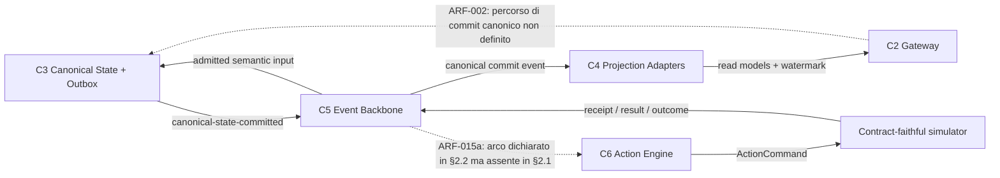

# OCOR ADD v1.0 — Independent Critical Review

# 1. Review Control

| Campo | Valore |
|---|---|
| Documento | `OCOR ADD v1.0 — Independent Critical Review` |
| Versione | `v1.0` |
| Data | 30 agosto 2026 |
| Oggetto | `OCOR_Architectural_Design_Document_v1.0.md` (`OCOR-ADD-1.0`) |
| Natura | Audit documentale indipendente, evidence-based |
| Autorità | Nessuna. La review non approva, non modifica sorgenti, non crea `DEC-*`, non chiude `OI-*`/`ASM-*`/`RSK-*` |
| Effetto probatorio | **Nullo.** `E1` ed `E2` restano `0` prima e dopo questa review |

## 1.1 Sorgenti e verifica di integrità

Pacchetto `OCOR_DDD_Execution_Context_v1.0.zip`. Tutti i digest sono stati ricalcolati e confrontati con `SHA256SUMS` e `CONTEXT_MANIFEST.json`.

| File | SHA-256 ricalcolato | Esito | Letto |
|---|---|---|---|
| `OCOR_Architectural_Design_Document_v1.0.md` | `1e0fe999d66b0133638293d9568f79fb861636f81bc939e170e7d6fa392d8fed` | **MATCH** — coincide con il digest atteso indicato nel mandato di review | integrale, 2342 righe fino a EOF |
| `OCOR_Decision_Register_v1.0.md` | `1a1adfb4a7a83b7f1aae85fd07d6349302bc7d5d0e805908ab5ec157a2a0da32` | MATCH | integrale |
| `OCOR_Decision_Traceability_Index_v1.0.md` | `f7f45763621d68df62f6e2e1ad3ac8f0554c65478d91e6dbf3cfd084f50a3123` | MATCH | integrale |
| `OCOR_Requirement_Register_v0.9.md` | `f8a25dd050caaa468001149abc92fa9e7713cc3ba17d61aab31bfee6af4008cd` | MATCH | integrale |
| `OCOR_Requirement_Traceability_Index_v0.9.md` | `a01400054e9f4871eb22062be7ede92064526a53232cf37e3eb3f4a5c95c08d1` | MATCH | integrale |
| `OCOR_CAP_ELM_Requirement_Crosswalk_v0.9.md` | `cc1af191625b8267ac588dcdba1941dc316c75cdcc84efd312e8e32a4a0aef3b` | MATCH | integrale |
| `OCOR_Registers_v0.9.md` | `3810de19c25b5fc3179cbcf2189bb663c684180424337790f1ae3583f2ab9f42` | MATCH | integrale |
| `README_FIRST.md`, `CONTEXT_MANIFEST.json` | `d940148d…`, `a9a4fa1e…` | MATCH (non normativi) | integrale |

`payload_size_bytes = 817449` dichiarato nel manifest coincide con la somma dei sette payload normativi. Nessun file assente, illeggibile o incoerente con il manifest.

I digest interni citati dall'ADD §1.1 per Decision Register (`1a1adfb4…`), Requirement Register (`f8a25dd0…`) e CAP/ELM Crosswalk (`cc1af191…`) coincidono con i file consegnati.

### `SOURCE LIMITATION` registrate

| ID | Limitazione | Conclusioni non traibili |
|---|---|---|
| `SL-01` | IRB v1.0 (`4cf1071c…`), Context Pack v1.0 (`16578fdc…`), Prompt Master (`3b8bd82e…`) e manifest IRB v1.0 (`1950e71e…`) sono citati in ADD §1.1 ma **non inclusi nel pacchetto** | Non è verificabile che l'ADD «concretizzi la IRB senza modificarla» (§1.1). Nessuna conclusione su fedeltà ADD↔IRB, né su completezza del Context Pack |
| `SL-02` | Il corpus baseline v0.9 (`7cc54e10…`) e il manifest v0.9 (`eec4132e…`) citati in `DEC-196` non sono inclusi | Non verificabile la catena di promozione v0.9 → v1.0 |
| `SL-03` | `GAP-18-002`–`GAP-18-011` e `GAP-COV-001`–`GAP-COV-014`, accettati da `DEC-196`, non compaiono in alcun registro del pacchetto | Non valutabile se l'ADD tratti, ignori o riapra tali gap |
| `SL-04` | Nessun artefatto eseguibile, fixture, build o telemetria | Nessuna conclusione su implementabilità effettiva, prestazioni o comportamento dei backend |

## 1.2 Review scope

In perimetro: ADD §1–§7 integrale; coerenza interna; coerenza con i sei registri; invarianti hard; contratti formali; scope fence; tracciabilità. Fuori perimetro: correttezza della IRB, merito delle singole `DEC-*`, valutazione di prodotto, qualsiasi verifica implementativa.

## 1.3 Standard applicati

`ISO/IEC/IEEE 42010:2022` (viewpoint, stakeholder concerns, correspondence rules, architecture rationale) · `IEEE 1016-2009` (design entity attributes: identification, type, purpose, function, subordinates, dependencies, interface, resources, processing, data) · `ISO/IEC/IEEE 12207:2017` (architecture definition e design definition process outcomes) · `C4 Model` L1/L2 · principi di formal systems engineering · secure-by-design, fail-safe, least privilege.

## 1.4 Evidence status della baseline (assunto, non verificato)

`E1=0`; `E2=0`; 285 requisiti, 284 `Confermato`, `FR-048` `Differito`, **0 `Verified`**; 26 `CAP` in `Design Target`; tecnologie in `Candidate Implementation`; 29 open issue accettati (`OI-001`, `OI-006`, `OI-008`–`OI-034`). Conforme a `DEC-196`.

## 1.5 Tool-backed check eseguiti e non eseguiti

| Controllo | Metodo | Esito |
|---|---|---|
| Digest di tutte le sorgenti | `sha256sum` | **EXECUTED** — 9/9 match |
| Parsing dei 3 blocchi JSON Schema | `json` + `jsonschema` 4.26 | **EXECUTED** — 3/3 parse |
| Meta-validazione JSON Schema 2020-12 | `Draft202012Validator.check_schema` | **EXECUTED** — 3/3 `PASS` |
| Conformance comportamentale degli schemi (16 casi positivi/negativi) | istanze costruite + validator | **EXECUTED** — 9 deviazioni rilevate |
| Parsing OpenAPI 3.1 + risoluzione `$ref` interni | `PyYAML` + risolutore | **EXECUTED** — parse OK; 23/23 `$ref` risolti; 0 schemi orfani; 0 schemi non definiti |
| Compilazione Protobuf | `grpc_tools.protoc` (proto3) | **EXECUTED** — compila senza errori né warning |
| Parsing RDF/Turtle | `rdflib` 7.6 | **EXECUTED** — 17 triple, parse OK |
| Bijezione FSM diagramma ↔ tabella transizioni | estrazione automatica archi/stati | **EXECUTED** — 4 disallineamenti |
| Universo ID e copertura tracciabilità | estrattore con espansione dei range | **EXECUTED** |
| Validazione semantica OpenAPI 3.1 con validator ufficiale | — | **NOT EXECUTED** — nessun validator OpenAPI 3.1 disponibile offline. Eseguita revisione strutturale + risoluzione `$ref`. **Non dichiarato superato** |
| Validazione SHACL delle shape di §3.6 | — | **NOT EXECUTED** — l'ADD descrive i vincoli SHACL in prosa, non fornisce shape graph. **Non dichiarato superato** |
| Rendering/validazione Mermaid | — | **NOT EXECUTED** — analisi testuale degli archi. **Non dichiarato superato** |
| Verifica delle proprietà dei backend candidati | — | **NOT EXECUTED e non eseguibile** in review documentale. Vedi §8 |

---

# 2. Executive Verdict

## `NOT READY FOR DDD`

L'ADD è un documento architetturale di qualità superiore alla media per rigore epistemico e disciplina probatoria. La separazione `Observation/Claim ≠ Canonical State ≠ Projection ≠ Prediction ≠ Intervention ≠ Action ≠ Outcome` è mantenuta senza eccezioni; l'evidence fence è applicato correttamente in ogni sezione; non è stato trovato **alcun** claim di parità, sicurezza, performance, portabilità o readiness non supportato; `DEC-197` è trattato correttamente come sola numerazione futura. Tutti i blocchi formali parsano e meta-validano.

Il verdetto negativo non deriva dalla qualità complessiva né dall'assenza di evidenza — correttamente dichiarata e non computata come difetto — ma da **tre contraddizioni/omissioni che impediscono di avviare un DDD coerente senza decisioni architetturali implicite**:

1. **`ARF-001`** — Il set di metadati che §1.4 dichiara obbligatorio su *ogni* chiamata ed evento non è trasportabile da nessun contratto normativo dell'ADD. `organization_id` compare una sola volta nell'intero documento (§1.4 stesso) e in zero contratti; `purpose`, `policy_bundle_digest`, `ontology_release_digest` e `actor_chain` sono assenti dal Canonical Ingestion Envelope, che è `additionalProperties: false`. La chiave di isolamento `(tenant_id, domain_id, compartment, purpose, marking, release_digest)` non è quindi costruibile per un evento ingerito. Verificato con validator: l'envelope **rigetta** tutti e cinque i campi.
2. **`ARF-002`** — Non esiste un percorso definito da `Decision` a mutazione canonica. §2.2 specifica che l'input di `C3` include `Decision e Authority ref`, ma nessun subsystem è incaricato di produrlo, la FSM §4.1 termina soltanto in dispatch verso adapter esterno, e §2.1 non ha alcun arco verso `C3` da `C6` o dal control plane. L'ammissione Claim → `CanonicalAssertion`, cuore epistemico del sistema, è priva di control flow.
3. **`ARF-003`** — Lo scope del single-writer è indeterminato: §2.4 impone «Solo `C3`, per ownership boundary **e branch**», mentre §2.5.2, §2.2 (`C7`), §1.4 (`TB-CXT-07`) e §4.2 lo limitano coerentemente a `main` e contemplano esplicitamente overlay di scenario implementati come branch TerminusDB.

La distanza da `READY FOR DDD WITH CONDITIONS` è **piccola e delimitata**: sei emendamenti puntuali (§12) chiudono i tre blocker senza riscrivere l'ADD e senza toccare le decisioni di baseline. Le quattro `CRITICAL` restanti riguardano direzione della propagazione dei marking, quorum di approvazione nei tool contract, punto di valutazione della guardia di emergency stop e disposizione terminale di `EXECUTION_UNKNOWN`: tutte correggibili in change control ordinario.

---

# 3. Architecture Scorecard

Scala 0–5. Ogni voto è motivato e riferito.

| # | Dimensione | Voto | Motivazione e riferimento |
|---|---|:--:|---|
| 1 | Baseline consistency | **5** | Digest interni coincidenti (§1.1 vs `SHA256SUMS`); evidence fence ripetuto e coerente in §1.1, §1.5, §2.5.10, §3 preambolo, §4 preambolo, §5 preambolo, §6 preambolo, §7.2, §7.3; scan lessicale su claim assoluti: **zero** occorrenze non negate; `DEC-197` citato solo come progressivo futuro (`DEC-196`), mai come decisione; 29 open issue enumerati correttamente (`OI-001`+`OI-006`+`OI-008`–`034` = 29) |
| 2 | Architectural completeness | **3** | `C1`–`C8` specificati con I/O, statefulness, storage, failure domain, moduli interni e port (§2.2, §2.2.1): livello IEEE 1016 pieno. Ma §3 fornisce contratti normativi per 4 dei 6 `ContractDefinition.kind` dichiarati in §3.1.1 — mancano `ACTION` ed `EVENT` (`ARF-009`) — e manca il percorso di mutazione canonica (`ARF-002`) |
| 3 | Concern separation | **4** | §1.3 è esemplare: undici concern con autorità, persistenza e regola di separazione distinte; `Receipt ≠ ExecutionResult ≠ OutcomeAssessment`, `Recommendation ≠ Decision`, `Approval ≠ Decision`, `Intervention ≠ Action` tutti espliciti e mantenuti in §4.1.2 e §4.2. Penalizzato dalla contraddizione sullo scope di scrittura `C3`/`C7` (`ARF-003`) |
| 4 | Interface quality | **3** | 3/3 JSON Schema meta-validano; OpenAPI 3.1 parsa con 23/23 `$ref` risolti e zero schemi orfani; Protobuf compila pulito. Ma schemi chiusi impediscono i campi obbligatori di §1.4 (`ARF-001`), `Problem` non può trasportare il contesto di versione richiesto da §2.5.5 (`ARF-008`), e il MCP contract non enforza `G-CONTRACT` (`ARF-010`, verificato con 4 casi) |
| 5 | Distributed consistency | **4** | Modello corretto e completo: commit locale atomico `(delta, revision+1, commit_id, OutboxEntry[])` (§2.3), niente 2PC/XA/ACID globale/multi-master/triple-write (§1.3, §6.2), at-least-once esplicito, dedup `(store, branch, commit_id)`, ordering solo per `ordering_key`, watermark atomico ai facts (§2.5.3, §6.2.5), «mai reverse-write» (§2.3), tabella delle finestre di crash completa. Penalizzato solo da `ARF-003` |
| 6 | Security | **3** | Zero-Trust ben costruito: formula dell'Authority effettiva come intersezione sulla catena (§5.1), `DelegationGrant` con nonce/parent digest/`confirmation_key_thumbprint`, `redelegation_allowed=false` di default, SoD per sei classi di operazione (§5.4), break-glass bounded con divieti espliciti (§5.5), `stop_epoch` firmato. Ma la formula di propagazione dei marking è anti-conservativa per i controlli di disseminazione (`ARF-004`), il tool contract ammette quorum vuoto (`ARF-005`), e l'algebra dei marking non è definita (`ARF-012`) |
| 7 | Causal safety | **4** | Identify-or-abstain corretto e strutturale (§4.2): `ABSTAIN` obbligatorio con reason code, `ABSTAIN` privo di effect estimate, `REJECTED`/`FAILED` distinti, isolamento copy-on-write per `(scenario_id, run_id, compartment)`, baseline read-only, rebase non riscrive, `do(X)` definito formalmente come sostituzione di \(F_X\) e rimozione degli archi entranti, `ELM-070` correttamente differito con `REJECTED{CAPABILITY_DEFERRED}`. Penalizzato da sovrapposizione dei reason code (`ARF-024`) e da `ARF-003` |
| 8 | Multi-agent governance | **4** | Agente come Principal distinto con workload identity per tipo/istanza/run; divieto esplicito di credenziali datastore (§5.2.6); taint su Goal/Plan/Message/Memory/tool output (§4.3.1.3); handoff tipizzati e mediati con `HandoffEnvelope` completo; Challenger con snapshot immutabile e budget indipendente, output non sopprimibile (§4.3.1.7); Critical Dissent bloccante per High-Impact (§4.3); «Nessun agente possiede `approve`». Penalizzato da `ARF-016` (collisione «lease») e dal fatto che il fence PoC su `EXECUTE_APPROVED` vive solo in prosa |
| 9 | Resilience | **3** | Backup authority-aware con nove classi distinte e sorgente di ricostruzione dichiarata (§6.4) è di qualità notevole; recovery gate a dieci passi con riautorizzazione umana finale (§6.5); safe-degraded per otto fault (§6.3). Ma `EXECUTION_UNKNOWN`/`COMPENSATION_UNKNOWN` non hanno disposizione terminale alla scadenza della reconciliation (`ARF-007`) e la guardia di stop non è al punto di emissione (`ARF-006`) |
| 10 | Traceability | **2** | `CAP` 25/26 allocate (`CAP-026` correttamente esclusa), `ELM` 103/103, `RSK` 60/60: copertura piena e verificata. Ma §7 alloca **0/23 `ARC-*`** benché §1.1 dichiari `ARC-001`–`ARC-023` vincolanti; `BR` 6/18; 15 `FR` e 10 `NFR` assenti dall'intero documento, fra cui i P0 `FR-007`, `FR-009`, `FR-011`, `FR-012`, `FR-016`, `NFR-001`, `NFR-008` (`ARF-013`) |
| 11 | Implementation readiness | **2** | Tre `BLOCKER` aperti obbligano il DDD a scelte architetturali implicite su isolamento, ammissione canonica e single-writer. Il resto è sufficientemente preciso: profili temporali candidati, guardie formali, port vendor-neutral e failure posture sono tutti al livello richiesto |

**Media aritmetica: 3,4 / 5.**

---

# 4. Hard-Invariant Audit

Risultati ammessi: `PASS`, `PASS WITH CONDITION`, `FAIL`, `NOT EVALUABLE`.

## 4.1 Separazione epistemica (§6.1 del mandato)

| Invariant | Result | Evidence | Gap | Required correction |
|---|---|---|---|---|
| `Observation/Claim ≠ Canonical State ≠ Projection ≠ Prediction ≠ Intervention ≠ Action ≠ Outcome` | `PASS` | ADD §1.3 (tabella a 11 righe con autorità e regola di separazione per concern); formula esplicita §1.3; ribadito §3.2 regole runtime, §3.6 invariante 1 | — | — |
| `Receipt ≠ ExecutionResult` | `PASS` | §1.3 riga `ExecutionResult`: «Receipt, ACK e risultato non sono Outcome»; §4.1.2 `ACT-T15` «Registra ricezione, **non successo operativo**»; §4.1 «Un ACK prova soltanto la ricezione» | — | — |
| `ExecutionResult ≠ OutcomeAssessment` | `PASS` | §1.3 riga `OutcomeAssessment`: «Riferisce l'ExecutionResult senza coincidere con esso»; §4.1.2 `ACT-T22`; §4.1 chiusura | — | — |
| `Recommendation ≠ Decision` | `PASS` | §1.3 riga Decision: «Recommendation, Goal o prompt non concedono Authority»; §4.2 «`SimulationResult` può generare soltanto `Recommendation` o `DecisionProposal`»; §3.4 `ModelOutputKind` | — | — |
| `Approval ≠ Decision` | `PASS` | §5.4: «Approval non equivale a Decision e non crea Authority»; FSM separa `APPROVAL_RESOLVED` → `DECISION_PENDING` → `INTENT_RECORDED`; `ACT-T07` «non simula Approval umana» | — | — |
| `Decision ≠ ActionIntent` | `PASS` | §4.1.2 `ACT-T10` (Decision) e `ACT-T11` (derivazione intento) sono transizioni distinte; §4.1 elenca i record come «distinti, immutabili, correlati e append-only» | — | — |
| `ActionIntent ≠ ActionCommand` | `PASS` | §4.1.2 `ACT-T11` «Registra `ActionIntent`… **senza command**»; `ACT-T12` registra il command | — | — |
| `Intervention ≠ Action` | `PASS` | §1.3 riga Intervention; §4.2 «Non equivale a property update, branch edit o Action»; §2.2 `C7`: «Nessuna identity del subsystem può… produrre ActionCommand» | — | — |
| Nessuna promozione automatica `Claim → CanonicalAssertion` | `PASS WITH CONDITION` | §3.6 invariante 1: Claim e CanonicalAssertion sono «specializzazioni sorelle di `Assertion`, non una relazione di sottotipo reciproca»; richiesti `acceptedFromClaim` + `acceptedByDecision` + Authority; SHACL richiesto | Il **divieto** è impeccabile; il **percorso lecito** di ammissione non è definito da alcun subsystem o flusso (`ARF-002`) | Definire in §2.2/§2.5/§4.1 quale subsystem produce la commit request governata e quale Decision la autorizza |

## 4.2 Consistenza distribuita (§6.2)

| Invariant | Result | Evidence | Gap | Required correction |
|---|---|---|---|---|
| Single writer per ownership boundary | `FAIL` | §2.2 `C3` «un writer logico per aggregate/branch»; §6.2.1; §6.1 «Single writer canonico per boundary» — **ma** §2.4 «Solo `C3`, per ownership boundary e branch» contraddice §2.5.2 «Solo `C3` … un commit su `main`», §2.2 `C7`, §1.4 `TB-CXT-07` e §4.2 | Lo scope dell'esclusività di scrittura è indeterminato; §4.2 contempla overlay come branch TerminusDB scritti dall'adapter di `C7` | `ARF-003`: emendare la cella §2.4 |
| Transazione locale State Delta + Outbox | `PASS` | §2.3: `(aggregate_delta, aggregate_revision+1, canonical_commit_id, OutboxEntry[])` nello stesso commit locale; §6.2.2; «Il broker non partecipa al commit» | Assunzione backend non verificata (§8, `BA-01`), ma **correttamente dichiarata** `CI` | — |
| Assenza di 2PC/XA | `PASS` | §1.3; §2.2 `C3` «Nessun 2PC»; §4.1 «Non è ammessa alcuna transazione distribuita globale»; §6.2 | — | — |
| Assenza di ACID globale | `PASS` | §1.3; §6.2 intestazione | — | — |
| Assenza di triple-write sincrono | `PASS` | §1.3; §6.2 intestazione | — | — |
| Assenza di multi-master | `PASS` | §1.3; §6.2; `ARC-020` recepito in §6.2 «ogni bounded context ha un solo writer logico» | — | — |
| At-least-once delivery | `PASS` | §2.2 `C5`; §2.5.4; §6.2.3; «nessun claim exactly-once end-to-end» (§2.2 `C5`, §3.2) | — | — |
| Idempotency e fencing | `PASS` | §2.5.4; `MutationFence` §6.2; `writer_epoch`; §4.1.2 `ACT-T02`/`T03`/`T12`/`T19`; §2.2 `C3` «Writer stale respinto mediante fencing» | — | — |
| Ordering limitato alla partition key | `PASS` | §2.2 `C5` «Ordering per `ordering_key`»; §3.2 regole runtime «Ordering è garantito soltanto per `ordering_key` nella relativa partizione» | — | — |
| Watermark e facts atomicamente visibili | `PASS` | §2.5.3; §6.2.5 «stessa transazione locale oppure tramite versioned dataset e atomic pointer switch» | Assunzione backend (§8, `BA-02`), dichiarata | — |
| Nessun reverse-write dalle proiezioni | `PASS` | §2.3 riga «Divergenza checksum»: «Reconciler … ricostruisce; **mai reverse-write**»; §6.2.7; §2.4 write policy `LogicProjection`/`W3CBoundary` | — | — |

## 4.3 Adapter isolation (§6.3)

| Invariant | Result | Evidence | Gap | Required correction |
|---|---|---|---|---|
| Triade come reference adapter sostituibili | `PASS` | §2.4 ruoli logici `VersionedAssertedState`/`LogicProjection`/`W3CBoundary` con colonna «Sostituibilità richiesta»; §7.3; coerente con `ARC-022` e `DVG-001` (`DEC-005` reference profile vs `DEC-020` ruolo logico) | — | — |
| Nessun dialect nei contratti pubblici (SQL/Cypher/TypeQL/SPARQL/WOQL/Datalog) | `PASS` | §2.2 `C2` «Zero raw SQL/Cypher/Datalog/TypeQL/WOQL/SPARQL»; §3 preambolo; §1.4 `TB-CXT-06`; §2.4 riga «Query dialect esposto ad app/agenti» = `unsupported` ovunque. **Verificato**: scan dei 4 blocchi formali — zero occorrenze di dialect backend | — | — |
| Nessun backend ID o schema fisico nei contratti | `PASS` | §3 preambolo; `stableId` pattern `^urn:ocor:…` in tutti gli schemi; `ResourceRef` tipizzato; §3.1.1 `Namespace` «nessun nome o ID backend» | — | — |
| Dialect confinati alle implementazioni private degli adapter | `PASS` | §2.4; §4.2 «L'eventuale implementazione tramite branch TerminusDB o altro backend resta confinata nell'adapter»; §5.1 adapter crittografici vendor-neutral | — | — |
| Vocabolario di disposizione delle capability univoco | `FAIL` | §2.4 usa `unsupported` per quattro semantiche incompatibili (gap dell'adapter / divieto architetturale / scoping di ruolo / elemento differito), mentre §3.1.1 rende `unsupported` bloccante per la release | Il compilatore non può distinguere un gap da un divieto voluto | `ARF-011` |

## 4.4 Governed agents (§6.4)

| Invariant | Result | Evidence | Gap | Required correction |
|---|---|---|---|---|
| Agente come Principal distinto | `PASS` | §1.2; §4.3.1.1 «workload identity distinta per tipo, istanza e run; account condivisi e credenziali backend sono vietati»; §5.1 riga Agent identity | — | — |
| Assenza di credenziali datastore | `PASS` | §5.2.6 elenco esplicito (TypeDB, TerminusDB, Jena, broker, workflow DB, secret store); §1.4 `TB-CXT-03`; §2.2 `C8` | — | — |
| Capability allow-list | `PASS` | §1.4 `TB-CXT-03`; §4.3.1.4; §3.5 «tool non allow-listed non sono capability esportabili» | — | — |
| Delegation bounded | `PASS` | §5.2 `DelegationGrant` con `max_chain_depth`, `not_before`/`expires_at`, `effect_ceiling`, `risk_ceiling`, `redelegation_allowed=false` default, `parent_grant_digest`, nonce; §5.1 formula di intersezione | — | — |
| Prompt, Goal, Message, Memory e tool output tainted | `PASS` | §2.5.7; §4.3.1.3; §5.3 riga «Agent context e Memory» con `instructionEligible`; §3.5 chiusura | — | — |
| Nessuna Authority derivata dal prompt | `PASS` | §1.3; §3.5 «Prompt, Goal, Message o Memory non modificano il Tool Contract e non concedono Authority»; §5.2 preambolo «non derivabile da prompt, Memory, Goal, Plan o Message»; §3.3 e §3.4: Principal dal transport security context, non dal body | — | — |
| Handoff tipizzati e mediati | `PASS` | §4.3 «ogni handoff attraversa il Governed Agent Kernel»; `HandoffEnvelope` (23 campi); «Non esistono comunicazioni peer-to-peer non osservate» | — | — |
| Challenger indipendente | `PASS` | §4.3 tabella ruoli; §4.3.1.7 «snapshot immutabile e budget indipendente; il Coordinator non può alterarne o sopprimerne l'output» | — | — |
| Dissent non sopprimibile | `PASS` | §4.3 riga Challenger «dissent non cancellabile»; riga Coordinator «Nessuna … soppressione del dissent»; §3.6 invariante 6 | — | — |
| Critical Dissent bloccante per High-Impact | `PASS` | §4.3: «Un Dissent Record Critical relativo a identity ambiguity, policy violation, causal abstention o provenance gap **blocca** la proposta High-Impact» | — | — |
| Revoca, budget e kill switch | `PASS WITH CONDITION` | §4.3.1.6 e §4.3.1.8; §2.2 `C8`; §5.2.5; §5.5 | §5.5 fonda la contenzione ≤10 s su una `capability lease` TTL ≤5 s, mentre §4.3.1.9 e §7.1 dichiarano il PoC «budget **senza lease**» (`ELM-080` differito); i due usi di «lease» non sono definiti né distinti | `ARF-016` |
| Nessun agente possiede `approve`; tier PoC = observe/analyze/simulate/propose | `PASS WITH CONDITION` | §4.3.1.2 | Il fence è solo in prosa: lo schema §3.5 ammette senza condizioni `effect_class: EXECUTE_APPROVED_ACTION` e il tier `EXECUTE_APPROVED` nel profilo PoC | `ARF-010` |

## 4.5 Causal safety (§6.5)

| Invariant | Result | Evidence | Gap | Required correction |
|---|---|---|---|---|
| Identify-or-abstain | `PASS` | §4.2 diagramma decisionale: `Estimand identified?` → No → `ABSTAIN: NOT_IDENTIFIED`; `CausalRunOutcome` | — | — |
| Validity envelope | `PASS` | §4.2 secondo gate; §3.4 `ValidityAssessment` con `inside_envelope`, `envelope_version`, `failed_conditions`; `ModelDescriptor.validity_envelope_ref` | — | — |
| `ABSTAIN` obbligatorio se non identificabile | `PASS` | §4.2; §2.2 `C7` failure posture; §3.4 «Un Model fuori validity envelope restituisce `abstention`, mai output canonico» | — | — |
| Reason code esplicito | `PASS WITH CONDITION` | §4.2 tabella a 8 reason code; `failed_conditions` obbligatorio per `OUTSIDE_VALIDITY_ENVELOPE` | `OUT_OF_DISTRIBUTION` è definito come sottoinsieme stretto di `OUTSIDE_VALIDITY_ENVELOPE`, senza regola di disambiguazione | `ARF-024` |
| Nessun effect estimate utilizzabile dentro `ABSTAIN` | `PASS` | §4.2: la variante `ABSTAIN` non contiene `effect_estimate`; asserzione esplicita «`ABSTAIN` non contiene un Effect Estimate utilizzabile» e divieto di conversione automatica | `diagnostics` non è schematizzato (`ARF-026`, `OBSERVATION`) | — |
| Isolamento copy-on-write | `PASS` | §4.2 «baseline montata read-only; ogni ipotesi è un delta append-only in overlay copy-on-write isolato per `(scenario_id, run_id, compartment)`»; §1.4 `TB-CXT-07` | — | — |
| Nessun commit su `main` | `PASS` | §2.2 `C7`; §4.2 «Ogni tentativo di merge diretto o emissione di Action Command è negato e auditato»; §1.4 `TB-CXT-07` «assenza tecnica della capability `main.write`»; §7.1 | Vedi `ARF-003` per lo scope dei branch non-`main` | — |
| `do(X) ≠ Action` | `PASS` | §4.2 formalizzazione SCM \(M_{do(X=x)}\) + «Non equivale a property update, branch edit o Action»; `ARC-012` recepito | — | — |
| `ELM-070` correttamente differito | `PASS` | §4.2: contratto «riconosciuto e validabile», esecuzione → `REJECTED{reason=CAPABILITY_DEFERRED, element=ELM-070}`; §7.1 coerente; `do(X)` e confronto interventistico P0 restano attivi | Il codice `CAPABILITY_DEFERRED` non è esprimibile nell'enum chiuso del Gateway (`ARF-008`) | — |

## 4.6 Action safety (§6.6)

| Invariant | Result | Evidence | Gap | Required correction |
|---|---|---|---|---|
| Pre-admission failure | `PASS` | §4.1: gate pre-admission prima della creazione della FSM; `SCHEMA_VIOLATION`/`CONTRACT_REJECTED`; «**non crea** un'`ActionInstance`; pertanto nessuna transizione, Approval o idempotency receipt esecutiva può derivarne» | — | — |
| Tutte le guardie | `PASS WITH CONDITION` | §4.1.1: `G-CONTRACT`, `G-AUTHORITY`, `G-APPROVAL`, `G-DECISION`, `G-FRESHNESS`, `G-DISPATCH`, tutte con condizioni congiuntive esplicite | `G-DISPATCH` (che contiene «Emergency stop inattivo») è valutata a `ACT-T12`; `ACT-T14`, che emette realmente, è guardata solo da «Command non scaduto»; nessuna guardia include la disponibilità dell'audit append, che §5.1/§6.3 rendono fail-closed per il dispatch | `ARF-006` |
| Famiglia `ACT-T01`–`ACT-T23` | `PASS` | **Verificato automaticamente**: 26 identificatori presenti — `T01`–`T23` più `T21a`, `T21b`, `T21c`, senza buchi né duplicati | — | — |
| Presenza di `ACT-T21a`, `ACT-T21b`, `ACT-T21c` | `PASS` | §4.1.2: esito definitivo, timeout ambiguo → `COMPENSATION_UNKNOWN`, reconciliation «senza inferenze da assenza di risposta» | — | — |
| Semantica di `EXECUTION_UNKNOWN` | `PASS WITH CONDITION` | §4.1 «non equivale né a successo né a fallimento e non abilita retry ciechi»; `ACT-T18` sospende i retry e apre reconciliation; §6.3 e §6.5.8 coerenti | Nessuna disposizione terminale alla scadenza del `reconciliation deadline` `PT15M`; nessuna guardia impedisce nuove azioni sullo stesso aggregate con effetto esterno irrisolto | `ARF-007` |
| Semantica di `COMPENSATION_UNKNOWN` | `PASS WITH CONDITION` | §4.1 «stato specializzato della semantica `EXECUTION_UNKNOWN`: non equivale a fallimento e non abilita retry ciechi» | Stesso gap di `ARF-007`; **verificato sul grafo**: gli unici archi uscenti richiedono evidenza positiva | `ARF-007` |
| ACK distinto dal successo | `PASS` | `ACT-T15` «Registra ricezione, non successo operativo»; §4.1 chiusura | — | — |
| Nessun retry cieco | `PASS` | `ACT-T19` richiede «Operazione **provatamente idempotente**, stessa key, fence corrente e retry budget»; `ACT-T18` sospende; §6.3; `FR-163`/`RSK-054` recepiti | — | — |
| Compensation come nuova azione governata | `PASS` | §4.1: «non è rollback implicito: è una nuova operazione governata con idempotency key, fencing, Delivery Attempt ed Execution Result propri»; `ACT-T21` «Crea una nuova command»; §2.2 `C6` «compensation non cancella la storia» | — | — |
| Human Gate e Dual Control | `PASS WITH CONDITION` | §5.4 quattro classi di rischio; `R3_HIGH_IMPACT` = due approvatori indipendenti + SoD; `G-APPROVAL` «nessun approvatore coincide col proposer»; `GatePackage` congelato; `ApprovalSet` scade a 10 minuti, non rinnovabile; §3.5 `self_approval_allowed: {const: false}` | **Verificato con validator**: il contratto MCP accetta `EXECUTE_APPROVED_ACTION` + `HUMAN_GATE` con `independent_approver_count` omesso o `0` | `ARF-005` |

**Sintesi:** 38 `PASS`, 8 `PASS WITH CONDITION`, 2 `FAIL`, 0 `NOT EVALUABLE`.

---

# 5. Findings Register

Ordinati per severità e dipendenza. `ARF-001`…`ARF-027`.

| ID | Severity | Conf. | ADD locator | Related IDs | Finding | Evidence | Impact | Exact remediation | Disposition |
|---|---|---|---|---|---|---|---|---|---|
| `ARF-001` | `BLOCKER` | `HIGH` | §1.4 (righe 109–125) vs §3.2 schema `canonical-ingestion-envelope:1.0`, §3.3 `QueryContext`, §3.4 `InvocationContext`, §4.3 `HandoffEnvelope`, §5.3 `SecurityContext`, §6.3 | `FR-006`, `FR-131`, `NFR-006`, `NFR-040`, `RSK-020`, `RSK-035`, `TB-CXT-05`, `ELM-049` | §1.4 impone che «ogni chiamata, evento, cache entry, embedding, log, explanation e artefatto derivato» trasporti 11 campi, e definisce la chiave di isolamento `(tenant_id, domain_id, compartment, purpose, marking, release_digest)`. Nessun contratto normativo dell'ADD trasporta quel set. `organization_id` compare **una sola volta in tutto il documento**, in §1.4 stesso. L'envelope di ingestione è `additionalProperties: false` e non ha `purpose`, `policy_bundle_digest`, `ontology_release_digest`, `actor_chain`, `organization_id` | **Tool-verified**: il validator rigetta l'envelope se si aggiunge uno qualsiasi dei cinque campi (5/5 `REJECTS`). Conteggio testuale: `organization_id` = 1 occorrenza totale | Un evento ammesso non è assegnabile alla chiave di isolamento come definita. §5.3 riga «Eventi e DLQ» e la propagazione conservativa non sono implementabili sul percorso di ingestione. Il DDD non può derivare la superficie di enforcement di `TB-CXT-05` | Aggiungere a §3.2 i campi `organization_id`, `purpose`, `ontology_release_digest`, `policy_bundle_digest`, `actor_chain` (quest'ultimo assegnato dall'ingress boundary, come `ingest_time`), inserendoli in `required`; **oppure** definire in §3.2 un secondo tipo, `AdmittedEventEnvelope`, che l'ingress produce dall'envelope esterno e che porta il set §1.4, dichiarando esplicitamente che §1.4 si applica a quello e non al wire format esterno. Allineare §1.4 al risultato | `VALID` |
| `ARF-002` | `BLOCKER` | `HIGH` | §2.2 riga `C3` (input «…Evidence, Decision e Authority ref»), §2.2.1 port `AdmitClaim`, §2.1 diagramma, §4.1 FSM, §5.4 tabella classi, §3.6 invariante 1 | `ARC-014`, `FR-002`, `FR-005`, `FR-012`, `FR-130`, `FR-149`, `FR-150`, `DEC-142`, `DEC-143`, `RSK-042` | L'ADD definisce la **forma** della commit request governata (include `Decision e Authority ref`) ma non il **percorso**: nessun subsystem è incaricato di produrla; `AdmitClaim` compare una sola volta, nella tabella dei port; la FSM §4.1 termina solo in dispatch verso adapter esterno (`DISPATCHED`→`ACKNOWLEDGED`→`EXECUTION_CONFIRMED` via receipt esterno) e non ha ramo di commit canonico; §2.1 non ha archi `C6`→`C3` né `CP`→`C3` mutativi. §5.4 `R2_CONTROLLED` («mutazione interna reversibile e confinata, un approvatore umano indipendente») non è agganciata ad alcun flusso | Grep: `AdmitClaim` 1 occorrenza (§2.2.1); `CommitAggregate` 1 occorrenza (§2.2.1); §2.3 descrive solo `commitAggregate` come operazione, senza chiamante. §3.4 rinvia a «una Function-backed Action» un concetto che §3 non contrattualizza | Il percorso Claim → `CanonicalAssertion` — il cuore epistemico del sistema e l'oggetto di `FR-012`/`FR-149`/`FR-150` — non è progettabile. Il DDD dovrebbe inventare sia il control flow sia l'allocazione a subsystem, cioè prendere una decisione architetturale implicita vietata da §1.1 | Aggiungere a §2.5 una regola di interazione che nomini il produttore della commit request governata e il tipo di Decision che la autorizza; aggiungere in §4.1 un ramo terminale `CANONICAL_COMMIT_*` **oppure** definire in §4 un secondo workflow «Internal Governed Mutation» con guardie proprie; aggiungere l'arco corrispondente in §2.1 | `VALID` |
| `ARF-003` | `BLOCKER` | `HIGH` | §2.4 tabella «Reference triad isolation», riga `VersionedAssertedState`, colonna «Write policy» vs §2.5 regola 2, §2.2 riga `C7`, §1.4 `TB-CXT-07`, §4.2, §6.4 | `ARC-007`, `ARC-020`, `ARC-021`, `DEC-148`, `FR-154`, `RSK-044`, `RSK-053` | Quattro affermazioni normative danno due scope diversi all'esclusività di scrittura di `C3`. §2.4: «Solo `C3`, per ownership boundary **e branch**». §2.5.2: «Solo `C3` può chiedere al `VersionedAssertedState` un commit **su `main`**». §2.2 `C7`: «Nessuna identity del subsystem può scrivere **su `main`**». §1.4 `TB-CXT-07`: «assenza tecnica della capability **`main.write`**». §4.2 contempla esplicitamente l'overlay di scenario «tramite branch TerminusDB», scritto da `appendOverlay` nell'adapter di `C7` | Citazioni testuali dirette; §6.4 classifica «scenario genealogy» sotto *Canonical authority*, rafforzando la lettura che gli scenari vivano nello stesso store | Il DDD non può decidere se l'overlay di scenario sia un branch dello stesso store `VersionedAssertedState` (lettura §2.5.2/§4.2) o debba essere uno store fisicamente separato (lettura §2.4). La scelta determina l'enforcement di `TB-CXT-07`, il modello di fencing, il confine delle classi di backup §6.4 e la sufficienza dell'assenza di `main.write` | Emendare la cella §2.4 in: «Solo `C3` per commit su `main`; scritture su branch di scenario esclusivamente tramite `ScenarioOverlayStore` di `C7`, senza capability `main.write` e senza pubblicazione di outbox». Aggiungere in §2.5 una regola che vincoli il relay outbox al solo branch `main` | `VALID` |
| `ARF-004` | `CRITICAL` | `HIGH` | §5.3 formule di propagazione vs §3.2 `$defs.marking.dissemination_controls`, §1.4, §3.6 invariante 7 | `FR-131`, `FR-132`, `NFR-006`, `RSK-006`, `RSK-020`, `RSK-035`, `RSK-049`, `OI-021` | §5.3 definisce `Dissemination(d) = ⋂ᵢ Dissemination(xᵢ)`. Il campo omonimo nello schema normativo si chiama `dissemination_controls`, cioè **restrizioni**. Per restrizioni, l'operazione conservativa è l'unione: con `x₁ = {NOFORN}` e `x₂ = {}`, l'intersezione produce `{}` e il derivato **perde** il controllo | §3.2 righe 567–571 (`dissemination_controls`); §5.3 formula; §1.4 «Il marking derivato è il `conservative_join`»; §3.6 invariante 7 «marking non meno restrittivo del join» | Declassificazione silenziosa per derivazione, senza l'attività governata di sanitizzazione che §5.3 e §3.6 richiedono. Vettore diretto di leakage cross-compartment su cache, explanation, embedding ed export. Contraddice il criterio di accettazione §7.2 «Marking non decresce» | Scegliere una delle due e applicarla ovunque: **(a)** mantenere la semantica di restrizione e correggere §5.3 in `Dissemination(d) = ⋃ᵢ Dissemination(xᵢ)`; **(b)** adottare la semantica allow-list, rinominare il campo in `permitted_dissemination` in §3.2 e in `SecurityContext.dissemination_rules[]`, e mantenere `⋂`. L'opzione (a) è coerente con la denominazione attuale | `VALID` |
| `ARF-005` | `CRITICAL` | `HIGH` | §3.5 schema `mcp-tool-contract:1.0`, blocco `approval` e `allOf` | `FR-003`, `FR-137`, `NFR-005`, `DEC-033`, `DEC-131`, `RSK-055`, `OI-024` | `independent_approver_count` non è in `approval.required` (che contiene solo `mode`, `self_approval_allowed`, `timeout_action`) e il vincolo `const: 2` scatta solo per `risk_class ∈ {HIGH, CRITICAL}` o `mode = DUAL_CONTROL`. Un contratto `effect_class: EXECUTE_APPROVED_ACTION` con `risk_class: MEDIUM` e `approval.mode: HUMAN_GATE` può quindi dichiarare `independent_approver_count: 0`, o ometterlo | **Tool-verified**: entrambe le istanze sono `ACCEPTS`; il minimo dichiarato per il campo è `"minimum": 0` | Il contratto normativo — che §3.7 e §2.2 `C1` designano come gate di completezza («Contract incompleto non esportato») — ammette un tool che esegue un'azione approvata con quorum umano vuoto. §5.4 `R2_CONTROLLED` richiede un approvatore indipendente, ma il vincolo vive solo in prosa | Aggiungere un ramo `allOf`: se `approval.mode = HUMAN_GATE` allora `approval.required` include `independent_approver_count` con `minimum: 1`. Aggiungere un ramo: se `effect_class = EXECUTE_APPROVED_ACTION` allora `approval.mode ∈ {HUMAN_GATE, DUAL_CONTROL}` **e** `independent_approver_count ≥ 1` | `VALID` |
| `ARF-006` | `CRITICAL` | `HIGH` | §4.1.1 `G-DISPATCH`; §4.1.2 `ACT-T12`, `ACT-T14`, `ACT-T19`, `ACT-T23`; §4.1.3 `predispatch_fence_ttl`; §5.5; §5.1 riga Audit; §6.3 | `NFR-047`, `FR-138`, `FR-139`, `DEC-132`, `RSK-037`, `RSK-054` | `G-DISPATCH` contiene «Emergency stop inattivo» ma è valutata a `ACT-T12` (→`COMMAND_READY`). La transizione che emette realmente, `ACT-T14` (relay outbox → `DISPATCHED`), è guardata **solo** da «Command non scaduto», con `predispatch_fence_ttl = PT30S` e `decision_dispatch_ttl = PT5M`. `ACT-T19` (retry) è guardata da «fence corrente», termine non legato a `stop_epoch`. `ACT-T23` risolve lo stop solo «Prima del dispatch», senza regola di precedenza rispetto a un relay concorrente. Nessuna guardia include la disponibilità dell'audit append, che §5.1 e §6.3 rendono fail-closed per il dispatch | Testo delle guardie e della tabella transizioni; `MutationFence` (§6.2) contiene `stop_epoch`, ma la tupla `ActionInstance` (§4.1) e l'effetto durevole di `ACT-T12` non lo registrano | Finestra fino a 30 s in cui un command già `COMMAND_READY` può raggiungere l'adapter dopo l'attivazione dell'emergency stop, senza rivalutazione di `stop_epoch`: il target `≤10 s` di `NFR-047` non è garantito dalla tabella normativa. Analogamente, un dispatch può avvenire con audit append indisponibile | Aggiungere `stop_epoch` alla tupla `ActionInstance` e all'effetto durevole di `ACT-T12`; portare la guardia di `ACT-T14` a «Command non scaduto **∧ `G-DISPATCH` rivalutata ∧ `stop_epoch` invariato ∧ audit append disponibile**»; estendere la stessa condizione ad `ACT-T19`; enunciare in §4.1.2 la precedenza di `ACT-T23` su `ACT-T14` | `VALID` |
| `ARF-007` | `CRITICAL` | `HIGH` | §4.1 diagramma di stato; §4.1.2 `ACT-T18`, `ACT-T20`, `ACT-T21b`, `ACT-T21c`; §4.1.3 `reconciliation deadline PT15M`; §4.1.1 `G-FRESHNESS` | `FR-163`, `NFR-079`, `RSK-023`, `RSK-050`, `RSK-054`, `DEC-169` | `ACT-T20` e `ACT-T21c` risolvono «soltanto con evidenza positiva» e ammettono l'esito «resta unknown». L'ADD fissa un `reconciliation deadline` di `PT15M` ma **non definisce alcuna transizione, stato terminale o obbligo di escalation** alla sua scadenza. Inoltre nessuna guardia impedisce di proporre e dispacciare una nuova azione su un `aggregate_ref` con un effetto esterno irrisolto: `G-FRESHNESS` confronta `expected_revision`, commit, policy digest e watermark — tutti stati **interni**, ciechi rispetto a un effetto esterno indeterminato | **Tool-verified** sul grafo della FSM: `EXECUTION_UNKNOWN` ha esattamente due archi uscenti (`EXECUTION_CONFIRMED`, `EXECUTION_FAILED`), entrambi condizionati a evidenza positiva; `COMPENSATION_UNKNOWN` idem. Nessuno dei due è marcato terminale | Un'`ActionInstance` può restare indefinitamente indeterminata senza owner né escalation; e una seconda azione sullo stesso aggregate può essere autorizzata mentre la prima è irrisolta, materializzando esattamente `RSK-023` («esito esterno ambiguo e doppia esecuzione»), che l'ADD dichiara mitigato da «idempotency, fencing, confirmation event e reconciliation» senza però impedire la seconda proposta | Aggiungere `ACT-T24`: scadenza del reconciliation deadline con stato ancora unknown → stato terminale `EXECUTION_INDETERMINATE` con escalation obbligatoria a Human Gate e Audit Record; analogo `ACT-T25` per `COMPENSATION_UNKNOWN`. Aggiungere a `G-FRESHNESS` la congiunzione «nessun effetto esterno irrisolto sull'`aggregate_ref` e sul target esterno» | `VALID` |
| `ARF-008` | `MAJOR` | `HIGH` | §3.3 `components.schemas.Problem` e `reason_code` enum; §2.5 regola 5; §6.2; §1.4 tabella trust boundary; §4.2; §7.1 | `NFR-077`, `FR-157`, `FR-162`, `RSK-052`, `ELM-070`, `FR-048` | `Problem` è `additionalProperties: false` con esattamente cinque proprietà (`type`, `title`, `status`, `reason_code`, `correlation_id`). Non può quindi trasportare `branch`, `served_commit`, `watermark`, `staleness_ms`, che §2.5.5 impone a «ogni risposta version-sensitive» — cioè proprio le risposte `STALE_CONTEXT` e `PROJECTION_NOT_READY`. Inoltre l'enum chiuso a 9 valori omette `CONTROL_PLANE_UNAVAILABLE` (§1.4 `TB-CXT-04`), `CAPABILITY_DENIED` (`TB-CXT-03`), `SCENARIO_ISOLATION_VIOLATION` (`TB-CXT-07`) e `CAPABILITY_DEFERRED`, quest'ultimo richiesto da §4.2 e §7.1 e necessariamente esposto attraverso `C2`, unico canale di `C7` verso l'esterno (§2.1) | Schema §3.3; §2.5.5; §4.2 «restituisce `REJECTED{reason=CAPABILITY_DEFERRED, element=ELM-070}`»; §7.1 righe `FR-048` ed `ELM-070` | Il client che riceve `STALE_CONTEXT` non conosce il watermark raggiunto e non può decidere se e quando ritentare: la semantica di consistenza di §6.2 diventa non osservabile proprio nel caso in cui serve. Quattro stati di fallimento dichiarati non sono esprimibili sul solo contratto pubblico esistente | Aggiungere a `Problem` un oggetto opzionale `served` (`$ref: ServedContext`), obbligatorio quando `reason_code ∈ {STALE_CONTEXT, PROJECTION_NOT_READY, RELEASE_MISMATCH}`; estendere l'enum con `CONTROL_PLANE_UNAVAILABLE`, `CAPABILITY_DENIED`, `SCENARIO_ISOLATION_VIOLATION`, `CAPABILITY_DEFERRED`; aggiungere `deferred_element` opzionale | `VALID` |
| `ARF-009` | `MAJOR` | `HIGH` | §3 (struttura), §3.1.1 `ContractDefinition.kind`, §4.1 e §4.1.1 `G-CONTRACT`, §4.1.3, §2.2 righe `C1` e `C5` | `FR-016`, `FR-032`, `FR-072`, `FR-084`, `FR-085`, `CAP-011`, `ELM-024`–`ELM-028` | §3.1.1 dichiara `kind ∈ {NAMED_QUERY, FUNCTION, MODEL_FUNCTION, ACTION, EVENT, MCP_TOOL}`. §3 fornisce contratti normativi completi per quattro di essi (OpenAPI per `NAMED_QUERY`; Protobuf per `FUNCTION` e `MODEL_FUNCTION`; JSON Schema per `MCP_TOOL`) e **nessuno** per `ACTION` ed `EVENT`. Eppure `G-CONTRACT` richiede che l'`ActionType` dichiari «`effect_class`, `risk_class`, timeout, retry, idempotency, compensabilità e irreversibilità», e §4.1.3 dice che «il compilatore rifiuta un `ActionType` privo di timeout espliciti»: campi di un contratto che l'ADD non definisce. Per `EVENT`, §2.2 `C1` genera AsyncAPI e `C5` espone il port `Subscribe`, ma nessun contratto pubblico di sottoscrizione/change feed è specificato, benché `FR-016` (P0) lo richieda | Struttura di §3; testo di `G-CONTRACT`; §2.2 righe `C1`/`C5`; `FR-016` nel Requirement Register | Il DDD non può implementare l'admission check dell'`ActionType` né il generatore AsyncAPI senza inventare due schemi normativi. L'asimmetria è interna al documento: il contratto meno critico per la safety (`MCP_TOOL`) è specificato al massimo dettaglio, quello più critico (`ACTION`) non esiste | Aggiungere §3.8 «Action Type Contract» come JSON Schema con almeno `action_type_id`, `version`, `contract_digest`, `effect_class`, `risk_class`, `parameters_schema`, `timeouts` (tutti obbligatori), `retry_policy`, `idempotency`, `compensation`, `irreversibility_class`, `approval`, `policy_refs`, `error_codes`; aggiungere §3.9 «Event Subscription Contract» con envelope di consegna, filtro autorizzato, watermark e semantica di delivery | `VALID` |
| `ARF-010` | `MAJOR` | `HIGH` | §3.5 schema `mcp-tool-contract:1.0` vs §4.1.1 `G-CONTRACT`, §4.1, §4.3.1.2 | `FR-106`–`FR-113`, `FR-140`, `NFR-016`, `NFR-034`, `NFR-048`, `RSK-038` | Quattro deviazioni fra lo schema e le regole che lo governano. (a) `irreversibility_class` è richiesto solo se `compensation.mode = HUMAN_AUTHORIZED`: un tool `EXECUTE_APPROVED_ACTION` può non dichiarare l'irreversibilità, che `G-CONTRACT` esige. (b) `additionalProperties: false` e nessun campo `retry`: un contratto non **può** dichiarare il retry, che `G-CONTRACT` esige. (c) `EXECUTION_UNKNOWN` non è imposto in `error_codes` per i tool esecutivi, benché §4.1 lo renda l'esito obbligatorio di un timeout ambiguo. (d) `allowed_autonomy_tiers` è vincolato al solo `EXECUTE_APPROVED_ACTION`: un `PROPOSE_ACTION` può dichiarare tier `["OBSERVE"]` | **Tool-verified**: (a) `ACCEPTS`; (b) `REJECTS` un contratto con campo `retry`; (c) `ACCEPTS`; (d) `ACCEPTS` | I contratti generati passano il gate di completezza pur violando `G-CONTRACT`, cioè il gate stesso che §3.7 («Contract incompleto non esportato») e §2.2 `C1` dichiarano bloccante per la release | Portare `irreversibility_class` in `compensation.required` incondizionatamente; aggiungere un oggetto `retry` obbligatorio (`max_attempts`, `backoff`, `retry_safe: boolean`); aggiungere un `allOf`: se `effect_class = EXECUTE_APPROVED_ACTION` allora `error_codes` contiene `EXECUTION_UNKNOWN`; aggiungere la corrispondenza `effect_class ↔ allowed_autonomy_tiers` per tutti e cinque i valori | `VALID` |
| `ARF-011` | `MAJOR` | `HIGH` | §2.4 matrice capability (righe «`do(X)`…», «Action/workflow execution», «Vector profile PoC», «Query dialect esposto ad app/agenti») e regola successiva; §3.1.1 `CapabilityDisposition` | `NFR-084`, `ARC-018`, `DEC-147`, `DEC-179`, `ELM-011`, `RSK-012`, `DVG-001` | `unsupported` è usato per quattro semantiche incompatibili: **gap dell'adapter** (`Scenario baseline` su Jena), **divieto architetturale voluto** (`Query dialect esposto ad app/agenti` — che deve essere unsupported ovunque per progetto), **scoping di ruolo** (`Action/workflow execution` non compete a uno store semantico), **elemento differito** (`Vector profile PoC (ELM-011)`). §3.1.1 stabilisce che «`unsupported` blocca la release senza eccezione approvata» e §2.4 che «Ogni `unsupported` raggiunto da un profilo richiesto blocca la build o richiede un'eccezione nominata» | Testo delle quattro righe e delle due regole | Il compilatore non può distinguere un gap che deve bloccare la release da un divieto o da una scelta di scope che non deve. Applicando la regola alla lettera, il profilo PoC richiederebbe eccezioni nominate per righe che esprimono decisioni architetturali volute | Estendere l'enum di `CapabilityDisposition.disposition` in §3.1.1 con `not_applicable_in_role` e `deferred_by_scope`, e stabilire che solo `unsupported` blocca la release; riclassificare di conseguenza le quattro righe di §2.4 | `VALID` |
| `ARF-012` | `MAJOR` | `HIGH` | §5.3 formule; §1.4 `conservative_join`; §3.2 `$defs.marking`; §3.1.1 (nessun costrutto `MarkingScheme`); §7.2 riga Security | `FR-131`, `FR-132`, `NFR-006`, `RSK-006`, `RSK-020`, `OI-021`, `ELM-041`–`ELM-050` | §5.3 usa `Classification(d) = ⊔ᵢ Classification(xᵢ)` e §1.4 il `conservative_join`, che presuppongono un reticolo. Lo schema normativo definisce `marking.labels` come array di stringhe **non ordinato** con `uniqueItems`, più `scheme_id` e `marking_digest`; §3.1.1 non contiene alcun costrutto che dichiari l'ordinamento parziale, l'elemento massimo o la regola di join di uno scheme. `SecurityContext` (§5.3) introduce invece `classification_level` + `caveats[]` + `mandatory_markings[]`, una terza forma ancora | Confronto fra §3.2 `$defs.marking`, §5.3 `SecurityContext` e le formule; assenza di `MarkingScheme` in §3.1.1 | `conservative_join` non è implementabile dai contratti dell'ADD. Il criterio di accettazione §7.2 «Marking non decresce» non è verificabile perché «decrescere» non è definito. `OI-021` copre la **tassonomia nazionale**, non l'**algebra**: non è quindi un finding già governato | Aggiungere a §3.1.1 un costrutto `MarkingSchemeDefinition` con `scheme_id`, `levels[]` ordinati, `dominance_relation`, `caveat_semantics`, `join_rule`, `incomparable_behavior`; riferirlo da `marking.scheme_id` in §3.2; riformulare §5.3 sui campi effettivamente definiti | `VALID` |
| `ARF-013` | `MAJOR` | `HIGH` | §7 matrice crosswalk (intestazioni di colonna); §1.1 | Tutti gli `ARC-*`; `BR-001`–`004`, `006`, `007`, `009`–`014`; `FR-007`, `009`, `011`–`021`, `037`, `171`; `NFR-001`–`004`, `007`–`011`, `083` | §1.1 dichiara vincolanti `DEC-001`–`DEC-196` **e `ARC-001`–`ARC-023`**, ma §7 non ha colonna `ARC-*`: **0 su 23 vincoli architetturali sono allocati a un subsystem**. L'intero documento cita individualmente solo `ARC-011` e `ARC-014`–`ARC-017`. Allo stesso modo §7 alloca 6/18 `BR`, 157/174 `FR`, 83/93 `NFR`; e 12 `BR`, 15 `FR`, 10 `NFR` sono assenti dall'intero documento. Fra questi, i P0 `FR-007`, `FR-009`, `FR-011`, `FR-012`, `FR-013`, `FR-016`, `FR-020`, `FR-021`, `NFR-001`, `NFR-002`, `NFR-003`, `NFR-004`, `NFR-007`, `NFR-008`, `NFR-009`, `NFR-010`, `NFR-011` | **Tool-verified** con espansione dei range: conteggi completi in §9 | §7 dichiara sé stessa «allocazione ingegneristica sintetica» e rinvia il mapping atomico ai registri; ma i registri non allocano ai subsystem, quindi per `ARC-*` non esiste **alcuna** allocazione, in nessun documento del pacchetto. Il DDD non può derivare meccanicamente la copertura dei vincoli architetturali vincolanti, e `NFR-003` («il PoC non è approvabile con un P0 fallito») non è verificabile su requisiti mai allocati. Il contenuto di molti di questi requisiti **è** coperto (es. `ARC-003` in §3.1.1, `ARC-018` in §2.4, `ARC-020` in §6.2): il difetto è di tracciabilità, non di design — con l'eccezione di `ARF-014` | Aggiungere a §7 una colonna «Vincoli architetturali (`ARC-*`)» e popolarla per tutte e sette le righe fino a coprire `ARC-001`–`ARC-023`; aggiungere una riga «Programme & Evidence Governance» che allochi `BR-001`–`014` e `NFR-003`, `004`, `009`–`011`; estendere i range `FR`/`NFR` o dichiarare esplicitamente in §7.1 i requisiti non allocati con motivazione | `VALID` |
| `ARF-014` | `MAJOR` | `HIGH` | §3.3 `ObjectSnapshot`, `SearchHit`, `GetObjectResponse`, `ObjectPageResponse` vs `FR-007` | `FR-007` (P0/PoC), `DEC-040`, `EV-003`, `BR-002`, `ARC-010` | `FR-007` impone che il sistema restituisca «**per ogni risultato** identità, relazioni, validità temporale, claims, evidenze, provenance, stato di verità, incertezza e spiegazione filtrata dalle policy». `ObjectSnapshot` è `additionalProperties: false` e contiene `object_ref`, `object_schema`, `valid_time`, `system_time`, `values`. Claims, evidenze, stato di verità e incertezza non sono presenti; provenance ed explanation richiedono chiamate separate a `GetProvenance` ed `Explain`. `FR-007` non è citato in alcuna riga di tracciabilità dell'ADD | Schema §3.3; testo di `FR-007` nel Requirement Register (P0, PoC) | Un requisito P0/PoC centrale per il Gateway non è soddisfatto dal contratto che lo dovrebbe realizzare, e la lacuna è invisibile perché il requisito non è allocato. Il DDD ereditrebbe un contratto che fallisce l'acceptance criterion di `FR-007` («Tutte le golden query del profilo PoC restituiscono gli attributi richiesti… conflitti e identity candidates non vengono appiattiti») | Estendere `ObjectSnapshot` con `epistemic_status`, `uncertainty` (opzionale), `claim_refs[]`, `evidence_refs[]`, `identity_candidates[]` (opzionale, non appiattito) e `explanation_ref`; **oppure** dichiarare in §3.3 che `FR-007` è soddisfatto dalla composizione `GetObject` + `Explain` + `GetProvenance` e allocare `FR-007` in §7 con questa nota | `VALID` |
| `ARF-015` | `MAJOR` | `MEDIUM` | §2.1 diagramma C4 L2 vs §2.2, §2.5.1, §4.1.2, §4.2, §5.3 | `ARC-009`, `NFR-053`, `FR-148`, `FR-162`, `DEC-141` | Il container view omette quattro dipendenze che il testo dichiara. (a) Nessun arco `C5`→`C6`: `SIM` invia «Receipt, result and outcome observation» a `C5`, ma `ACT-T15`/`T16`/`T17` richiedono che quelle evidenze raggiungano l'Action Ledger di `C6`. (b) Nessun arco da `C7` verso una fonte di stato: §4.2 definisce `openSnapshot` sul `ScenarioOverlayStore` e §2.2 gli attribuisce uno store S3-compatible e un job ledger. (c) Nessun arco `RB`→`C2`–`C8`, benché §2.2 dica che il release bundle è «pin-nato da `C2`–`C8`» e §2.5.1 lo renda una regola di interazione. (d) Nessun arco `CP`→`C4`, benché §2.5.1 imponga a `C4` di pinnare il `policy_bundle_digest` e §5.3 imponga al projector di respingere record senza security context | Confronto arco per arco fra il diagramma §2.1 e le tabelle §2.2/§2.2.1/§2.5 | Il C4 L2 non è una vista di dipendenza completa: viola la correspondence rule fra viste richiesta da ISO/IEC/IEEE 42010 §5.7 e l'attributo *dependencies* di IEEE 1016. In particolare (a) lascia indeterminato come si chiuda il ciclo dell'azione, che è la catena più critica per la safety | Aggiungere al diagramma §2.1 i quattro archi, con etichette: `C5 -->|"Receipt, ExecutionResult, outcome observation"| C6`; `C7 -->|"openSnapshot / appendOverlay"| OVL["Scenario overlay store"]`; `RB -.->|"pinned release"| C2..C8`; `CP -.->|"Identity, policy, authority and audit"| C4` | `VALID` |
| `ARF-016` | `MAJOR` | `MEDIUM` | §5.5 vs §4.3.1.9 e §7.1 riga `ELM-080`; §5.2.5; §2.2 riga `C3` | `ELM-080`, `NFR-047`, `FR-138`, `DEC-132`, `RSK-037` | §5.5 fonda la contenzione `≤10 s` su una `capability lease` con `stop_epoch` e TTL ≤5 s presentata da «ogni mutative call», e §5.2.5 vi si riferisce di nuovo. §4.3.1.9 dichiara però che «`ELM-080` e `ELM-084` restano differiti: nel PoC si usano **budget senza lease**», e §7.1 conferma «Budget e quota senza lease semantica generale». §2.2 `C3` introduce un terzo uso, «writer lease». L'ADD non definisce né distingue i tre concetti | §5.5, §5.2.5, §4.3.1.9, §7.1, §2.2 | O il meccanismo di enforcement dell'emergency stop dipende da un elemento differito — scope leakage su un controllo di safety — o l'ADD usa «lease» in tre accezioni non definite su un percorso critico. In entrambi i casi il DDD non può implementare `NFR-047` senza una decisione implicita | Definire in §5.2 il costrutto `CapabilityLease` (`lease_id`, `capability_id`, `principal`, `stop_epoch`, `issued_at`, `expires_at`, `fencing_token`) e affermare esplicitamente che **non** è il `ResourceReservation/Lease` di `ELM-080`; aggiungere la stessa precisazione in §4.3.1.9 e nella riga `ELM-080` di §7.1; rinominare «writer lease» in «writer epoch/fencing token» in §2.2 per coerenza con §6.2 | `VALID` |
| `ARF-017` | `MAJOR` | `MEDIUM` | §6.1 ultimo capoverso; §7.1 riga `CAP-024`; Crosswalk §A riga `CAP-024` | `CAP-024`, `NFR-059`–`062`, `NFR-064`, `NFR-065`, `NFR-071`, `NFR-072`, `NFR-074`, `NFR-078`, `NFR-079` | §6.1 afferma che «il PoC copre **soltanto** la slice … prevista da `NFR-059`, `NFR-062` e `NFR-065`», mentre il Crosswalk approvato alloca a `CAP-024` undici `NFR`, fra cui `NFR-072` e `NFR-079`, entrambi **P0 con obbligo `DEVE`** (`NFR-079`: admission control, budget, timeout, circuit breaker, backpressure). §7.1 fissa un fence ancora diverso, limitato ai claim HA/multi-site/scala/air-gap | §6.1; §7.1; Crosswalk riga `CAP-024`; Requirement Register `NFR-079` («DEVE», P0), `NFR-072` (P0), `NFR-071` («DOVREBBE», P0) | Due `NFR` P0 con obbligo forte risultano ambiguamente collocati dentro una capability `Deferred`. Poiché l'ADD **tratta** comunque `NFR-079` (§6.3 backpressure, citato in §4.1) e `NFR-072` (§4.2 job asincroni), la lettura più probabile è che l'enumerazione di §6.1 sia incompleta, non che vi sia un differimento sostanziale — ma il DDD non può basarsi su una probabilità | Riformulare §6.1 in: «Della `CAP-024` il PoC copre la slice di isolamento, deployment ripetibile e recovery (`NFR-059`, `NFR-062`, `NFR-065`), la degradazione sicura (`NFR-079`) e le classi di workload asincrono (`NFR-072`); restano differiti `NFR-060`, `NFR-061`, `NFR-064`, `NFR-074`, `NFR-078` e il target indicativo `NFR-071`». Allineare §7.1 | `VALID` |
| `ARF-018` | `MINOR` | `HIGH` | §4.1 diagramma `stateDiagram-v2` vs §4.1.2 tabella | `ACT-T23`, `ACT-T22`, `ACT-T10` | Il diagramma e la tabella normativa non sono in bijezione: `CANCELLED` (destinazione di `ACT-T23`, terminale dell'emergency stop) **non compare nel diagramma**; `DECISION_PENDING`, `OUTCOME_PENDING` e `OUTCOME_UNOBSERVED` compaiono nel diagramma senza `ACT-T` corrispondente | **Tool-verified** per estrazione automatica di stati e archi: 22 stati in comune, 3 solo nel diagramma, 1 solo nella tabella | Due rappresentazioni normative della stessa FSM divergono; il DDD non sa quale prevalga. Lo stato mancante è proprio quello dell'emergency stop, che aggrava `ARF-006` | Aggiungere al diagramma `PRE_DISPATCH_CHECK --> CANCELLED: cancel or emergency stop` e `COMMAND_READY --> CANCELLED: emergency stop before relay`; aggiungere alla tabella le transizioni `APPROVAL_RESOLVED → DECISION_PENDING`, `EXECUTION_CONFIRMED → OUTCOME_PENDING` e `OUTCOME_PENDING → OUTCOME_UNOBSERVED` (scadenza finestra) | `VALID` |
| `ARF-019` | `MINOR` | `HIGH` | §3.2 blocco `allOf`, terzo ramo | `FR-069`–`FR-075`, `DEC-089`–`DEC-091`, `NFR-027` | Il vincolo è unidirezionale: `ingest_mode = CDC` implica `semantic_class = CDC_CHANGE` e `cdcTransport`, ma **non** il converso. Un envelope con `semantic_class: CDC_CHANGE` e `ingest_mode: STREAM` è valido e passa con `streamTransport`, quindi **senza** `operation`, `source_transaction_id`, `source_position`, `before_digest`, `after_digest` | **Tool-verified**: l'istanza è `ACCEPTS` | Un CDC change ammesso senza posizione nella transazione sorgente non è ordinabile né riconciliabile rispetto alla sorgente; la semantica `CREATE/UPDATE/DELETE/SNAPSHOT` viene persa. Difetto circoscritto e correggibile con una clausola | Aggiungere un quarto ramo `allOf`: `if {properties: {semantic_class: {const: CDC_CHANGE}}, required: [semantic_class]}` `then {properties: {ingest_mode: {const: CDC}}}` | `VALID` |
| `ARF-020` | `MINOR` | `HIGH` | §3.2 (`compartment`), §3.3 `QueryContext` (`compartments`), §3.4 `InvocationContext` (`compartments`), §4.2 `ScenarioRunSpec` (`compartment`), §4.3 `HandoffEnvelope` (`compartment`), §5.3 `SecurityContext` (`compartments[]`), §6.3 (`compartment`) | `FR-006`, `NFR-006`, `TB-CXT-05` | Lo stesso concetto usa due nomi e due cardinalità apparenti in sette contratti normativi: `compartment` come array in §3.2, `compartment` come scalare in §4.2/§4.3/§6.3, `compartments` come array in §3.3/§3.4/§5.3 | Confronto diretto fra i sette blocchi | Gli SDK generati da un'unica Canonical IR (§2.2 `C1`) esporrebbero nomi e tipi divergenti per il campo che porta la chiave di isolamento; la propagazione cross-contract richiede mapping non dichiarati | Adottare `compartments: [string]` (array, `minItems: 1`) in tutti e sette i punti, o `compartment` ovunque, e dichiarare la scelta come regola di naming in §3 preambolo | `VALID` |
| `ARF-021` | `MINOR` | `HIGH` | §3.2 `$defs.marking`; §3.4 `classification_marking_ref`; §3.3 `result_marking_ref`/`marking_ref`; §4.3 `classification_marking`; §5.3 `SecurityContext` | `FR-131`, `NFR-006`; correlato a `ARF-012` | Il marking è trasportato in tre forme strutturalmente incompatibili: oggetto inline (§3.2), riferimento opaco a stringa (§3.3, §3.4), e insieme decomposto `classification_level` + `caveats[]` + `mandatory_markings[]` + `dissemination_rules[]` (§5.3). Nessuna regola di equivalenza o di risoluzione è dichiarata | Confronto fra i cinque blocchi | L'enforcement uniforme di §5.3 richiede una funzione di risoluzione `ref → marking` che l'ADD non definisce; il `marking_digest` non è collegato ad alcuno dei `*_ref` | Dichiarare in §3 preambolo che `*_marking_ref` è sempre `urn:sha256:<marking_digest>` del `marking` object di §3.2, e che `SecurityContext` è la proiezione valutata di quell'oggetto secondo il `MarkingSchemeDefinition` di `ARF-012` | `VALID` |
| `ARF-022` | `MINOR` | `MEDIUM` | §5.1 riga Autorizzazione; §6.3 riga IdP/Policy; §2.5.1; tutti i contratti che portano `policy_bundle_digest` | `FR-130`, `NFR-040`, `OI-016` | §5.1 rende fail-closed il caso «Policy assente, **scaduta** o non valutabile» e §6.3 ammette letture «se policy snapshot **ancora valida**», ma nessun contratto porta un intervallo di validità del policy bundle: esiste solo `policy_bundle_digest`, che è un digest, non una finestra temporale. Il caso è rilevante per la cella Edge in partizione (§6.1) | Assenza di campi di validità in `SecurityContext`, `QueryContext`, `MutationFence`, `ScenarioRunSpec`, `DelegationGrant` (che ha `not_before`/`expires_at` per la Delegation, non per il policy bundle) | Il DDD non può implementare «policy scaduta». `OI-016` governa le **soglie numeriche** di staleness, non l'esistenza del campo | Aggiungere a `SecurityContext` e al policy bundle i campi `policy_bundle_not_before` e `policy_bundle_expires_at`, e riferirli nella riga Autorizzazione di §5.1; lasciare i valori numerici a `OI-016` | `VALID` |
| `ARF-023` | `MINOR` | `HIGH` | §3.7 tabella «Conformance target»; §7.2 colonna «Evidenza richiesta» | `EV-001`–`EV-035`, `NFR-090`–`NFR-093`, `DEC-191` | Su 7 conformance target di §3.7 solo uno cita un `EV-*` (`EV-010`); su 7 righe di §7.2 solo una (`EV-031`). Gli altri descrivono metodi e artefatti in prosa, benché l'Evidence Register approvato contenga voci direttamente corrispondenti — ad es. `EV-024` (negative test su TypeQL/SPARQL/WOQL e tool non allow-listed) per «Tool governance», `EV-015` (fault injection su duplicazione, perdita di ACK, riordino, replay) per «Envelope canonico», `EV-012` per «Registry pinning», `EV-005`/`EV-008` per «Identity reversibile», `EV-027` per «Provenance completa», `EV-028` per la campagna red-team dell'Agent Kernel | §3.7; §7.2; Evidence/Experiment Register | Il test plan del DDD non è derivabile meccanicamente dall'ADD verso il registro approvato; aumenta il rischio di duplicare o omettere esperimenti già pianificati e finanziati | Aggiungere una colonna `EV-*` a §3.7 e popolare la colonna «Evidenza richiesta» di §7.2 con gli identificatori del registro accanto agli artefatti | `VALID` |
| `ARF-024` | `MINOR` | `HIGH` | §4.2 tabella `ABSTAIN.reason_code` | `ELM-065`–`ELM-073`, `FR-086`–`FR-105`, `RSK-014`, `RSK-024` | `OUTSIDE_VALIDITY_ENVELOPE` = «Almeno un constraint esplicito di popolazione, orizzonte, regime di misura o contesto del validity envelope non è soddisfatto»; `OUT_OF_DISTRIBUTION` = «Popolazione o contesto fuori dal validity envelope». Il secondo è un sottoinsieme stretto del primo; nessuna regola di precedenza è data | Testo della tabella | Il reason code alimenta `permissible_next_steps` e le decisioni a valle: un'assegnazione ambigua produce implementazioni incompatibili e metriche non confrontabili fra run | Ridefinire `OUT_OF_DISTRIBUTION` come «input dentro i constraint dichiarati ma fuori dal supporto empirico dei dati di training/identificazione, rilevato dai diagnostics»; aggiungere la regola «se sono soddisfatte più condizioni, prevale il codice più specifico nell'ordine `ASSUMPTION_VIOLATION` > `NOT_IDENTIFIED` > `OUTSIDE_VALIDITY_ENVELOPE` > `OUT_OF_DISTRIBUTION` > `EXTRAPOLATIVE` > `NOT_TRANSPORTABLE` > `INSUFFICIENT_EVIDENCE` > `STALE_CONTEXT`» | `VALID` |
| `ARF-025` | `MINOR` | `MEDIUM` | §3.3 `components.responses.Problem` (`application/problem+json`) e `schemas.Problem` | — | Il media type `application/problem+json` è registrato per RFC 9457 (già RFC 7807), che definisce `type`, `title`, `status`, `detail`, `instance` e **ammette membri di estensione**. Lo schema è `additionalProperties: false` e omette `detail` e `instance`, quindi vieta due membri standard e ogni estensione. L'ADD **non dichiara conformità** a RFC 9457/7807 in alcun punto: non è quindi un claim non supportato, ma una deviazione non dichiarata | Schema §3.3; assenza di occorrenze di «9457» o «7807» nell'ADD | Un client che implementa RFC 9457 vede una risposta `problem+json` non conforme; strumenti generici di error handling non funzionano | Aggiungere `detail` e `instance` come proprietà opzionali; **oppure** dichiarare esplicitamente in §3.3 «profilo ristretto di RFC 9457, `detail` e `instance` omessi per prevenire leakage; estensioni non ammesse», rendendo la deviazione intenzionale e tracciata | `VALID` |
| `ARF-026` | `OBSERVATION` | `MEDIUM` | §4.2 `CausalRunOutcome`, variante `ABSTAIN` | `RSK-024`, `RSK-025` | Il divieto «`ABSTAIN` non contiene un Effect Estimate **utilizzabile**» è un giudizio, non un vincolo strutturale: il campo `diagnostics`, presente sia in `ESTIMATED` sia in `ABSTAIN`, non è schematizzato e potrebbe veicolare una stima puntuale | Testo di §4.2 | Basso: il DDD può imporre strutturalmente il divieto. Segnalato perché il resto di §4.2 è strutturale e questo punto no | Sostituire «utilizzabile» con un vincolo: «`ABSTAIN.diagnostics` non può contenere campi di tipo effect estimate, intervallo di confidenza o ranking di intervento; lo schema generato lo impone» | `DDD_DETAIL` |
| `ARF-027` | `OBSERVATION` | `MEDIUM` | §3.4 `ModelResult.oneof disposition` | — | In proto3 un `oneof` può non essere valorizzato: un `ModelResult` privo sia di `output` sia di `abstention` è sintatticamente valido, mentre §3.4 richiede che un Model fuori envelope restituisca sempre `abstention` | **Tool-verified**: il file compila e la semantica proto3 lo consente | Basso: pratica standard, risolvibile con validazione applicativa | Aggiungere ai vincoli di admission di §3.4: «`ModelResult` con `disposition` non valorizzata è invalido e produce fail-closed» | `DDD_DETAIL` |

**Findings scartati in passata 3** (registrati per trasparenza, non conteggiati): assenza di soglie numeriche di latenza/quota/staleness — già governata da `OI-008`, `OI-016`–`OI-019`, `OI-032` e `ASM-010` (`ALREADY_GOVERNED`); assenza di prove di isolamento fisico dei compartimenti — governata da `OI-020` (`ALREADY_GOVERNED`); profilo crittografico non fissato — governato da `OI-022` (`ALREADY_GOVERNED`); §4.1.3 cita `OI-024` fra gli open issue non chiusi mentre quelli numerici sono `OI-016`–`OI-019` — la clausola generale «non chiudono gli open issue prestazionali» e §1.1 coprono il caso (`ALREADY_GOVERNED`); assenza di evidenza `E1`/`E2` — dichiarata correttamente ovunque (`ALREADY_GOVERNED`); `DEC-197` — trattato correttamente come sola numerazione futura, nessun finding.

---

# 6. C1–C8 Review

| Subsystem | Strengths | Material gaps | Dependency/failure concerns | DDD entry conditions |
|---|---|---|---|---|
| `C1` — Ontology Compiler & IR Pipeline | Normalizzazione deterministica in 6 passi (§3.1.1); `ir_digest = sha256(RFC8785(CanonicalIRCore))` con Protobuf semanticamente equivalente e **senza digest alternativo**; busta DSSE verificabile offline con profilo crittografico non hard-coded, che preserva `OI-022`; lock offline; fail-closed su cicli, owner multipli, `unsupported` non approvati | Non genera contratti per `ACTION` ed `EVENT` perché §3 non li definisce (`ARF-009`); il vocabolario `unsupported` non distingue gap da divieto (`ARF-011`) | Autorità Git/OaC unica e non ricostruibile dagli store: corretto. Failure domain «singola build/release digest», il digest attivo non cambia in caso di fallimento: corretto | Chiudere `ARF-009` e `ARF-011`. Definire il `MarkingSchemeDefinition` di `ARF-012` come costrutto OaC compilabile |
| `C2` — Unified Semantic Gateway | Sei operazioni nominate, nessuna path expression arbitraria; Principal dal transport security context con divieto esplicito di override dal body; tre modi di consistenza con semantica precisa (`EXACT_AT_COMMIT(Cn)` non servibile da `Cm>Cn`); divieto di fallback diretto al datastore; cache effimera segregata per security context | `Problem` non trasporta il contesto di versione e ha enum incompleto (`ARF-008`); `ObjectSnapshot` non soddisfa `FR-007` (`ARF-014`); `QueryContext` non porta `policy_bundle_digest` né marking (`ARF-001`) | Dipende da `C4` (read model), `C7` (simulazione), control plane. `PROJECTION_NOT_READY`/`STALE_CONTEXT` sono fail-closed corretti. Nessun ciclo sincrono oltre `C2`↔`C7`, che §4.2 rende asincrono per i workload non bounded | Chiudere `ARF-008` e `ARF-014`. Definire la disposizione di `EXACT_AT_COMMIT` quando il ruolo servente è `emulated` (§8, `BA-03`) |
| `C3` — Canonical State Service & Outbox Worker | Cuore corretto del modello: commit locale atomico `(delta, revision+1, commit_id, OutboxEntry[])`; broker fuori dal commit; tabella completa delle 5 finestre di crash con recupero per ciascuna; fencing del writer stale; «mai reverse-write» | **Nessun chiamante definito** per `AdmitClaim`/`CommitAggregate` (`ARF-002`); scope di scrittura contraddittorio (`ARF-003`) | Il gap più serio del documento: il subsystem che detiene l'autorità sullo stato canonico non ha un percorso di ingresso governato definito. Failure posture altrimenti corretta | Chiudere `ARF-002` e `ARF-003` **prima** di qualsiasi progettazione di dettaglio. Confermare `BA-01` (atomicità multi-documento su TerminusDB) |
| `C4` — Projection Adapters | Idempotenza su `(store, branch, commit_id)`; watermark atomico ai facts o versioned dataset con atomic pointer switch; drift detector e capability probe come moduli obbligatori; proiezioni esplicitamente eliminabili e ricostruibili; lag non altera il commit canonico | Nessun arco dal control plane in §2.1 benché §2.5.1 imponga il pinning del `policy_bundle_digest` e §5.3 imponga al projector di respingere record senza security context (`ARF-015`) | Failure domain indipendente per adapter/store/branch: corretto. Dipendenza da `BA-02` (atomicità facts+watermark su TypeDB 3.x) e `BA-04` (watermark di export su Jena) | Chiudere `ARF-015`. Definire la conformance suite dell'adapter (`RunAdapterConformance`) con i casi di `BA-02`/`BA-04` |
| `C5` — Event Backbone | Journal esplicitamente **non** world-state master; ordering solo per `ordering_key`; at-least-once dichiarato e nessun claim exactly-once; quarantena/DLQ per poison/permanent/policy-denied con reason code e provenance; replay controller come modulo obbligatorio | Nessun contratto pubblico di sottoscrizione/change feed (`ARF-009`), benché `FR-016` sia P0 e `C1` generi AsyncAPI; envelope privo dei campi §1.4 (`ARF-001`); arco di ritorno verso `C6` assente dal diagramma (`ARF-015`) | Il diagramma §2.1 mostra `C3`→`C5`→`C3`: entrambi asincroni, nessun ciclo sincrono. Da chiarire nel DDD quali topic `C3` consuma, per escludere un loop di riammissione dei propri eventi canonici | Chiudere `ARF-009` (parte `EVENT`) e `ARF-019`. Definire in DDD la matrice topic↔consumer con il branch scope del relay (`ARF-003`) |
| `C6` — Action Engine & Saga Coordinator | FSM a 25 stati con gate di pre-admission che **non crea** l'istanza in caso di fallimento; 26 transizioni normative; sei guardie congiuntive; `EXECUTION_UNKNOWN` con divieto di retry cieco; compensation come nuova azione governata; profilo temporale candidato esplicito e dichiarato non-SLO | Guardia di stop e audit non al punto di emissione (`ARF-006`); nessuna disposizione terminale per `EXECUTION_UNKNOWN`/`COMPENSATION_UNKNOWN` (`ARF-007`); nessun ramo di commit canonico (`ARF-002`); FSM non in bijezione col diagramma (`ARF-018`) | Dipendenza da adapter esterno con timeout ambiguo: trattata correttamente. `ELM-035` differito con un solo percorso compensativo bounded: fence coerente in §3.5, §4.1 e §7.1 | Chiudere `ARF-006`, `ARF-007`, `ARF-018`. Definire l'Action Type Contract di `ARF-009`. Confermare `BA-05` (Temporal/PostgreSQL) |
| `C7` — Causal Runtime & Scenario Orchestrator | Identify-or-abstain strutturale; `ScenarioRunSpec` immutabile con 20 campi di pinning; overlay copy-on-write per `(scenario_id, run_id, compartment)`; `do(X)` formalizzato; job asincroni con lifecycle e budget obbligatori; timeout che **non** rende valido un risultato parziale; `ELM-070` differito con codice esplicito | Scope di scrittura sui branch non risolto (`ARF-003`); reason code sovrapposti (`ARF-024`); dipendenza dallo store baseline assente dal diagramma (`ARF-015`); `CAPABILITY_DEFERRED` non esprimibile sul canale pubblico (`ARF-008`) | Isolamento dell'identità del subsystem da `main.write` e da `action.command.emit`: corretto ed esplicito. Rischio residuo sul confine fra overlay store e store canonico | Chiudere `ARF-003` in via prioritaria: determina se l'overlay è un branch dello stesso store. Chiudere `ARF-024`. Confermare `BA-03` e `BA-06` |
| `C8` — Governed Agent Kernel | Coordinamento mediato senza peer-to-peer non osservato; `HandoffEnvelope` completo; lifecycle del task con Commitment; cycle detection, max delegation depth e termination condition esplicite; Challenger con snapshot e budget indipendenti; dissent non sopprimibile; nessuna memoria globale né credenziale DB; `ELM-080`/`ELM-084` differiti con comportamento PoC dichiarato | Collisione terminologica su «lease» sul percorso di emergency stop (`ARF-016`); fence PoC su `EXECUTE_APPROVED` solo in prosa (`ARF-010`); quorum vuoto ammesso dallo schema (`ARF-005`) | Fail-closed su indisponibilità di identity/policy/audit/version fence: corretto ed esplicito (§4.3.1.8). Dipendenza dal control plane per ogni capability mutativa | Chiudere `ARF-005`, `ARF-010`, `ARF-016`. Definire in DDD la capability allow-list del profilo PoC come artefatto firmato e versionato |

---

# 7. Contract and Schema Review

| Contratto | Stato del controllo | Metodo | Esito e note |
|---|---|---|---|
| **JSON Schema** — `signed-canonical-ir:1.0` (§3.1.2) | `PARSED` | `json.loads` + `Draft202012Validator.check_schema` | **PASS.** Meta-valida. `additionalProperties: false`, `required` completo, pattern `^sha256:[0-9a-f]{64}$` e `^urn:sha256:…` corretti, `minItems: 1` su `signatures`, `signingProfile` come URN versionato che disaccoppia l'algoritmo dall'IR preservando `OI-022`. Nessun finding |
| **JSON Schema** — `canonical-ingestion-envelope:1.0` (§3.2) | `PARSED` + `FAIL` comportamentale | meta-validazione + 9 istanze di test | **Meta-validazione PASS.** Comportamento: BATCH↔transport e CDC→`CDC_CHANGE` correttamente enforced; **FAIL** su `CDC_CHANGE`↔`ingest_mode` (`ARF-019`) e su tutti e cinque i campi obbligatori di §1.4 (`ARF-001`) |
| **JSON Schema** — `mcp-tool-contract:1.0` (§3.5) | `PARSED` + `FAIL` comportamentale | meta-validazione + 11 istanze di test | **Meta-validazione PASS.** Enforced correttamente: `risk_class` HIGH/CRITICAL → `DUAL_CONTROL`; `independent_approver_count const 2` sotto `DUAL_CONTROL`; `self_approval_allowed const false`; `EXECUTE_APPROVED_ACTION` → `idempotency.scope ≠ NONE`. **FAIL** su quorum `HUMAN_GATE` (`ARF-005`), `irreversibility_class`, `retry`, `EXECUTION_UNKNOWN`, coerenza `effect_class`↔tier (`ARF-010`) |
| **OpenAPI 3.1** (§3.3) | `STRUCTURAL REVIEW ONLY` | `PyYAML` + risolutore `$ref` custom | Parsa come YAML valido; `openapi: 3.1.0`; 6 path, 22 schemi; **23/23 `$ref` interni risolti**; 0 schemi definiti e mai referenziati; 0 schemi referenziati e non definiti; `securitySchemes` `mutualTLS` + `oauth2 clientCredentials` coerenti con §5.1. Il conditional `Consistency` (`AT_LEAST_COMMIT`/`EXACT_AT_COMMIT` → `required_commit`) è ben formato. Findings: `ARF-008`, `ARF-014`, `ARF-020`, `ARF-025`. **Validazione semantica OpenAPI 3.1 `NOT EXECUTED`**: nessun validator disponibile offline; il controllo non è dichiarato superato |
| **Protobuf/gRPC** (§3.4) | `PARSED` | `grpc_tools.protoc`, proto3 | **PASS.** Compila senza errori né warning. Numerazione dei campi contigua, `_UNSPECIFIED = 0` presente in entrambi gli enum, `optional` usato correttamente per la field presence, `oneof disposition` ben formato. Vincoli di admission in prosa forti (`effect_class=UNSPECIFIED` invalido; `ModelDescriptor.effect_class` deve essere `MODEL_INFERENCE`; Principal dal transport). Findings: `ARF-001` (assenza di `policy_bundle_digest`/`actor_chain` in `InvocationContext`), `ARF-021`, `ARF-027` |
| **MCP Tool Contract** (§3.5, semantica) | `PARSED` | vedi sopra | Separazione Tool Contract / Tool Binding dichiarata e corretta; invocation envelope transport-attested; divieto esplicito di shell, query backend arbitrarie e tool non allow-listed; fence `ELM-035` coerente. Findings: `ARF-005`, `ARF-010` |
| **Provenance / PROV-O** (§3.6) | `PARSED` | `rdflib` 7.6, formato turtle | **PASS.** 17 triple, parse pulito, prefissi dichiarati, gerarchia coerente. Modellazione di qualità: `Claim` e `CanonicalAssertion` come specializzazioni **sorelle** di `Assertion` (non sottotipi reciproci) è la scelta corretta per impedire la promozione implicita; `MergeDecision`/`SplitDecision` sotto `IdentityResolutionDecision` con `reversesDecision`; distinzione `SourceReliabilityAssessment` vs `EvidentialSupport` corretta; 10 invarianti espliciti. **Nessun finding sostanziale** |
| **SHACL** (§3.6 chiusura) | `NOT EXECUTED` | — | L'ADD enuncia in prosa gli otto gruppi di vincoli che SHACL «deve verificare», ma non fornisce shape graph. Non è un'omissione ADD: le shape sono un artefatto di dettaglio. Il controllo **non è dichiarato superato** e le shape restano da produrre nel DDD |
| **FSM** (§4.1, §4.1.1, §4.1.2) | `FAIL` | estrazione automatica di stati e archi + confronto con la tabella | Famiglia `ACT-T01`–`T23` + `T21a/b/c` **completa e senza duplicati** (26 ID). Guardie congiuntive ben formate. **FAIL**: bijezione diagramma↔tabella (`ARF-018`); guardia di stop non al punto di emissione (`ARF-006`); nessun arco terminale da `EXECUTION_UNKNOWN`/`COMPENSATION_UNKNOWN` alla scadenza della reconciliation (`ARF-007`) |
| **Causal contracts** (§4.2) | `STRUCTURAL REVIEW ONLY` | revisione strutturale | `CausalRunOutcome` come somma a 4 varianti con campi disgiunti è ben tipizzato; `ScenarioRunSpec` completo; port `ScenarioOverlayStore` a 6 operazioni vendor-neutral; lifecycle dei job esplicito. Findings: `ARF-024`, `ARF-026`; scope di scrittura in `ARF-003` |
| **Security contracts** (§5.1–§5.5) | `STRUCTURAL REVIEW ONLY` | revisione strutturale | `DelegationGrant` a 18 campi con anti-replay (`nonce`, `parent_grant_digest`, `confirmation_key_thumbprint`) è di buona fattura; formula dell'Authority effettiva ben posta; `SecurityContext` completo; identificatore SPIFFE gerarchico coerente con la compartimentazione. Findings: `ARF-004` (direzione della formula), `ARF-012` (algebra assente), `ARF-016` (lease), `ARF-022` (validità del policy bundle) |

---

# 8. Backend Assumption Register

Nessuna proprietà è stata verificata: la review è documentale. Ogni riga registra una proprietà che l'ADD **attribuisce** a una tecnologia candidata senza evidenza.

| Candidate backend | Required semantic property | Evidence in ADD | Unverified assumption | Conformance test | Fallback |
|---|---|---|---|---|---|
| `BA-01` TerminusDB (`VersionedAssertedState`) | Commit locale **atomico** che includa in un'unica unità `aggregate_delta`, `aggregate_revision+1`, `canonical_commit_id` e `OutboxEntry[]` | §2.3; §6.2.2; §2.2 `C3` «state delta e immutable `OutboxEntry` entrano nello stesso commit locale»; disposizione `exact` in §2.4 | Che un versioned graph store supporti commit multi-documento atomici con concorrenza ottimistica su `aggregate_revision` e fencing del writer, e che l'outbox operativa possa risiedere nella storia versionata senza contaminare branch di scenario | Test di crash-window sulle 5 finestre di §2.3; test di concorrenza su writer stale; verifica che un `forkScenario` non renda pubblicabili outbox non pubblicate | Outbox in uno store transazionale separato con commit in due fasi logiche e reconciler, accettando una finestra di incoerenza esplicita; oppure `VersionedAssertedState` su RDBMS con event log |
| `BA-02` TypeDB 3.x (`LogicProjection`) | Visibilità **atomica** di facts + `projection_watermark` nella stessa transazione locale, oppure versioned dataset con atomic pointer switch | §2.5.3; §6.2.5; §2.4 «`materialized` con watermark atomico ai facts» | Che il backend offra almeno una delle due primitive, con costo compatibile con il rebuild completo richiesto da `Rebuild` | Test di lettura concorrente durante la proiezione; verifica che nessun lettore osservi watermark avanzato con facts mancanti | Doppio dataset con puntatore atomico esterno (pattern blue/green sulla proiezione); oppure watermark servito da `C4` e non dallo store |
| `BA-03` TypeDB 3.x (time travel) | Sandbox disposable per servire `EXACT_AT_COMMIT(Cn)` su query logiche nominate | §2.4 «`emulated` con sandbox disposable»; §3.3 `Consistency.mode = EXACT_AT_COMMIT`; §6.2 | Che la creazione di una sandbox a un commit arbitrario sia possibile e sostenibile per richiesta. **L'ADD non dichiara quale `reason_code` restituire quando l'emulazione non è disponibile** | Benchmark di creazione sandbox; test di esaurimento risorse; test negativo con emulazione indisponibile | Restringere `EXACT_AT_COMMIT` al solo `VersionedAssertedState` (`exact`) e restituire `UNSUPPORTED_CAPABILITY` sulle query logiche; oppure snapshot materializzati pre-costruiti a commit selezionati |
| `BA-04` Apache Jena/TDB2 (`W3CBoundary`) | Export watermark e round-trip RDF 1.1 / JSON-LD / SHACL senza perdita nel profilo dichiarato | §2.4 righe 3 e 5; §3.6; `NFR-056`, `DEP-019` | Che il profilo portabile dichiarato sia effettivamente round-trippabile e che l'export porti un watermark correlabile al commit canonico | Round-trip conformance su fixture canoniche (`EV-030`); validazione SHACL delle shape di §3.6 | Boundary W3C come export batch offline non correlato a watermark, con staleness dichiarata; ruolo esplicitamente non interrogabile in linea |
| `BA-05` Temporal + PostgreSQL (`C6`) | Workflow durevole con fencing del worker stale, idempotenza per `action_id` e nessuna cancellazione presunta dopo il dispatch | §2.2 `C6`; §4.1; `DEP-011` («Temporal/PostgreSQL resta candidato … soggetto a verifica di licenza e benchmark») | Che il motore garantisca esattamente le semantiche di `ACT-T14`/`T18`/`T19` e supporti la guardia aggiuntiva richiesta da `ARF-006` senza degradare | Failure injection su timeout ambiguo, worker stale, duplicate delivery (`EV-016`, `EV-017`) | FSM proprietaria su PostgreSQL con outbox e lease, rinunciando alle primitive di workflow |
| `BA-06` Storage S3-compatible + PostgreSQL (`C7`) | Content-addressing immutabile per `sealResult`; job ledger con budget, progress e cancellation | §2.2 `C7`; §4.2 | Che l'oggetto sigillato sia immutabile e che il TTL liberi risorse entro `PT30S` come da §4.1.3 | Test di cancellazione con verifica del rilascio risorse; test di immutabilità post-`sealResult` | Object lock applicativo con digest verificato in lettura |
| `BA-07` Kafka/Strimzi (`C5`) | Ordering per partizione, retention sufficiente per il replay, DLQ e schema registry, **in edizione strict-OSS** | §2.2 `C5`; `ARC-023` («Kafka è il backbone reference strict-OSS»); `OI-028`; `RSK-047`, `RSK-051`, `RSK-056` | Che nessuna proprietà richiesta ricada in feature enterprise o in licenze non ammesse. `OI-028` mantiene aperta la verifica | Inventario licenze e capability (`NFR-073`); test di replay dalla retention configurata | Backbone alternativo strict-OSS dietro lo stesso port `Publish/Subscribe/Replay/Quarantine`; il port è già vendor-neutral |
| `BA-08` OPA, Keycloak, SPIFFE/SPIRE, OpenBao | Decisione di policy entro `policy_authority_timeout = PT3S`; revoca propagata entro il target `≤10 s`; SVID a vita breve | §5.1; §5.5; §4.1.3 | Che la revoca push e la scadenza locale, come meccanismi indipendenti, raggiungano complessivamente il target. **Con `ARF-016` irrisolto, il meccanismo di scadenza locale potrebbe dipendere da un elemento differito** | Chaos/safety drill con misura dell'ultimo command accettato dopo lo stop (`NFR-047`) | Scadenza locale mediante TTL del certificato workload, indipendente da qualsiasi lease semantica |

**Regola generale non rispettata dall'ADD:** §2.4 assegna disposizioni `exact`/`emulated`/`materialized` per ruolo, ma non produce un registro delle assunzioni backend con test e fallback per ciascuna. La tabella qui sopra è ciò che manca; il DDD dovrebbe incorporarla (vedi `P1-04` in §11).

---

# 9. Traceability and Scope-Fence Audit

## 9.1 Universo atteso vs trovato

Estrazione automatica con espansione dei range (`DEC-060–067`, `ELM-001–023`, ecc.).

| Classe | Attesi | Presenti nei registri | Allocati in ADD §7 | Presenti in ADD (documento intero) | Assenti dall'ADD |
|---|---:|---:|---:|---:|---:|
| `DEC` | 196 | 196 (`DEC-001`–`DEC-196`) | 129 | 136 | 60 |
| `BR` | 18 | 18 | 6 | 6 | 12 |
| `FR` | 174 | 174 | 157 | 159 | 15 |
| `NFR` | 93 | 93 | 83 | 83 | 10 |
| `ARC` | 23 | 23 | **0** | 5 | 18 |
| `CAP` | 26 | 26 | 25 | 26 | 0 |
| `ELM` | 103 | 103 | **103** | **103** | 0 |
| `RSK` | 60 | 60 | **60** | **60** | 0 |
| **Core total** | **693** | **693** | — | — | — |

**Il totale core di 693 è confermato**: 196+18+174+93+23+26+103+60 = 693, coincidente con `CONTEXT_MANIFEST.json` e con `DEC-196`.

## 9.2 ID mancanti, duplicati, inesistenti, range errati

| Controllo | Esito |
|---|---|
| **ID duplicati** | Nessuno. Ogni `DEC-*`, `BR-*`, `FR-*`, `NFR-*`, `ARC-*`, `CAP-*`, `ELM-*`, `RSK-*` compare una sola volta come riga di registro |
| **ID inesistenti (fuori universo)** | Nessuno nell'ADD. Nel Decision Register compare `DEC-197`, **esclusivamente** dentro il testo di `DEC-196` come progressivo da usare per future modifiche: trattamento corretto, non è una decisione esistente e non è conteggiato |
| **Range errati** | Nessuno. Tutti i range di §7 (`DEC-060–067`, `FR-039–061`, `NFR-059–080`, `ELM-089–103`, `RSK-045–060`, ecc.) sono monotoni e contenuti nell'universo |
| **Mapping incoerenti** | Nessuna incoerenza fra ADD §7 e i registri per gli ID allocati. Il Crosswalk dichiara `CAP` 26/26, `ELM` 103/103, 129/129 righe mappate: verificato |
| **Requirement orfani** (nessuna allocazione a subsystem, in nessun documento) | `ARC-001`–`ARC-023` (23); `BR-001`–`004`, `006`, `007`, `009`–`014` (12); `FR-007`, `009`, `011`–`021`, `037`, `171` (15); `NFR-001`–`004`, `007`–`011`, `083` (10). Fra questi, **17 sono P0** |
| **Design element privi di fonte** | Nessuno. Ogni sezione dell'ADD porta una riga «Tracciabilità» con `DEC`/`FR`/`NFR` e, dove pertinente, `CAP`/`ELM`/`RSK`/`DEP`/`ASM`/`OI` |
| **Capability senza requisito** | Nessuna. Il Crosswalk §A copre `CAP-001`–`CAP-026`, ciascuna con almeno un `BR`/`FR`/`NFR` |
| **Rischio senza trattamento** | Nessuno nell'ADD: 60/60 `RSK` allocati in §7. Nel Risk Register 58/60 sono `Active` con mitigazione dichiarata e `RSK-001` è `Mitigated`; lo stato `Active` è coerente con `E1=0` |
| **Criterio di accettazione non verificabile** | Uno: §7.2 riga Security & Governance, «Marking non decresce», non è verificabile perché la relazione d'ordine sui marking non è definita (`ARF-012`). Gli altri 13 criteri di §3.7 e §7.2 sono verificabili una volta disponibili le fixture |
| **Evidenza richiesta non definita** | L'evidenza **è** definita nell'Evidence Register (`EV-001`–`EV-035`), ma §3.7 e §7.2 la citano per ID solo in 2 righe su 14 (`ARF-023`) |

## 9.3 Scope fence — verifica puntuale

| Elemento | Disposizione dichiarata | Coerenza interna | Leakage rilevato |
|---|---|---|---|
| `FR-048` (SDK aggiuntivi, Rust/A2A) | Differito; generator profile disabilitato, non incluso nel bundle; build → `CAPABILITY_DEFERRED` | §1.5, §4.3, §7.1 coerenti | **Nessuno.** Unica osservazione: `CAPABILITY_DEFERRED` non è esprimibile sul contratto pubblico (`ARF-008`) |
| Hardening esteso `CAP-024` | Differito; PoC single-site/non-HA; nessun claim HA/multi-site/scala/air-gap | §1.5, §6.1, §7.1 — **enumerazioni divergenti** | **Ambiguità di perimetro** su `NFR-072` e `NFR-079`, P0 con obbligo forte (`ARF-017`) |
| `ELM-011` (Vector) | Differito; nessun vector field/index/embedding store nel PoC; query vector/hybrid `unsupported` | §2.4 (riga `Vector profile PoC`), §3.3 (`VECTOR_SIMILARITY`/`HYBRID_RANK` riservati ma `UNSUPPORTED_CAPABILITY`), §5.3 (profilo embedding disabilitato), §7.1: **quattro punti coerenti** | **Nessuno.** Fence esemplare |
| `ELM-015` (Secret/Cipher/Sensitive Reference) | Differito; solo secret reference infrastrutturale non ontologica | §5.1 («Materiale segreto fuori da OaC, Canonical IR, graph, log ed export»), §5.2.6, §7.1 coerenti | **Nessuno** |
| `ELM-035` (Saga/Compensation) | Differito; un solo percorso bounded human-authorized | §3.5 («il profilo PoC accetta compensation `NOT_APPLICABLE` o un singolo percorso bounded `HUMAN_AUTHORIZED`, non una Saga generale»), §4.1, §7.1 coerenti | **Nessuno.** Osservazione: `C6` è nominato «Saga Coordinator» e §4.1.2 `ACT-T21` cita «la Saga», terminologia che sopravvive al differimento senza ambiguità di scope ma che conviene qualificare |
| `ELM-049` (Purpose/Legal Basis/Consent/Retention/Legal Hold) | Differito; purpose enforcement minimo; nessuna dichiarazione di conformità | §5.3, §7.1 coerenti; `NFR-050` rispettato (nessun claim di conformità in tutto l'ADD) | **Nessuno** come deliberato. Ma il «purpose enforcement minimo» non è realizzabile sul percorso di ingestione perché `purpose` non è nell'envelope (`ARF-001`) |
| `ELM-070` (Counterfactual Query/Result) | Differito; contratto riconosciuto e validabile, esecuzione `REJECTED: CAPABILITY_DEFERRED` | §4.2 e §7.1 coerenti; `do(X)` e confronto interventistico P0 esplicitamente **mantenuti** attivi | **Nessuno.** La distinzione fra contratto riconosciuto ed esecuzione assente è la formulazione corretta |
| `ELM-080` (Resource Reservation/Lease) | Differito; budget e quota senza lease semantica generale | §4.3.1.9 e §7.1 coerenti fra loro, **ma in tensione con §5.5** | **Leakage potenziale**: §5.5 fonda l'emergency stop su una `capability lease` (`ARF-016`) |
| `ELM-084` (Agent Memory) | Differito; contesto effimero ricostruibile da Evidence ref | §4.3.1.9, §5.3 (riga Agent context), §7.1 coerenti | **Nessuno** |
| `ELM-091` (Ontology Alignment/Semantic Mapping) | Differito; mapping W3C dichiarato e fixture circoscritte; nessuna equivalenza Palantir implicita | §7.1; coerente con `NFR-089` e `OI-033` | **Nessuno.** L'ADD non contiene alcuna affermazione di equivalenza Palantir |
| `CAP-026` (ampiezza completa Foundry/AIP/Apollo) | Fuori perimetro; `OUT_OF_SCOPE`; non entra nel coverage claim | §1.5, §7.1; **correttamente esclusa** da §7 (unica `CAP` non allocata, per progetto) | **Nessuno.** L'esclusione dalla matrice §7 è coerente, non una lacuna |

**Deferred leakage complessivo:** 1 caso (`ELM-080`, `ARF-016`). **Out-of-scope leakage:** nessuno. **Promozione indebita di evidenza:** nessuna.

## 9.4 Claim probatori non supportati

Scan lessicale su termini di attestazione (`garantisce`, `assicura`, `dimostra`, `prova`, `verificato`, `conforme a`, `certificato`, `superiore a`) sull'intero ADD: **nessuna occorrenza affermativa non negata**. Le due occorrenze di «verificata» sono in costruzioni negative («implementazione candidata e **non** verificata»); l'unica occorrenza di «superiore a» è un limite temporale («TTL non superiore a 5 secondi»). Le sette occorrenze di `exact` in §2.4 sono tutte accompagnate, nello stesso blocco, dalla dichiarazione «disposizione di design, non evidenza di conformance», e §7.3 ribadisce «`exact` … indica semantica target dell'adapter, non conformance osservata». **Nessun finding in questa categoria.**

---

# 10. Dependency and Failure Analysis

## 10.1 Dipendenze statiche (build/release)

`OaC` → `C1` → `Signed release bundle (RB)` → pin di `C2`–`C8`. Grafo aciclico; `C1` è l'unica sorgente di contratti. Il pinning `RB → C2..C8` è normato in §2.2/§2.5.1 ma **non disegnato** in §2.1 (`ARF-015c`).

## 10.2 Dipendenze sincrone runtime

| Chiamante → Chiamato | Natura | Ciclo? |
|---|---|---|
| `C8` → `C2` | request/reply (named query, MCP) | No |
| `C2` → `C4` | lettura read model | No |
| `C2` → `C7` | request/reply, bounded; i workload non bounded diventano job asincroni (§4.2) | **`C2` ↔ `C7`** — bidirezionale ma non ricorsivo: `C7` non richiama `C2` |
| `C2`, `C3`, `C6`, `C7`, `C8` → Control plane | policy/authority/identity/audit, sincrono e fail-closed | No |
| `C6` → Action Adapter/`SIM` | dispatch, asincrono con ACK | No |

**Nessun ciclo sincrono rilevato.** L'unica coppia bidirezionale (`C2`↔`C7`) è request/reply e §4.2 la disaccoppia per i carichi non bounded.

## 10.3 Feedback loop a eventi



Due loop:

- **`C3` → `C5` → `C3`** — potenziale loop di riammissione. L'ADD non enumera i topic che `C3` consuma; se `C3` sottoscrivesse i propri `canonical-state-committed` si avrebbe un ciclo. Nessuna evidenza che lo faccia, ma il DDD deve dichiarare la matrice topic↔consumer per escluderlo.
- **`C6` → `SIM` → `C5` → `C6`** — è il loop che chiude il ciclo dell'azione ed è **necessario**; l'arco di ritorno `C5`→`C6` è però assente da §2.1 (`ARF-015a`).

## 10.4 Failure propagation

| Guasto | Propagazione dichiarata | Valutazione |
|---|---|---|
| Control plane (IdP/Policy/Audit) | Nessuna nuova operazione governata; mutazioni fail-closed; sole letture già autorizzate (§6.3) | Corretto e fail-safe. Il caso «audit append indisponibile» non è però legato ad alcuna guardia FSM (`ARF-006`) |
| Canonical writer `C3` | Eventi durably queued; nessuna conferma di commit; mutazioni sospese | Corretto: nessuna promozione di copie, nessun secondo writer automatico |
| Broker `C5` | Outbox conservata, relay successivo; nessun claim di freshness | Corretto |
| Proiezione `C4` | `PROJECTION_NOT_READY`/`STALE_CONTEXT`; High-Impact bloccato; il commit canonico non è alterato | Corretto. Il client non riceve però il watermark raggiunto (`ARF-008`) |
| Action Adapter | `EXECUTION_UNKNOWN`; solo status inquiry o reconciliation | Corretto in ingresso, **incompleto in uscita**: nessuna disposizione terminale (`ARF-007`) |
| Partizione Edge | Read/analyze/simulate su snapshot pin-nato, staleness esplicita, High-Impact negato; rivalidazione e riconciliazione al reconnect (§6.1, §6.2, coerente con `FR-157`/`RSK-050`) | **Corretto e ben trattato.** Lo stale-context execution è governato da `G-FRESHNESS` e `ACT-T13`. Resta indefinita la validità temporale dello snapshot di policy (`ARF-022`) |
| Emergency stop | Nuove capability mutative negate entro il target locale di 10 s | Obiettivo corretto; **enforcement non ancorato al punto di emissione** (`ARF-006`) e meccanismo in tensione con `ELM-080` (`ARF-016`) |

## 10.5 Recovery authority

§6.5 definisce una sequenza di dieci passi con autorità esplicita, recovery point firmato entro RPO, verifica di trust root e firme, ripristino allo stesso recovery cut per canonical ledger / event journal / Action Ledger / audit, ricostruzione delle proiezioni con watermark atomico, riconciliazione di outbox/offset/checksum/Saga, assegnazione di `EXECUTION_UNKNOWN` a ogni effetto non dimostrabile **senza retry automatico**, conformance suite e **riautorizzazione umana** del mutative path. È la sezione più solida del capitolo 6. Unica lacuna: il passo 8 crea `EXECUTION_UNKNOWN` di cui il passo successivo non definisce l'esito terminale — stesso gap di `ARF-007`, qui amplificato perché in recovery gli effetti indeterminati possono essere numerosi.

---

# 11. Prioritised Remediation Plan

## `P0 — before DDD` (chiude i tre `BLOCKER`)

| # | Correzione | Finding | Owner role | Documento | Change control | Verifica di chiusura |
|---|---|---|---|---|---|---|
| `P0-01` | Rendere trasportabile il set di metadati obbligatorio di §1.4: estendere l'envelope di §3.2 oppure introdurre `AdmittedEventEnvelope`; allineare §1.4 | `ARF-001` | Principal Enterprise Architect + Zero-Trust Security Architect | ADD §1.4, §3.2 | **Sì** — modifica di contratto normativo | Validator: un'istanza con tutti gli 11 campi §1.4 è `ACCEPTS`; la chiave di isolamento è costruibile da un evento ammesso |
| `P0-02` | Definire il percorso governato Decision → mutazione canonica: chiamante, Decision autorizzante, guardie, allocazione a subsystem, arco in §2.1 | `ARF-002` | Principal Enterprise Architect + Distributed Systems Architect | ADD §2.1, §2.5, §4 (nuova sottosezione o ramo FSM) | **Sì** — introduce un flusso architetturale | Tracciabilità: `FR-012`, `FR-149`, `FR-150`, `ARC-014` allocati a un flusso nominato; §3.6 invariante 1 realizzabile end-to-end |
| `P0-03` | Risolvere lo scope del single-writer: emendare la cella «Write policy» di §2.4 e aggiungere la regola sul branch scope del relay outbox | `ARF-003` | Distributed Systems Architect | ADD §2.4, §2.5 | **Sì** — tocca un invariante hard | Le quattro affermazioni (§2.4, §2.5.2, §2.2 `C7`, §1.4 `TB-CXT-07`) diventano mutuamente coerenti; `TB-CXT-07` ha un enforcement point unico |

## `P1 — during DDD bootstrap` (chiude le `CRITICAL` e le `MAJOR` di contratto)

| # | Correzione | Finding | Owner role | Documento | Change control | Verifica di chiusura |
|---|---|---|---|---|---|---|
| `P1-01` | Correggere la direzione di `Dissemination(d)` o rinominare il campo in tutti i contratti | `ARF-004` | Zero-Trust Security Architect | ADD §3.2, §5.3 | **Sì** | Test di propagazione: un derivato da input con controlli disgiunti non perde alcun controllo |
| `P1-02` | Imporre nel contratto MCP il quorum minimo per `HUMAN_GATE` e per `EXECUTE_APPROVED_ACTION` | `ARF-005` | Multi-Agent Safety Architect | ADD §3.5 | **Sì** | Validator: le due istanze di `ARF-005` diventano `REJECTS` |
| `P1-03` | Portare la valutazione di `G-DISPATCH`, `stop_epoch` e disponibilità audit su `ACT-T14` e `ACT-T19`; enunciare la precedenza di `ACT-T23` | `ARF-006` | Distributed Systems Architect + Zero-Trust Security Architect | ADD §4.1.1, §4.1.2 | **Sì** | Drill di emergency stop: nessun command accettato oltre il target `≤10 s` a partire dall'accettazione locale dell'evento firmato |
| `P1-04` | Aggiungere `ACT-T24`/`ACT-T25` (disposizione terminale con escalation) ed estendere `G-FRESHNESS` al blocco su effetto esterno irrisolto | `ARF-007` | Verification and Validation Lead + Distributed Systems Architect | ADD §4.1.1, §4.1.2 | **Sì** | Failure injection: nessuna `ActionInstance` resta senza stato terminale oltre il reconciliation deadline; nessuna seconda azione su aggregate con effetto irrisolto |
| `P1-05` | Estendere `Problem` con il contesto servito e completare l'enum dei reason code | `ARF-008` | Principal Enterprise Architect | ADD §3.3 | **Sì** | Una risposta `STALE_CONTEXT` porta branch, commit servito, watermark e staleness; `CAPABILITY_DEFERRED` è esprimibile |
| `P1-06` | Aggiungere §3.8 Action Type Contract e §3.9 Event Subscription Contract | `ARF-009` | Principal Enterprise Architect + Semantic and Ontology Systems Architect | ADD §3 | **Sì** | Tutti e sei i `ContractDefinition.kind` hanno un contratto normativo; `G-CONTRACT` è interamente enforceable; `FR-016` allocato |
| `P1-07` | Allineare il contratto MCP a `G-CONTRACT` (irreversibilità, retry, `EXECUTION_UNKNOWN`, coerenza tier) | `ARF-010` | Multi-Agent Safety Architect | ADD §3.5 | **Sì** | Validator: le quattro deviazioni di `ARF-010` diventano conformi |
| `P1-08` | Introdurre `MarkingSchemeDefinition` in §3.1.1 e riformulare §5.3 sui campi definiti; unificare la forma del marking | `ARF-012`, `ARF-021` | Semantic and Ontology Systems Architect + Zero-Trust Security Architect | ADD §3.1.1, §3.2, §5.3 | **Sì** | Il criterio «Marking non decresce» diventa verificabile; esiste una funzione di risoluzione `ref → marking` |
| `P1-09` | Disambiguare il vocabolario delle disposizioni di capability | `ARF-011` | Semantic and Ontology Systems Architect | ADD §2.4, §3.1.1 | **Sì** | Il compilatore blocca la release solo sui gap reali |
| `P1-10` | Definire `CapabilityLease` e separarlo da `ELM-080`; rinominare «writer lease» | `ARF-016` | Zero-Trust Security Architect | ADD §2.2, §4.3.1, §5.2, §7.1 | **Sì** | Nessun controllo di safety dipende da un elemento differito |
| `P1-11` | Riformulare l'enumerazione della slice PoC di `CAP-024` in §6.1 e §7.1 | `ARF-017` | Principal Enterprise Architect | ADD §6.1, §7.1 | **Sì** | `NFR-072` e `NFR-079` hanno una collocazione di scope non ambigua |
| `P1-12` | Incorporare il Backend Assumption Register (§8) come sottosezione dell'ADD o come allegato governato | `ARF-011` correlato; §8 | Distributed Systems Architect | ADD §2.4 o nuovo allegato | **Sì** | Ogni disposizione `exact`/`emulated`/`materialized` ha proprietà, test e fallback dichiarati |

## `P2 — before implementation`

| # | Correzione | Finding | Owner role | Documento | Change control | Verifica di chiusura |
|---|---|---|---|---|---|---|
| `P2-01` | Aggiungere la colonna `ARC-*` a §7 e allocare i requisiti orfani | `ARF-013` | Verification and Validation Lead | ADD §7, §7.1 | **Sì** | 23/23 `ARC`, 18/18 `BR`, 174/174 `FR`, 93/93 `NFR` allocati o esplicitamente dichiarati non allocabili con motivazione |
| `P2-02` | Soddisfare o dichiarare esplicitamente la composizione che soddisfa `FR-007` | `ARF-014` | Principal Enterprise Architect | ADD §3.3, §7 | **Sì** | Le golden query del profilo PoC restituiscono gli attributi richiesti da `FR-007` |
| `P2-03` | Completare il C4 L2 con i quattro archi mancanti | `ARF-015` | Principal Enterprise Architect | ADD §2.1 | No — correzione di vista | Ogni dipendenza dichiarata in §2.2/§2.5 ha un arco corrispondente |
| `P2-04` | Portare in bijezione diagramma e tabella FSM | `ARF-018` | Verification and Validation Lead | ADD §4.1, §4.1.2 | No | Estrazione automatica: 0 stati e 0 archi divergenti |
| `P2-05` | Chiudere il vincolo bidirezionale `CDC_CHANGE` ↔ `ingest_mode` | `ARF-019` | Distributed Systems Architect | ADD §3.2 | **Sì** | Validator: l'istanza di `ARF-019` diventa `REJECTS` |
| `P2-06` | Uniformare `compartment`/`compartments` su tutti i contratti | `ARF-020` | Semantic and Ontology Systems Architect | ADD §3.2, §3.3, §3.4, §4.2, §4.3, §5.3, §6.3 | **Sì** | Gli SDK generati espongono un solo nome e una sola cardinalità |
| `P2-07` | Aggiungere la validità temporale del policy bundle | `ARF-022` | Zero-Trust Security Architect | ADD §5.1, §5.3 | **Sì** | «Policy scaduta» diventa implementabile; valori numerici lasciati a `OI-016` |
| `P2-08` | Disambiguare `OUT_OF_DISTRIBUTION` e fissare la precedenza dei reason code | `ARF-024` | Causal Systems Architect | ADD §4.2 | **Sì** | Ogni condizione di astensione mappa a un solo codice |
| `P2-09` | Dichiarare la deviazione da RFC 9457 o ripristinare `detail`/`instance` | `ARF-025` | Principal Enterprise Architect | ADD §3.3 | **Sì** | La deviazione è intenzionale e tracciata, oppure assente |

## `P3 — before PoC acceptance`

| # | Correzione | Finding | Owner role | Documento | Change control | Verifica di chiusura |
|---|---|---|---|---|---|---|
| `P3-01` | Legare i conformance target agli `EV-*` del registro approvato | `ARF-023` | Verification and Validation Lead | ADD §3.7, §7.2 | No — completamento di tracciabilità | Ogni riga di §3.7 e §7.2 cita almeno un `EV-*` |
| `P3-02` | Rendere strutturale il divieto di effect estimate dentro `ABSTAIN` | `ARF-026` | Causal Systems Architect | ADD §4.2 + DDD | No | Lo schema generato di `ABSTAIN.diagnostics` esclude i campi di stima |
| `P3-03` | Rendere invalido un `ModelResult` con `disposition` non valorizzata | `ARF-027` | Causal Systems Architect | ADD §3.4 vincoli di admission | No | Test negativo gRPC: `ModelResult` vuoto → fail-closed |
| `P3-04` | Produrre le shape SHACL dei vincoli enunciati in §3.6 | — (`NOT EXECUTED`) | Semantic and Ontology Systems Architect | DDD | No | Le otto famiglie di vincoli di §3.6 sono eseguibili su fixture |
| `P3-05` | Eseguire la validazione semantica OpenAPI 3.1 con validator ufficiale | — (`NOT EXECUTED`) | Verification and Validation Lead | DDD/CI | No | La specifica generata passa un validator OpenAPI 3.1 conforme |

---

# 12. Proposed Exact Amendments

Solo per i finding `BLOCKER` e `CRITICAL`. Nessuna riscrittura dell'ADD; nessuna nuova `DEC-*`; nessuna chiusura di `OI-*`.

## 12.1 `ARF-001` — §3.2, blocco `required` e `properties`

**Testo attuale problematico** — l'elenco `required` di `canonical-ingestion-envelope:1.0` termina con `"correlation_id", "transport"` e lo schema è `"additionalProperties": false`, senza `organization_id`, `purpose`, `ontology_release_digest`, `policy_bundle_digest`, `actor_chain`.

**Testo sostitutivo** — aggiungere alle `properties`:

```json
"organization_id": {"$ref": "#/$defs/stableId"},
"purpose": {"type": "string", "minLength": 1, "maxLength": 256},
"ontology_release_digest": {"$ref": "#/$defs/digest"},
"policy_bundle_digest": {"$ref": "#/$defs/digest"},
"actor_chain": {
  "type": "array", "minItems": 1,
  "items": {"$ref": "#/$defs/stableId"}
}
```

e ai `required`: `"organization_id"`, `"purpose"`, `"ontology_release_digest"`, `"policy_bundle_digest"`, `"actor_chain"`.

Aggiungere dopo il blocco «Regole runtime» di §3.2: «`ingest_time`, `ontology_release_digest`, `policy_bundle_digest` e `actor_chain` sono assegnati dal trusted ingress boundary e non sono asserzioni della sorgente; `purpose` e `organization_id` sono derivati dal binding autorizzato dell'adapter. Nessuno di questi campi può essere sovrascritto dal payload.»

**Conseguenze sulla tracciabilità:** rafforza `FR-006`, `FR-131`, `NFR-006`, `NFR-040`; nessun impatto su `DEC-089`–`DEC-091`, che non prescrivono l'elenco dei campi. La riga di tracciabilità di §3.2 va estesa con `FR-006` e `NFR-006`.

## 12.2 `ARF-002` — §2.5, nuova regola di interazione

**Testo attuale problematico** — §2.5 elenca dieci regole; nessuna nomina il produttore della commit request governata. §2.1 non ha archi mutativi verso `C3`.

**Testo sostitutivo** — inserire come nuova regola 11 (rinumerando l'attuale 10 in 11 se si preferisce mantenerla in chiusura):

> «11. Ogni mutazione dello stato canonico è prodotta esclusivamente da `C6` sul percorso governato: una `Decision=ACCEPT` con `effect_class = CANONICAL_COMMIT` deriva un `ActionIntent` interno il cui destinatario è `C3`, non un Action Adapter esterno. `C3` accetta `AdmitClaim` e `CommitAggregate` solo con `Decision` e `Authority ref` validi, non scaduti e coerenti con il `GatePackage` congelato. Nessun altro subsystem, evento o adapter può indurre una mutazione canonica; `C5` recapita a `C3` esclusivamente input semantico non canonico ai sensi di §3.2.»

Aggiungere in §4.1 al diagramma di stato il ramo terminale interno:

```
COMMAND_READY --> CANONICAL_COMMIT_PENDING: internal effect class
CANONICAL_COMMIT_PENDING --> CANONICAL_COMMITTED: commit receipt from C3
CANONICAL_COMMIT_PENDING --> INVALIDATED: fence or revision drift
```

e in §2.1 l'arco `C6 -->|"Internal ActionIntent (canonical commit)"| C3`.

**Conseguenze sulla tracciabilità:** alloca `FR-012`, `FR-149`, `FR-150`, `ARC-014`, `DEC-142`, `DEC-143` a un flusso nominato; §7 riga «State & Projections» va estesa con `FR-002`, `FR-005`.

## 12.3 `ARF-003` — §2.4, cella «Write policy»

**Testo attuale problematico:**

> `| VersionedAssertedState | TerminusDB | Solo C3, per ownership boundary e branch | Export/reimport di stato, storia e Stable IDs; conformance del commit adapter |`

**Testo sostitutivo:**

> `| VersionedAssertedState | TerminusDB | Commit su main: solo C3, per ownership boundary. Branch di scenario: solo l'adapter ScenarioOverlayStore di C7, privo di capability main.write, che non produce OutboxEntry pubblicabili | Export/reimport di stato, storia e Stable IDs; conformance del commit adapter |`

Aggiungere a §2.5 come regola 12:

> «12. Il relay dell'outbox pubblica esclusivamente `OutboxEntry` appartenenti al branch `main` dell'ownership boundary. Le entry replicate in un branch di scenario da `forkScenario` non sono pubblicabili e non generano `DeliveryAttempt`.»

**Conseguenze sulla tracciabilità:** allinea §2.4 a `ARC-007`, `ARC-020`, `DEC-148`, `FR-154`; nessun impatto su `DEC-005`/`DEC-020`, la cui divergenza resta risolta da `DVG-001`.

## 12.4 `ARF-004` — §5.3, formula di propagazione

**Testo attuale problematico:**

$$Markings(d)=\bigcup_i Markings(x_i),\quad Purposes(d)=\bigcap_i Purposes(x_i),\quad Dissemination(d)=\bigcap_i Dissemination(x_i).$$

**Testo sostitutivo:**

$$Markings(d)=\bigcup_i Markings(x_i),\quad Purposes(d)=\bigcap_i Purposes(x_i),\quad DisseminationControls(d)=\bigcup_i DisseminationControls(x_i).$$

Aggiungere sotto le formule: «I `dissemination_controls` sono restrizioni: il join conservativo è l'unione, mai l'intersezione. I `permitted_purposes` sono permessi: il join conservativo è l'intersezione. Nessuna derivazione può ridurre l'insieme dei controlli di disseminazione; una riduzione richiede l'attività governata di declassificazione di cui sotto.»

Rinominare in §5.3 il campo `SecurityContext.dissemination_rules[]` in `dissemination_controls[]` per allineamento con §3.2.

**Conseguenze sulla tracciabilità:** rende verificabile il criterio §7.2 «Marking non decresce»; rafforza `FR-131`, `FR-132`, `NFR-006`; nessun impatto su `DEC-126`, che prescrive la propagazione conservativa senza fissarne la formula.

## 12.5 `ARF-005` — §3.5, blocco `allOf`

**Testo attuale problematico** — il ramo `EXECUTE_APPROVED_ACTION` impone `approval.mode ∈ {HUMAN_GATE, DUAL_CONTROL}` ma non vincola `independent_approver_count`, che non è in `approval.required` e ammette `minimum: 0`.

**Testo sostitutivo** — aggiungere due rami `allOf`:

```json
{
  "if": {
    "properties": {"approval": {"properties": {"mode": {"const": "HUMAN_GATE"}}, "required": ["mode"]}},
    "required": ["approval"]
  },
  "then": {
    "properties": {
      "approval": {
        "properties": {"independent_approver_count": {"type": "integer", "minimum": 1, "maximum": 2}},
        "required": ["independent_approver_count", "required_approver_roles"]
      }
    }
  }
},
{
  "if": {
    "properties": {"effect_class": {"const": "EXECUTE_APPROVED_ACTION"}},
    "required": ["effect_class"]
  },
  "then": {
    "properties": {
      "approval": {"required": ["independent_approver_count"]},
      "error_codes": {"contains": {"const": "EXECUTION_UNKNOWN"}},
      "compensation": {"required": ["mode", "irreversibility_class"]}
    }
  }
}
```

**Conseguenze sulla tracciabilità:** rende enforceable `FR-003`, `FR-137`, `NFR-005` e la riga `R2_CONTROLLED` di §5.4; chiude contestualmente le parti (a) e (c) di `ARF-010`.

## 12.6 `ARF-006` — §4.1.2, guardie di `ACT-T14` e `ACT-T19`

**Testo attuale problematico:**

> `| ACT-T14 | Relay outbox | Command non scaduto | Registra DeliveryAttempt; invia lo stesso command e la stessa key | DISPATCHED |`
> `| ACT-T19 | Retry sicuro | Operazione provatamente idempotente, stessa key, fence corrente e retry budget | ... | DISPATCHED |`

**Testo sostitutivo:**

> `| ACT-T14 | Relay outbox | Command non scaduto ∧ G-DISPATCH rivalidata al momento dell'emissione ∧ stop_epoch invariato rispetto a quello registrato in ACT-T12 ∧ audit append durevole disponibile | Registra DeliveryAttempt; invia lo stesso command e la stessa key | DISPATCHED |`
> `| ACT-T19 | Retry sicuro | Operazione provatamente idempotente, stessa key, fencing token e stop_epoch correnti, audit append disponibile e retry budget | Nuovo DeliveryAttempt, mai nuovo logical command | DISPATCHED |`

Aggiungere alla tupla `ActionInstance` di §4.1 il campo `+ stop_epoch_at_command_ready` e all'effetto durevole di `ACT-T12` la registrazione di `stop_epoch`. Aggiungere dopo la tabella: «`ACT-T23` ha precedenza su `ACT-T14`: un emergency stop accettato localmente prima dell'emissione impedisce il relay e porta a `CANCELLED`, anche se la command deadline non è scaduta.»

**Conseguenze sulla tracciabilità:** rende la tabella normativa coerente con §5.5 e con `NFR-047`; rafforza `FR-138`, `DEC-132`, `RSK-037`.

## 12.7 `ARF-007` — §4.1.2, nuove transizioni terminali

**Testo attuale problematico** — `ACT-T20` e `ACT-T21c` ammettono l'esito «resta unknown» senza alcuna disposizione alla scadenza del reconciliation deadline (`PT15M`, §4.1.3).

**Testo sostitutivo** — aggiungere due righe alla tabella:

> `| ACT-T24 | Scadenza del reconciliation deadline con stato EXECUTION_UNKNOWN | Nessuna evidenza positiva acquisita entro il deadline | Registra EXECUTION_INDETERMINATE, congela retry e compensation automatiche, apre escalation obbligatoria al Human Gate con evidence package e blocca nuove azioni sullo stesso aggregate_ref e target esterno | EXECUTION_INDETERMINATE |`
> `| ACT-T25 | Scadenza del reconciliation deadline con stato COMPENSATION_UNKNOWN | Nessuna evidenza positiva acquisita entro il deadline | Registra COMPENSATION_INDETERMINATE ed escalation obbligatoria; nessuna inferenza di successo o fallimento | COMPENSATION_INDETERMINATE |`

Aggiungere a `G-FRESHNESS` la condizione congiuntiva: «nessun effetto esterno in stato `EXECUTION_UNKNOWN`, `EXECUTION_INDETERMINATE`, `COMPENSATION_UNKNOWN` o `COMPENSATION_INDETERMINATE` insiste sullo stesso `aggregate_ref` e sullo stesso target esterno». Aggiungere i due stati al diagramma §4.1.

**Conseguenze sulla tracciabilità:** chiude il gap di trattamento di `RSK-023` e `RSK-050`; rafforza `FR-163`, `NFR-079`; rende completo il passo 8 di §6.5.

## 12.8 Verifica degli emendamenti proposti

I due emendamenti che modificano uno schema formale sono stati applicati a una copia in memoria e ritestati.

| Emendamento | Meta-validazione dello schema patchato | Il finding si chiude? | Falsi rigetti introdotti? |
|---|---|---|---|
| §12.1 (`ARF-001`, envelope) | `PASS` — Draft 2020-12 | **Sì**: un'istanza con tutti gli 11 campi §1.4 è `ACCEPTS`; la chiave di isolamento `(tenant_id, domain_id, compartment, purpose, marking, release_digest)` è costruibile | Nessuno: le clausole `allOf` esistenti su `ingest_mode`/`transport` restano attive |
| §12.5 (`ARF-005`, MCP) | `PASS` — Draft 2020-12 | **Sì**: entrambe le istanze di `ARF-005` (count omesso, count `0`) passano da `ACCEPTS` a `REJECTS` | Nessuno: un contratto ben formato con `independent_approver_count: 1`, `required_approver_roles` popolato, `irreversibility_class` dichiarato ed `EXECUTION_UNKNOWN` fra gli `error_codes` resta `ACCEPTS` |

Gli emendamenti §12.2, §12.3, §12.4, §12.6 e §12.7 modificano prosa normativa, tabelle di transizione e formule: non sono meccanicamente testabili in una review documentale e restano soggetti alla verifica di chiusura indicata in §11.

---

# 13. Final Gate

## 13.1 Decisione

## `NOT READY FOR DDD`

## 13.2 Numero di finding per severità

| Severity | N | Confidence `HIGH` | `MEDIUM` | Disposition `VALID` |
|---|---:|---:|---:|---:|
| `BLOCKER` | 3 | 3 | 0 | 3 |
| `CRITICAL` | 4 | 4 | 0 | 4 |
| `MAJOR` | 10 | 7 | 3 | 10 |
| `MINOR` | 8 | 6 | 2 | 8 |
| `OBSERVATION` | 2 | 0 | 2 | 0 (2 `DDD_DETAIL`) |
| **Totale** | **27** | **20** | **7** | **25 `VALID`, 2 `DDD_DETAIL`** |

Finding scartati in passata 3 per `ALREADY_GOVERNED`: 5 (elencati in §5). Nessun `FALSE_POSITIVE` mantenuto. Quattro `SOURCE LIMITATION` registrate in §1.1.

## 13.3 Blocker residui

Tre, tutti aperti:

- `ARF-001` — il set di metadati obbligatorio di §1.4 non è trasportabile da alcun contratto normativo; la chiave di isolamento non è costruibile per un evento ingerito.
- `ARF-002` — nessun percorso governato definito da `Decision` a mutazione canonica; il ciclo Claim → `CanonicalAssertion` è privo di control flow e di allocazione a subsystem.
- `ARF-003` — lo scope dell'esclusività di scrittura su `VersionedAssertedState` è contraddittorio fra §2.4 e §2.5.2/§2.2/§1.4/§4.2.

## 13.4 Condizioni per avviare il DDD

1. Chiusura dei tre `BLOCKER` mediante gli emendamenti `P0-01`, `P0-02`, `P0-03` di §11 e §12, in change control, con incremento di versione dell'ADD e nuovo digest.
2. Piano di remediation `P1` approvato, con owner nominati e scadenze, prima del bootstrap del DDD; le sette voci `CRITICAL`/contrattuali `P1-01`…`P1-07` devono essere chiuse entro il bootstrap.
3. Backend Assumption Register (§8) incorporato come artefatto governato, con conformance test e fallback per ciascuna riga `BA-01`…`BA-08`.
4. Rilettura di ISO/IEC/IEEE 42010 correspondence rules dopo `P2-03`: il C4 L2 deve rispecchiare tutte le dipendenze dichiarate in §2.2 e §2.5.
5. Nessuna delle correzioni può chiudere `OI-*`, promuovere una tecnologia candidata, attivare una capability differita o alterare `E1`/`E2`.

## 13.5 Elementi legittimamente demandati al DDD

I seguenti **non** sono stati registrati come omissioni dell'ADD, perché il documento fornisce i vincoli necessari a definirli: shape SHACL concrete dei vincoli di §3.6; schemi chiusi generati per `parameters` e `values` (§3.3 ne dichiara la derivazione dalla Canonical IR); topologia di partizionamento e configurazione dei topic; struttura interna dei moduli di §2.2.1; algoritmi di matching per `CandidateMatch`; scelta della sandbox di esecuzione (`ASM-005` la lascia esplicitamente all'ADD/DDD); parametri numerici di quota, staleness, latenza e revoca (`OI-008`, `OI-016`–`OI-019`, `OI-032`, `ASM-010`); tassonomia nazionale di classificazione (`OI-021`); profilo crittografico e HSM (`OI-022`); classi che richiedono separazione fisica (`OI-020`); decomposizione puntuale delle righe aggregate (`OI-014`); dettaglio dei runbook operativi (`FR-159`).

## 13.6 Stato probatorio

**Invariato.** `E1 = 0`. `E2 = 0`. Requisiti `Verified`: `0`. Tutte le capability restano `Design Target`; tutte le tecnologie restano `Candidate Implementation`; i 29 open issue accettati restano aperti; nessun `ASM-*` o `RSK-*` è chiuso; nessun `DEC-*` è creato e `DEC-197` non è assegnato.

Questa review è un audit documentale. Non costituisce evidenza `E1` né revisione `E2`, non autorizza alcun gate, e non modifica lo stato di alcun elemento della baseline. I nove `PASS` degli strumenti riportati in §1.5 attestano proprietà **sintattiche e strutturali dei documenti**, non proprietà del sistema OCOR, che non esiste come artefatto eseguibile al cut-off.
