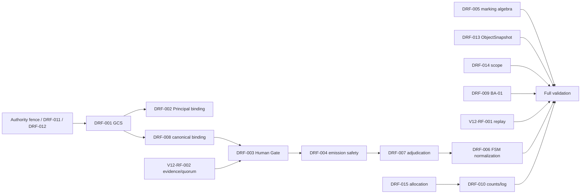

# FASE 2 — Reconciliation e piano di correzione

## Evidence base

Sono stati letti integralmente i 15 `DRF-*`, i 27 `ARF-*`, `AM-01`–`AM-28`, `DRAFT-A`–`DRAFT-I`, `RV-01/02`, i prompt, i report step-by-step e, solo dopo il commit di FASE 1, tutti i file `inputs/supporting/prior/`. `SHA256SUMS.prior` è `PASS` 2/2.

La review v1.0 è coerente con i 27 `ARF-*`; la review v1.1 è sostanzialmente corretta ma il suo runner 97/98 non copre tutte le omissioni semantiche. I 15 `DRF-*` sono confermati; due nuovi rilievi contrattuali verificabili sono aggiunti come `V12-RF-001/002`.

## DAG causale

## Ordine di applicazione

1. congelare authority/evidence/scope fence e redigere la proposta `FR-095` fuori PoC;
2. introdurre il GCS canonico e il binding Principal;
3. versionare e chiudere l'Action Contract canonical, evidence/quorum e reason code;
4. imporre revalidation atomica e modellare adjudication/conflict scope;
5. normalizzare la FSM e il test diagramma↔tabella;
6. totalizzare la marking algebra mantenendo `OI-021` aperta;
7. completare OpenAPI `ObjectSnapshot`, Event replay e mapping GCS;
8. correggere BA-01, scope `NFR-078`, allocazioni `DEC-173/175` e programme trace;
9. riesaminare §1–§8 integralmente, aggiornare Amendment Log e versioni;
10. eseguire conformance, structural, traceability, reference, evidence e diff-log tests;
11. red-team indipendente, fix, retest e final gate.

## Change-control fence

Le soluzioni tecniche sono univoche e fail-closed nella candidata, ma restano `PROPOSED — AWAITING CHANGE CONTROL` quando modificano authority, flussi, contratti o allocazioni. In particolare `FR-095` è proposto `P0/MVP` mantenendo `ELM-070` differita; i registri sorgente non sono modificati. Il Change-Control Package conterrà il testo decisionale esatto, alternative, rollback e criteri verificabili.

## Gate FASE 2

`PASS`: finding, root cause, dipendenze e test di chiusura sono registrati. Nessun finding è dichiarato chiuso prima dell'applicazione e del retest.
